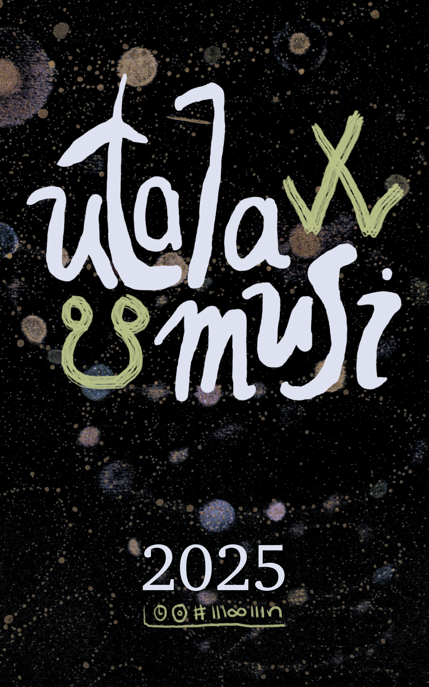

<h1>lipu ale</h1>

<h2>lipu pi utala musi la nasin PDF en nasin EPUB li lon!</h2>
<figure>

<figcaption>

tenpo ni la, o lukin e lipu musi ale tan<strong> utala musi pi tenpo sike #MAML </strong> lon lipu pi nasin PDF, lon lipu pi nasin EPUB a.

<ul><li>o lukin e lipu pi sin nanpa wan
<ul><li><a href="https://raw.githubusercontent.com/raacz/utala-pdf-epub/main/typ/output.pdf
"> kepeken nasin PDF</a></li>
<li><a href="https://raw.githubusercontent.com/raacz/utala-pdf-epub/main/output.epub
">kepeken nasin EPUB</a></li></ul></li>
<li>o lukin <a href="https://github.com/raacz/utala-maml-pdf-epub/blob/main/versions.yaml">e pali sin ale pi lipu ni</a> lon ilo Kita</li>
</ul>

sina wile ante e ijo lon lipu tu ni (tan pakala mi, tan wile ante pi lipu sina, tan sona nasin)  la o toki tawa <a href="mailto:tokipona.sasalin@gmail.com">jan Lakuse</a>.

</figcaption>

</figure>

<h2>lipu suli ale</h2>

lon lipu ni la sina ken lukin e lipu ale kepeken nasin mute.

- [o lukin e ijo toki](#o-kama-sona-e-ni-lipu-li-toki-e-seme)
- [o lukin e suli lipu](#lipu-pi-nimi-lili-li-lon-anpa-lipu-pi-nimi-mute-li-lon-sewi)

## o kama sona e ni: lipu li toki e seme

<ul role="list" class="ijo-mute">
    
  
    <li>
    <a href="{{ page.url }}">{{ page.title }}</a> 
     tan {{page.jan_pali}}
     {{ page.ijo_toki }}
    </li>
  

</ul>

## lipu pi nimi lili li lon anpa. lipu pi nimi mute li lon sewi.
<ul role="list">
   
  
  
    <li>
      <a href="{{ page.url }}">{{ page.title }}</a>, tan {{ page.jan_pali }}. mute nimi: {{ page.mute_nimi }}
    </li>
  

</ul>

