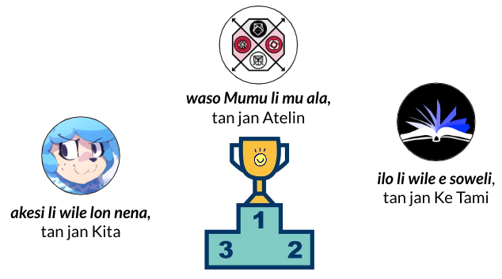

# utala pi lipu musi lili #MAMT/#LTW/#LW

jan Lakuse li toki wawa e ni tawa jan ale pi ma pona: o pana e lipu lili sina tawa mi a! lipu o toki pona e ijo pi lon ala. lipu o musi.

sina ken lukin e ale pi toki ona [lon ni](lawa_tok.md).

ni la jan mute li kama sitelen e lipu sin. jan Tepo en jan Lakuse li pana e ona ale tawa lipu ni 'utala.pona.la' la kulupu li ken lukin e lipu. 

sina wile sona e nasin pi pana pilin la o lukin [lon ni](pana-pilin-tok.md).

## lipu seme li pona nanpa wan tawa kulupu?

## o lukin e lipu ale lon ni:































