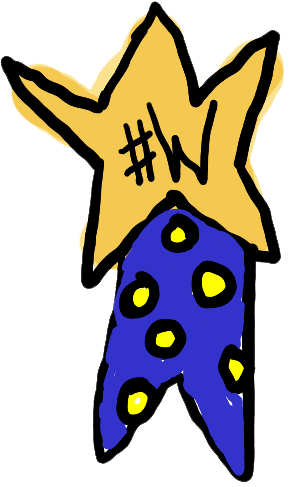
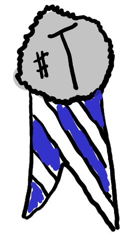
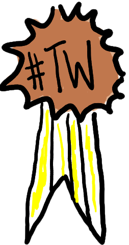

# Artistic Document Competition 2025

jan Lakuse asked for members of the Toki Pona community to submit big documents and little documents of creative writing. [You can review all the instructions here ](lawa/lawa_en). You can also look at the [opinion-expression method](pana-pilin/pana-pilin_en).

## Winning Documents

<ul class="nanpa-wan-a">
        <li>
        First Place 
        
        jan keteso
        
        <a href="/maml/lipu-musi/lipu-lili/index.html#o-esun!">
                o esun!
         </a>
        Short Document   2025
    </li>
    <li>
        Second Place 
        
        akesi Tala
        
        <a href="/maml/lipu-musi/lipu-lili/index.html#akesi-linja-li-pilin-ike">
                akesi linja li pilin ike
         </a>
        Short Document   2025
    </li>
        <li>
        Third Place 
        
        ijo pali
        
        <a href="/maml/lipu-musi/lipu-lili/index.html#pipi-lili">
                pipi lili
         </a>
        Short Document   2025
    </li>
      <li>
        First Place 
        
        jan Ke Tami
        
        <a href="/maml/lipu-musi/lipu-suli/tenpo-o-pona.html">
                tenpo o pona
         </a>
        Big Document   2025
    </li>
    <li>
        Second Place 
        
        soko sijeni
        
        <a href="/maml/lipu-musi/lipu-suli/taso.html">
                taso
         </a>
        Big Document   2025
    </li>
        <li>
        Third Place 
        
        jan Kepeliju
        
        <a href="/maml/lipu-musi/lipu-suli/jan-sama-tu-tu-en-soweli-monsuta.html">
                jan sama tu tu en soweli monsuta
         </a>
        Big Document   2025
    </li>

</ul>

## [All Small Documents](lipu-lili) (31)



<ul class="work" role="list">


  

    <li  class="prize {{page.prize}}" >
    tan {{ page.jan_pali }}:
      <a href="lipu-lili/index.html#{{stripped_title}}">{{ page.title }} </a>
    </li>

</ul>

## [All Big Documents](lipu-suli) (20)

<ul class="work" role="list">
   

  
  
    <li  class="prize {{page.prize}}" >
    by {{ page.jan_pali }}: 
      <a href="{{ page.url }}">{{ page.title }} </a> 
    </li>
  

</ul>

## Toki Pona Day 2026

During Toki Pona Day livestream, jan Lakuse praised all the documents and announced which documents won the contest!

[You can watch it all on YouTube](https://youtu.be/ggVFWGzdBOA). Also you can view: [jan Lakuse's slide deck](https://docs.google.com/presentation/d/1ENR53rNu0QFAvLVLTJc0EjN6bf8v2Y5euNm18TWuJLw/edit). 

[CC-BY-SA 4.0](https://creativecommons.org/licenses/by-sa/4.0/) is the license for all documents in this competition. 
