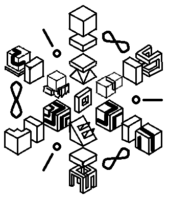

*jan pali li sitelen kepeken [nasin pi 'leko pona'](https://sona.pona.la/wiki/leko_pona
).*

sitelen Lasina la (sina lukin tan sewi lon nasin pi ilo tenpo la)

(*leko pona* la)  
o pali e pona  
o mama e jan  
o toki e suwi  
o utala e ike  
o pilin e wawa  
o pana e sona  

(*sitelen pona* la)  
o ale, o ale, o ale
