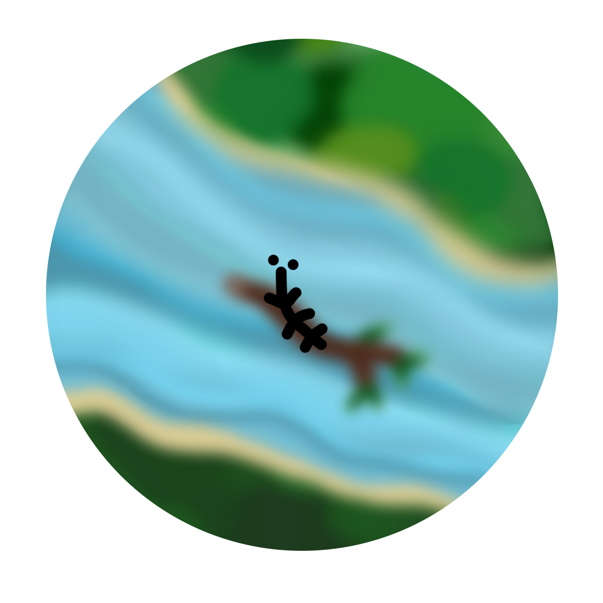
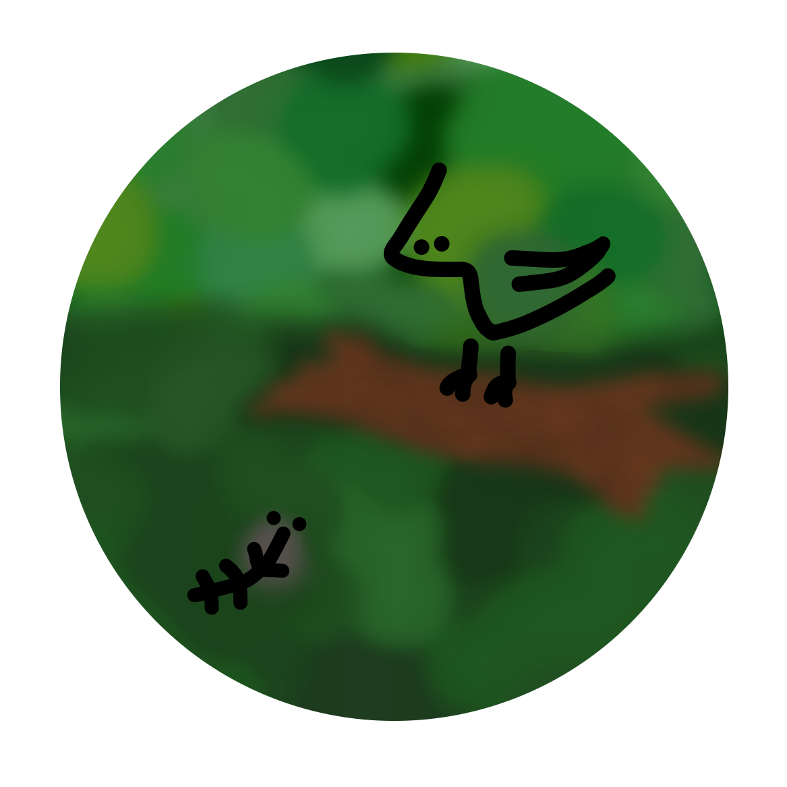

--- 
layout: lipu
title: pipi lili
suli_lipu: lili
mute_nimi: 808
jan_pali: jan Iwi
ken_ike:
- wan taso
- toki pi lon ala
- moli
ijo_toki: "pipi lili li kama weka tan kulupu pipi li pilin ike. ona li alasa e kulupu la pona li kama ala. ona li ken ala alasa lon ona taso, la ona o toki tawa ijo ante pi ma kasi..."
sona_namako: "lipu ni li jo e sitelen pi pona lukin. lon tenpo utala la, kulupu li ken ala lukin e sitelen pi pona lukin. pini utala la sitelen pi pona lukin li kama lon lipu utala.pona.la."
---

mi wile toki tawa sina. mi wile toki e pipi lili wan. o lukin:
{:.toki-pimeja}

pipi lili li lon kulupu suli pipi.
 
telo li kama li tawa wawa li weka e tomo pipi.
 
pipi ale pi kulupu ni li kama weka.
 
tenpo ni la pipi lili li taso.

 

pipi lili li wile lon kulupu li alasa e ona.
 
tenpo mute la ona li tawa lon ma kasi. ona li alasa e pipi taso ona li lukin e kasi mute e telo  mute e pipi ala. ona li toki ni: 'pipi o! sina lon ala lon?'
 
waso pimeja suli li kute li toki: 'sina lon la, pipi li lon, pipi lili o!'
 
pipi li toki: 'mi alasa e pipi pi mi ala a! kulupu mi li weka. mi alasa e ona.' waso li toki: 'ni la, mi ken ala pana e sona wile tawa sina. o alasa pona, pipi lili o!' waso li tawa luka li weka lon sewi.
 

waso suli li toki suwi tawa pipi lili. waso pona a!
 
{:.toki-pimeja}

pipi lili li lukin e waso lili mute. waso ni li lon poka pi kasi suwi mute. ona li moku e telo kasi  suwi sama pipi.
 
pipi li toki insa: 'waso ni li sama pipi! ken la ona li ken pana e sona wile tawa mi'
 
pipi li kama lon poka waso li toki: 'waso lili o! mi alasa e kulupu pipi! sina lukin ala lukin e  kulupu mi?'
 
waso wan li toki: 'pipi li lon ala ni. telo suwi ni li telo suwi mi! o weka! sina weka ala la mi  pakala e sina kepeken uta palisa mi!'
 
pipi li sona e ni: waso lili li toki lon. ni la, ona li tawa weka.
pipi lili li lukin e soweli suli. soweli ni li lape lon suno seli. ona li taso sama pipi lili.
 
pipi li toki insa: 'soweli li taso sama mi. uta ona li palisa ala li ken ala pakala e pipi! ni la mi o  toki tawa ona'
 
pipi li kama lon poka soweli li toki: 'soweli o! mi alasa e kulupu pipi! sina lukin ala lukin e kulupu mi?'
 
soweli li toki: 'pipi mute ike li lon a! ona li pakala e selo mi li wile moku e telo sijelo mi. o  weka! sina weka ala la mi pakala e sina kepeken linja monsi mi!'
 
pipi li sona e ni: soweli suli li toki lon. ni la, ona li tawa weka.
 

pipi lili li lukin e akesi laso. akesi ni li tawa lon telo li mu pona. ona li sama ala pipi.
 
pipi li toki insa: 'akesi ni li sona pona e telo. telo li tawa e kulupu mi. ken la akesi li sona e  ni: kulupu mi li lon seme? mi o alasa e sona ni!'
 
pipi li kama lon poka telo li toki: 'akesi o! mi alasa e kulupu pipi! sina lukin ala lukin e kulupu mi?'
 
akesi li toki: 'pipi mute suwi li lon a! mi lukin ala e kulupu sina, taso sina moku pona tawa  mi. o kama! sina kama ala la mi alasa e sina kepeken linja uta wawa mi!'
 
pipi li sona e ni: akesi laso li toki lon. ni la, ona li tawa weka.

waso lili en soweli en akesi li toki ike tawa pipi lili. ona o seme lon tenpo ni? 
 
{:.toki-pimeja}

pipi lili li pilin ike suli li toki pilin: 'kulupu mi li weka a! mi taso. mi ken ala ante e ni. mi o seme?'

waso pimeja suli li kute e ona li kama sin li toki: 'pipi lili o! seme li kama e pilin ike sina?'
 
pipi li toki: 'tenpo suli a la mi alasa e kulupu pipi mi, taso mi sona ala e ni: ona li lon seme? tenpo ni la mi lukin e pipi wan la mi pilin pona. taso pipi ala a li lon!'

waso li toki: 'n... mi kin li lukin ala e pipi ante lon tenpo ni, taso mi sona e ni: tenpo kama poka la pipi wan li lon ma wan. mi ken pana e sona ni tawa sina: ona li lon ma seme?'
 
pipi li pilin pona wawa li toki: 'o pana! mi wile sona!'
 

waso li toki: 'o kama lon insa pi uta mi! sina kama ala la mi ken ala pana e sina tawa ma pipi.' 

 
pilin pipi li wawa a la ona li toki insa ala. ona li tawa li kama lon insa pi uta waso.

ken la, sina sona e ijo kama. pipi li lili li wawa ala. waso li suli li sona. o lukin:
{:.toki-pimeja}

pipi li lon uta waso la, waso li moku e ona.
 
ona li mu musi: 'a a a!'
 
mu ona li wawa!
 
ona li toki: 'pipi lili o, mi toki lon! mi sona e ma pipi! pipi li sina! ma pipi li lon insa mi a!'
 

waso ike a!
{:toki-pimeja}
