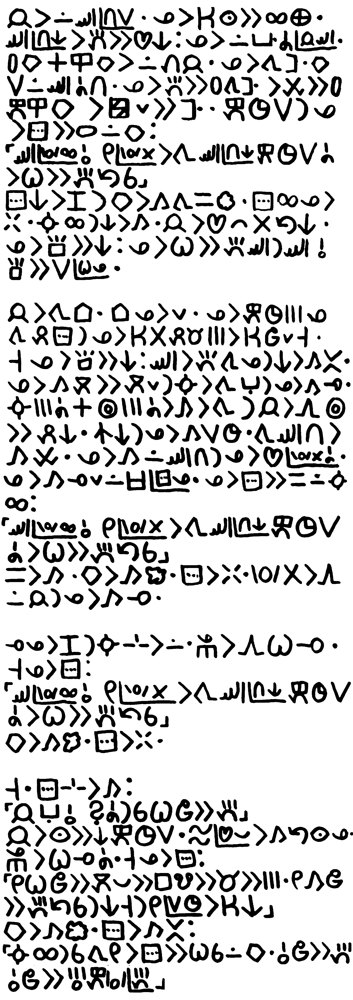

---  
layout: lipu
title: sitelen kiwen
suli_lipu: lili lili
mute_nimi: 638
ken_ike: 
- toki pi nasin sewi
ijo_toki: "jan anpa li wile e pona li toki tawa sewi kepeken sitelen pona. taso, ona li ken ala ken sitelen pona kepeken sitelen pona?"
---

o lukin kepeken sitelen Lasina

[sitelen ni li tawa sitelen pona. sitelen Lasina li pakala ali e musi ona. mi toki e ni lon poki sama ni: jan pi sitelen pona li ken pilin musi tan seme. taso sona pi tan musi li pana ala e pilin musi]

jan li lon sewi pi nena suli. ona li ken lukin e ali ma. sewi pi nena ni li pana e pilin ni: ona li lon poka a pi jan sewi. palisa kiwen en ilo kiwen li lon luka jan. ona li tawa sinpin kiwen suli lon sewi a nena. ona li pana e palisa tawa sinpin li utala e palisa kepeken ilo kiwen, li pakala lili e sinpin. kepeken tenpo suli la ona li sitelen e nimi lon kiwen:
"sewi pi wawa ali o, mi pi wawa ala li tawa sewi pi nena ni kepeken tenpo suli a li wile e pana tan sina"

[sitelen pona la jan li ken sitelen e sitelen wan lon sewi pi sitelen ante. jan li sitelen e sitelen "mute" lon sewi pi sitelen "luka" la ona li sama mute tawa sitelen "pana" tawa lukin, la jan ala li ni. mi sitelen Lasina e wile pi jan sitelen. taso o sona e ni: nimi "pana" en nimi "luka mute" li sama tawa lukin lon kepeken mi pi sitelen pona.]

sitelen ni li pini la kiwen li kama tawa sama ko. sitelen ali ona li weka. suno ali la ni kama. jan li pilin ike ala tan ni. ona li sona e ni: ona li wile e pana sewi la sewi o sona e suli pi wile ona.  jan li tawa tomo. tomo ona li lili. ona li kepeken tenpo mute ona tawa pali sitelen la ona li ken ala pali mani mute li ken jo lili taso. taso ona li sona e ni: sewi li pana tawa ona la ni li kama ante. ona li kama moku e moku lili la suno li kama ante la ona li kama lape. suno mute a en sike mute a li kama li tawa la jan li awen sike e pali ni. nasin ni la ona li kama suli tenpo. tawa sewi nena li kama utala. ona li kama lon sewi nena la ona li pilin pi wawa ala a. ona li kama lape lili lon open pi sitelen ona. ona li sitelen e sama lon suno ali:
"sewi pi wawa ali o, mi pi wawa ala li tawa sewi pi nena ni kepeken tenpo suli a li wile e pana tan sina"
sama li kama. kiwen li kama ko. sitelen li weka. wawa ala li awen lon jan la ona li kama lape. 

lape ona li pini la suno sin li lon. sijelo ona li awen wile lape. taso ona li sitelen:
"sewi pi wawa ali o, mi pi wawa ala li tawa sewi pi nena ni kepeken tenpo suli a li wile e pana tan sina"
kiwen li kama ko. sitelen li weka.

taso. sitelen sin li kama:
"jan anpa o, seme a la sina wile e luka mute"
jan li lukin e ni kepeken tenpo suli. telo pi pilin pona li kama tan lukin ona. sijelo ona li wile lape a. taso ona li sitelen:
"mi wile jo e moku pona e lipu musi e mani e mute. mi kama jo e pana tan sina la ni taso la mi pi suli tenpo li ken ni"
kiwen li kama ko. sitelen li kama ante:
"suno ali la sina tawa mi li sitelen e wile sina lon kiwen. o jo e luka mute. o jo e ijo mute kepeken wawa pi luka mute."

[nimi "pi" li lon open pi sitelen "luka mute" la jan ali lukin li ken kama sona e ni: ona li nimi "pana" ala. ken suli a la tenpo pini la ona li sona ala e ni]

