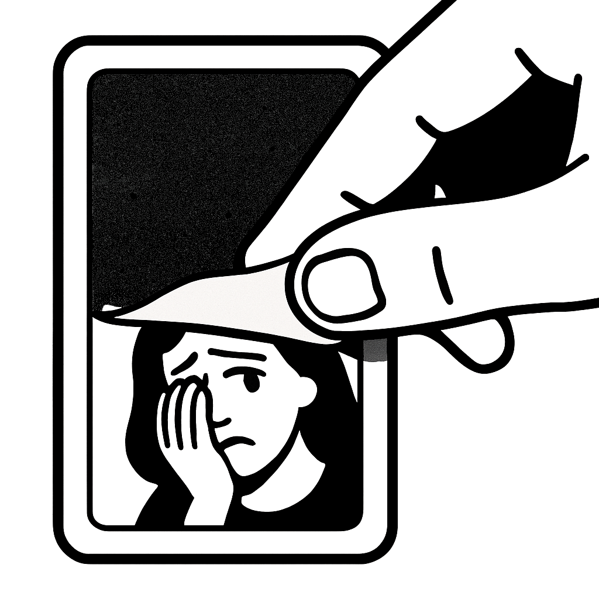
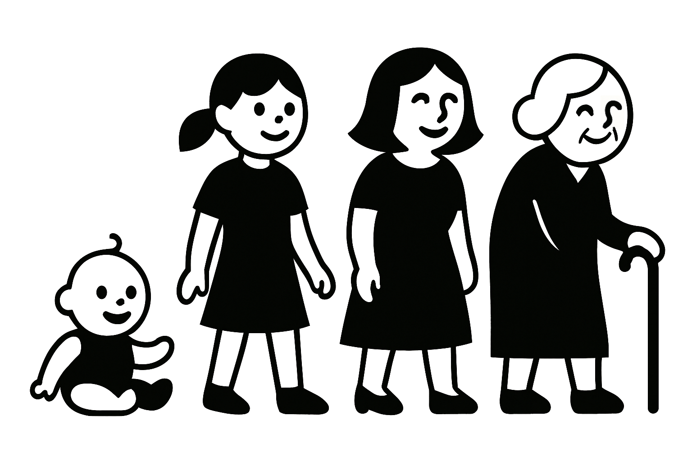

---  
layout: lipu
title: utala insa
without-title: true
suli_lipu: lili
mute_nimi: 788
jan_pali: jan Petokota
ken_ike:
- toki pi pilin ike suli
- moli pi ona sama
- pilin anpa pi wile moli
ijo_toki: "pona en ike. olin en pakala. wile awen en wile moli. pilin mute li utala tu lon mama pi jan pali. o kama sona e mama ni e utala ona kepeken nasin pi toki tu."
sona_namako: '
jan Petokota li pana e lipu ni lon <a href="https://github.com/pedrocosta/utalainsa">ilo Kita (Github)</a> kin.

lipu ni li jo e sitelen pi pona lukin. lon tenpo utala la, kulupu li ken ala lukin e sitelen pi pona lukin. pini utala la sitelen pi pona lukin li kama lon lipu utala.pona.la.

jan Petokota li wile e ni: sina lukin kepeken sitelen pona. taso, sina ken ala lukin e sitelen pona la, o tawa <a href="#sitelen-Lasina">sitelen Lasina lon anpa</a>

sina wile jo e lipu ni lon luka sina li wile pana e ni tawa lipu kasi kepeken ilo sitelen pana pi telo pimeja, la o kama kepeken <a href="utala-insa-lipu-kasi.pdf">utala insa pi lipu kasi</a>
'
---

<h1>utala insa</h1>

tan jan [pona e tenpo o kepeken olin tawa ale]

 

    
## nasin lipu li ni

mi sitelen e pilin  

poka open la mi sitelen e pilin pona 

poka pini la mi sitelen e pilin anpa  

pilin tu ni li utala  

utala ni li lon lawa insa pi mama mi  
    
    

    

## o len ala

o len ala  
lukin la mi pona a  
sona la mi suli a  
pilin la mi suwi a  
mi wan a   
o len ala a

    

## o len 

o len  
lukin la mi jaki a  
sona la mi lili a  
pilin la mi moli a  
mi wan a   
o len a

    

<h2>tawa wawa nasa</h2>

mi alasa e olin la mi tawa wawa a  
tawa wawa mi li nasa  
open tawa la mi wan  
pini tawa la mi sona e jan mute  
&nbsp; &nbsp; &nbsp; pilin anpa li weka  
&nbsp; &nbsp; &nbsp; pilin pona li suli  
&nbsp; &nbsp; &nbsp; pilin kulupu li pona  
&nbsp; &nbsp; &nbsp; mi wan ala  
&nbsp; &nbsp; &nbsp; pilin olin li ken open  
tawa wawa mi li pana e pona  
ken la jan wan la mi suwi  
&nbsp; &nbsp; &nbsp; &nbsp; &nbsp; mi pona  
&nbsp; &nbsp; &nbsp; &nbsp; &nbsp; mi suli  

    

## tawa wawa nasa

mi alasa e olin la mi tawa wawa a  
taso tawa wawa mi li nasa  
open tawa la mi wan  
pini tawa la jan ale li weka  
&nbsp; &nbsp; &nbsp;       pilin olin li weka  
 &nbsp; &nbsp; &nbsp;      pilin pakala li kama  
 &nbsp; &nbsp; &nbsp;      pilin pona li weka  
&nbsp; &nbsp; &nbsp;       pilin anpa li kama  
 &nbsp; &nbsp; &nbsp;      mi wan  
tawa wawa mi li pana e ala  
ken la jan ale la mi lili  
&nbsp; &nbsp; &nbsp; &nbsp; &nbsp;          mi ike  
&nbsp; &nbsp; &nbsp; &nbsp; &nbsp;          mi jaki  

    

## nasin olin

olin li seli  
seli suli li ike  
olin suli li ike ala ike  
   
ike ala a  
ona li seli e pilin 		   
olin o kama   

    

## nasin olin

olin li seli  
seli suli li ike  
olin suli li ike ala ike  
   
ike a					  
ona li seli e pilin 		   
olin o weka	  

    

## pakala

jan li kama lon la pakala li lon  
  
jan li jo ala e mani la pakala li lon  
jan li jo e mani mute la pakala li lon  
jan li jo ala e pali la pakala li lon  
jan li pali la pakala li lon  
  
jan li wan la pakala li lon  
jan li alasa e jan olin la pakala li lon  
jan olin li weka la pakala li lon  
jan en jan olin li kama wan la pakala li lon  
jan olin li moli la pakala li lon  
  
jan li lili la pakala li lon  
jan li majuna la pakala li lon   
  
jan li moli la pakala li lon  
  
pakala li lon pi tenpo ale  
pakala li lon la ale ala li ike  
  
  

  
  

    

## pakala  
  
jan li kama lon la pakala li lon  
  
jan li jo ala e mani la pakala li lon  
jan li jo e mani mute la pakala li lon  
jan li jo ala e pali la pakala li lon  
jan li pali la pakala li lon  
  
jan li wan la pakala li lon  
jan li alasa e jan olin la pakala li lon  
jan olin li weka la pakala li lon  
jan en jan olin li kama wan la pakala li lon  
jan olin li moli la pakala li lon  
  
jan li lili la pakala li lon  
jan li majuna la pakala li lon   
  
jan li moli la pakala li lon  
  
pakala li lon pi tenpo ale  
pakala li lon la ale a li ike  

  

  

  

    

## monsuta insa  
monsuta li lon insa pi pilin mi  
monsuta ni li pana e pilin anpa tawa mi  
lawa mi li pana e pilin pona  
monsuta li mu  
ona li wile moku e lawa mi li wile kama suli  
lawa mi li mu  
ona kin li wile moku li wile moli e monsuta  
monsuta la mi monsuta  
mi moku e ona  
ona li suli ala  
ona li moku ala e pilin pona mi  
mi ken kute lili e monsuta  
taso ona li awen lon insa mi  
mi wile ala pana e moku tawa monsuta  

  

    

## monsuta insa
monsuta li lon insa pi pilin mi   
monsuta ni li pana e pilin anpa tawa mi  
lawa mi li pana e pilin pona  
monsuta li mu  
ona li wile moku e lawa mi li wile kama suli  
lawa mi li mu  
ona kin li wile moku li wile moli e monsuta  
monsuta la mi monsuta  
mi moku e ona  
ona li suli a  
ona li moku e pilin pona mi  
mi ken ala kute e pilin pona mi  
mi ken kute e monsuta taso  
mi pana e moku tawa monsuta tan seme  

  

    

## pini  
mama meli mi li pakala  
toki insa ona la utala li lon  
nasin nanpawan la ona li pilin pona li wile lon  
nasin nanpa tu la ona li pilin anpa li wile moli  
tenpo li kama li tawa  
utala li kama ike suli  
nasin nanpa tu li kama wawa  
mama mi li moli  
peto  
lipu ni li toki e utala ona  

  

    

sina pilin anpa lon tenpo suli la o toki tawa jan pona tan ni  

sina suli

<aside id="sitelen-Lasina">

o sona: lipu pi sitelen Lasina li kepeken selo namako pi sitelen Lasina. lukin la jan li sitelen kepeken luka ona. sina wile ala e ni la o lawa e namako selo kepeken nena ni. 

<button id="o-weka-e-namako">mi wile weka e namako selo pi sitelen Lasina</button>
</aside>

<h1>utala insa</h1>

tan jan Petokota

    

    
## nasin lipu li ni

mi sitelen e pilin  
poka open la mi sitelen e pilin pona  
poka pini la mi sitelen e pilin anpa  
pilin tu ni li utala  
utala ni li lon lawa insa pi mama mi  
    
    

    

## o len ala

o len ala  
lukin la mi pona a  
sona la mi suli a  
pilin la mi suwi a  
mi wan a   
o len ala a

    

## o len 

o len  
lukin la mi jaki a  
sona la mi lili a  
pilin la mi moli a  
mi wan a   
o len a

    

<h2>tawa wawa nasa</h2>

mi alasa e olin la mi tawa wawa a   
tawa wawa mi li nasa   
open tawa la mi wan   
pini tawa la mi sona e jan mute   
pilin anpa li weka 
pilin pona li suli 
pilin kulupu li pona 
mi wan ala 
pilin olin li ken open 
tawa wawa mi li pana e pona   
ken la jan wan la mi suwi   
mi pona   
mi suli  

    

<h2>tawa wawa nasa</h2>

mi alasa e olin la mi tawa wawa a   
taso tawa wawa mi li nasa   
open tawa la mi wan   
pini tawa la jan ale li weka   
pilin olin li weka   
pilin pakala li kama   
pilin pona li weka   
pilin anpa li kama   
mi wan   
tawa wawa mi li pana e ala   
ken la jan ale la mi lili   
mi ike   
mi jaki  

    

## nasin olin

olin li seli  
seli suli li ike  
olin suli li ike ala ike  
   
ike ala a  
ona li seli e pilin 		   
olin o kama   

    

## nasin olin

olin li seli  
seli suli li ike  
olin suli li ike ala ike  
   
ike a					  
ona li seli e pilin 		   
olin o weka	  

    

## pakala

jan li kama lon la pakala li lon  
  
jan li jo ala e mani la pakala li lon  
jan li jo e mani mute la pakala li lon  
jan li jo ala e pali la pakala li lon  
jan li pali la pakala li lon  
  
jan li wan la pakala li lon  
jan li alasa e jan olin la pakala li lon  
jan olin li weka la pakala li lon  
jan en jan olin li kama wan la pakala li lon  
jan olin li moli la pakala li lon  
  
jan li lili la pakala li lon  
jan li majuna la pakala li lon   
  
jan li moli la pakala li lon  
  
pakala li lon pi tenpo ale  
pakala li lon la ike li lon ala  
  
  

  
  

    

## pakala  
  
jan li kama lon la pakala li lon  
  
jan li jo ala e mani la pakala li lon  
jan li jo e mani mute la pakala li lon  
jan li jo ala e pali la pakala li lon  
jan li pali la pakala li lon  
  
jan li wan la pakala li lon  
jan li alasa e jan olin la pakala li lon  
jan olin li weka la pakala li lon  
jan en jan olin li kama wan la pakala li lon  
jan olin li moli la pakala li lon  
  
jan li lili la pakala li lon  
jan li majuna la pakala li lon   
  
jan li moli la pakala li lon  
  
pakala li lon pi tenpo ale  
pakala li lon la ike li lon a  

  

  

    

## monsuta insa  
monsuta li lon insa pi pilin mi  
monsuta ni li pana e pilin anpa tawa mi  
lawa mi li pana e pilin pona  
monsuta li mu  
ona li wile moku e lawa mi li wile kama suli  
lawa mi li mu  
ona kin li wile moku li wile moli e monsuta  
monsuta la mi monsuta  
mi moku e ona  
ona li suli ala  
ona li moku ala e pilin pona mi  
mi ken lili kute e monsuta  
taso ona li awen lon insa mi  
mi wile ala pana e moku tawa monsuta  

  

    

## monsuta insa
monsuta li lon insa pi pilin mi   
monsuta ni li pana e pilin anpa tawa mi  
lawa mi li pana e pilin pona  
monsuta li mu  
ona li wile moku e lawa mi li wile kama suli  
lawa mi li mu  
ona kin li wile moku li wile moli e monsuta  
monsuta la mi monsuta  
mi moku e ona  
ona li suli a  
ona li moku e pilin pona mi  
mi ken ala kute e pilin pona mi  
mi ken kute e monsuta taso  
mi pana e moku tawa monsuta tan seme  

  

    

## pini  
mama meli mi li pakala  
toki insa ona la utala li lon  
nasin nanpawan la ona li pilin pona li wile lon  
nasin nanpa tu la ona li pilin anpa li wile moli  
tenpo li kama li tawa  
utala li kama ike suli  
nasin nanpa tu li kama wawa  
mama mi li moli  
peto  
lipu ni li toki e utala ona  

  

    

sina pilin anpa lon tenpo suli la o toki tawa jan pona tan ni  

sina suli

