lipu li lon sinpin sina la, o open kule e ona.

o kepeken laso. sina sona ala sona e laso? tenpo pini suli la, ma li laso. telo en sewi li suwi, li lete li awen e sina tan seli. sina moku e kon, e kala telo, e waso sewi. sina pilin e kasi lon noka, li mama e kili. o laso e ale lipu.

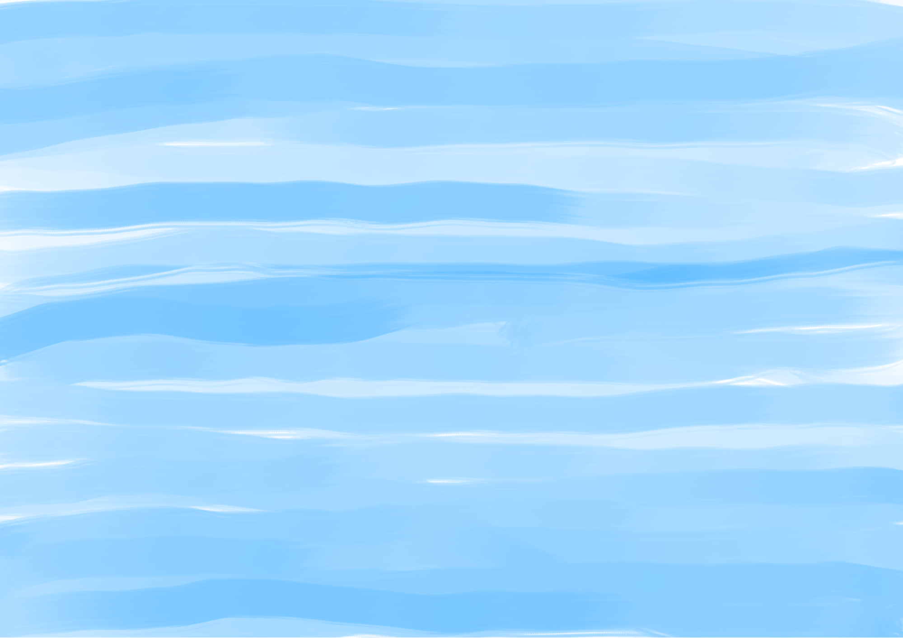

o kepeken jelo. jelo li nasa ala nasa tawa sina? mani li jelo. suli li jelo. jan li kama sona e suli esun la, ona li utala tan wile mani. jan suli li alasa e jan lili. ni la, sina wile jan suli a. tenpo la, sina jo. o jelo e ale lipu.

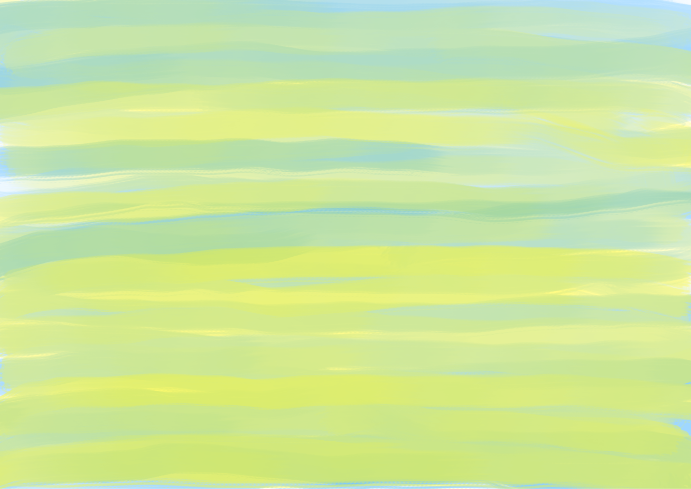

o kepeken loje. o pilin ike ala tan loje, o kepeken. insa sina li loje. seli li loje. utala li loje. sina wile ala pilin e pakala la, o kepeken palisa ala. o pana wawa e loje lon ale lipu tan poki ona. sina pilin pona ala pona tan wawa sina?

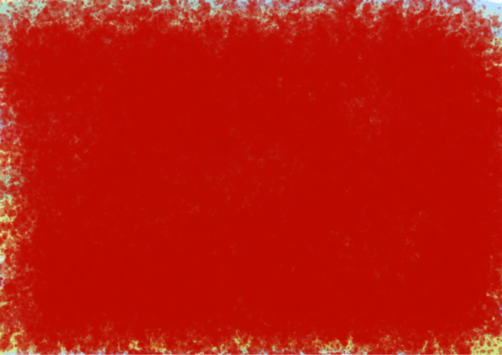

loje ni li wawa. o pilin ike ala. o jo sin e laso…

o jelo…

o loje…

o laso…

…

o jo sin e palisa. o wan e kule ale. o pimeja e ale lipu.

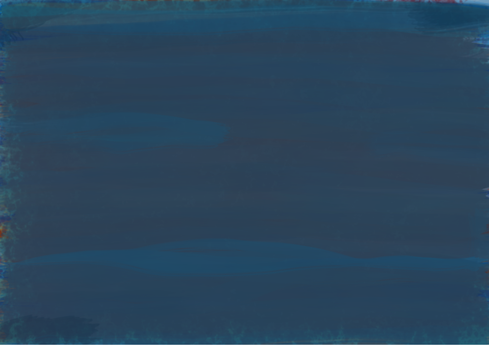

o lukin e pali sina. pimeja taso li lon. sina sona pona e ni.

kule li telo a la, o awen lon tenpo lili. telo o weka lon kon.

…

o kepeken walo.

o sitelen e tomo lon pimeja kepeken walo. sina sona e tomo ni, sina lon ni\! tomo li jo e kon, e moku, e ijo ante pona. tenpo pini suli la, tomo li tan ma. ma li lon seme?... weka a. o sitelen ala e ona. kin la, sina sona ala e kule ma. ona li laso, li jelo, li loje li… sona ala. jan o pona lon ma. tomo ni li tawa.

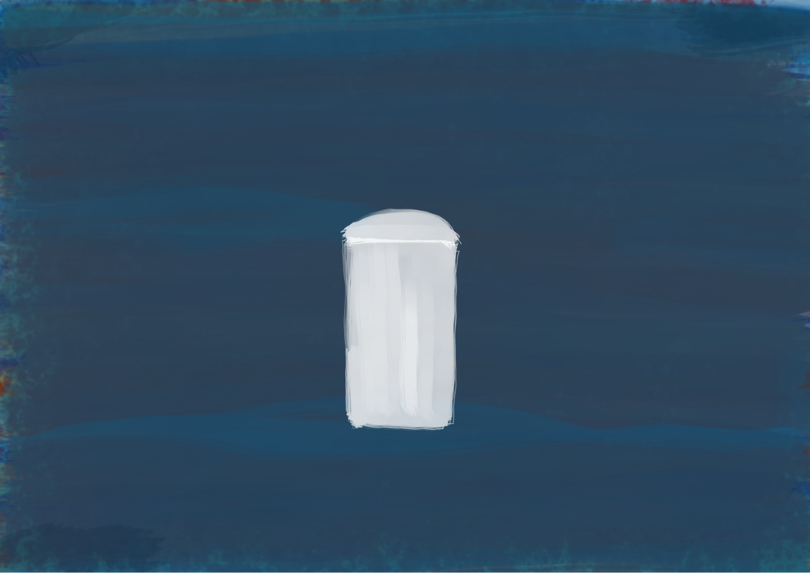

sina wile la, sina ken sitelen e nasin tawa pi tomo ni. nasin kiwen li lon ala, taso, sina wile pana e sitelen pi nasin tawa la, sina ken. o sona e sinpin tomo. sinpin tomo li tawa mun. monsi tomo li tan ma. ni li nasin taso.

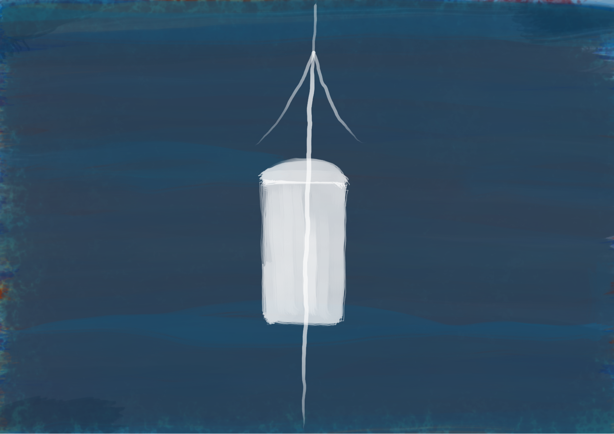

o wan e walo e pimeja. o kepeken ona tu.

o lukin e insa tomo. o sitelen e ijo ona, e ilo ona, e supa ona. sina sona e tomo ni lon tenpo suli la, sina ken sitelen wawa e ona. 

ni li supa lape sina. tenpo mute la sina lon ni. sijelo sina li pona ala pona? lape li pona ala pona? seme li awen e sina lon ona lon tenpo mute?

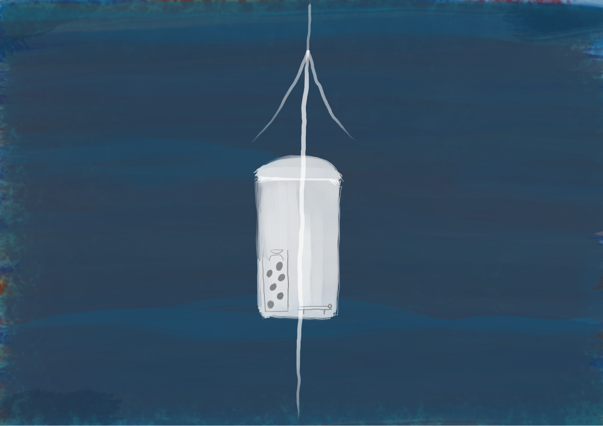

ni li poki moku. moku ale pi tawa ni li lon. o moku ala e ijo ale ona lon tenpo wan. sina pona tan ni: sina moku mute ala lon tenpo mute. taso, o awen e pona pi sijelo sina. o moli ala tan moku ala.

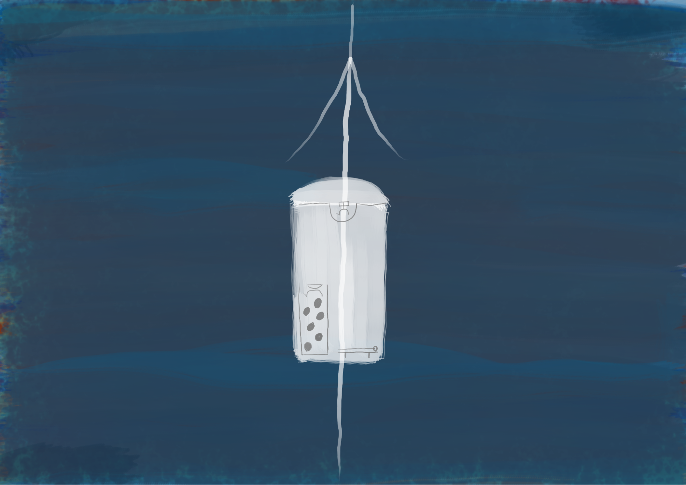

ni li lupa lon sinpin pi tomo lili ni. tomo poka li jo e ilo nasin. ona li tawa mun e sina. lukin la, ilo li awen wile e tenpo suli lon tawa tomo ona. ilo li toki ala kepeken kalama. ona li kepeken nanpa taso. ni li musi ala musi?

ni li sina ala sina? pona, sina ni\! jan U li lon. nimi sina li lili, taso, ona li pona lon uta. sina sitelen pona e sina, sina jan sitelen wawa.

ni li lipu sina. o sitelen lon sitelen lipu. sina wile ala wile sin e nasin sitelen?

o kepeken laso…

o jelo…

o loje…

o sitelen e tomo…

o sitelen e sina…

o sin e sitelen…

o laso…

o jelo…

o loje…

…

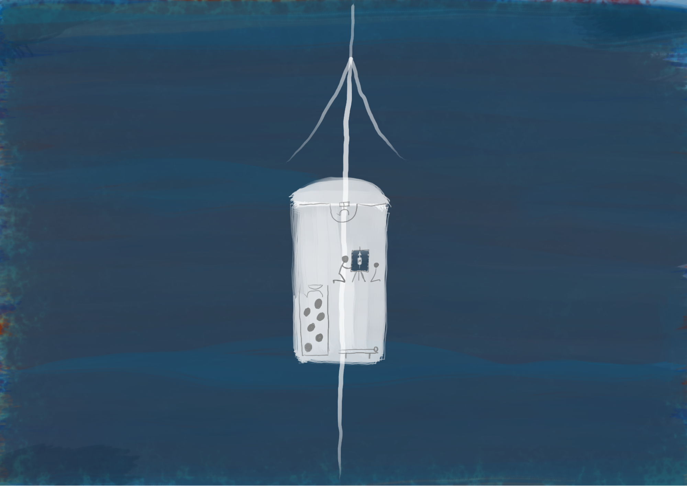

a. jan ni li seme? … mi? a. jan I li lon. mi lon poka sina… jan ante li lon la pona. sina en mi li ken toki. ilo li pona mute ala tawa wile toki.

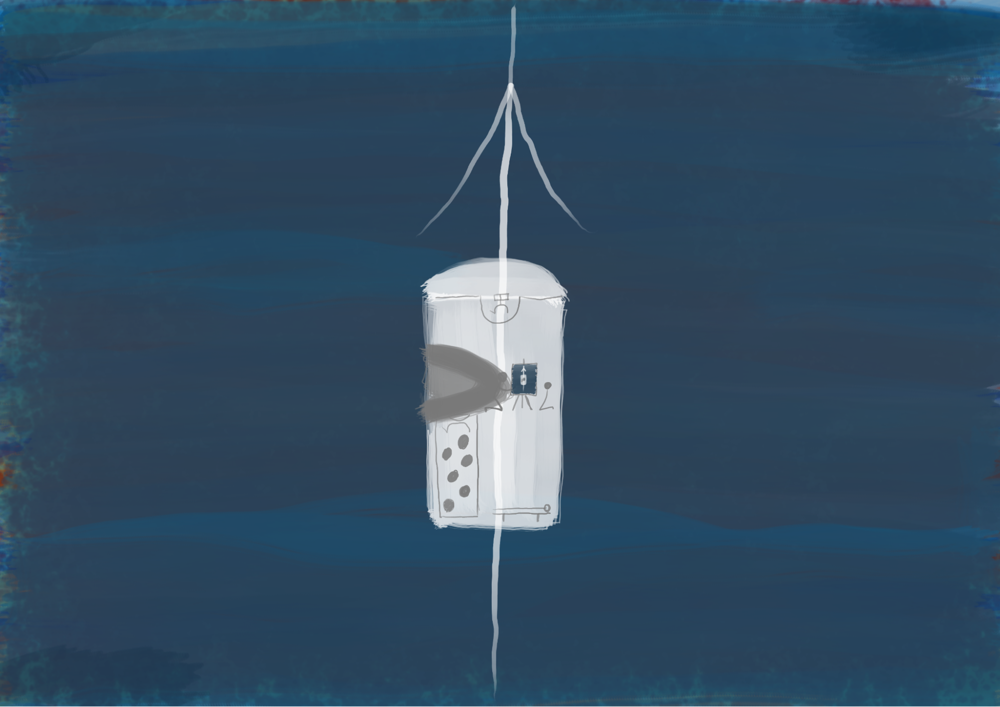

a\! sina pana e lupa lon poka tomo. ni la sina ken lukin e pimeja. sina pakala e poka tomo lon sitelen taso la, pona. sina wile ala moli lon pimeja lete poka pi kon ala… mi wile ala e ni.

sina wile lukin e seme lon pimeja? pimeja taso li lon. sina ken lukin e ni.

… suno. nimi ni li lon ala tomo ni lon tenpo suli… 

mi o toki e suno? mi sona ala pona e ona… taso mi o alasa toki. mi pana e sona ale mi lon sina. mi sitelen lon lipu mi.

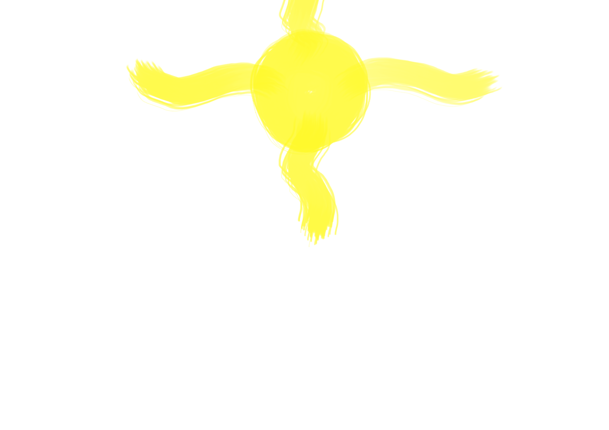

o lukin e lipu mi. tenpo open la, jan suli wawa li pali e suno. kiwen li kama tan suli ona, li pakala tan ona ante. kiwen wan li kama jo e telo, e kasi, e kala, e ijo pi moku kon… e jan. jan li kulupu, li pali e nasin, li esun, li kama mute. ona li pali e tomo, e ilo, e musi. ni li tenpo laso.

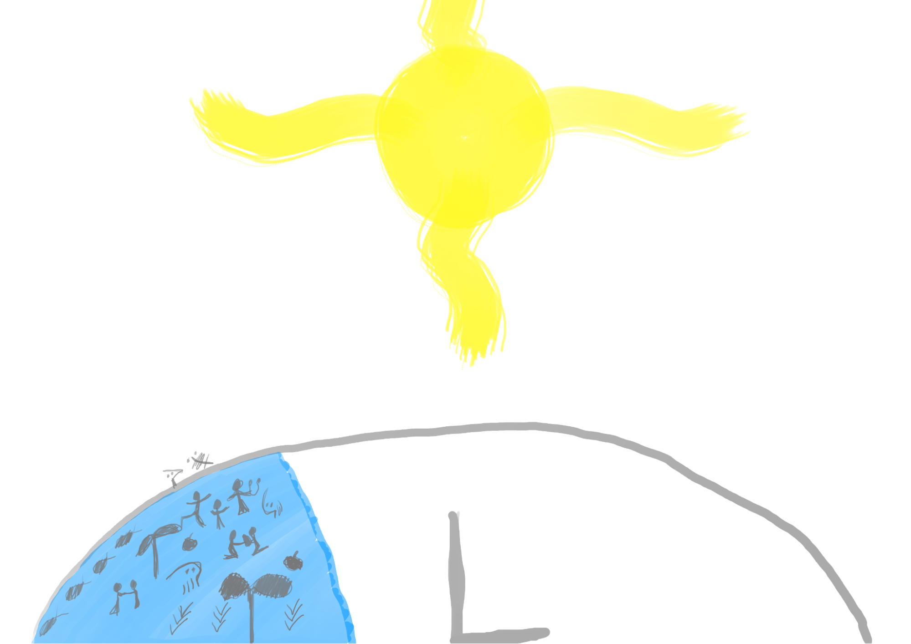

taso, kulupu jan mute li jo e wile ante utala la, pilin li ken kama ike. mani li kama ante. nasin li kama nasa. toki li kama jaki. kulupu li kama pakala. jan wawa li moku e mani pi jan lili. ale li kama musi lon jan mani. ni li tenpo jelo.

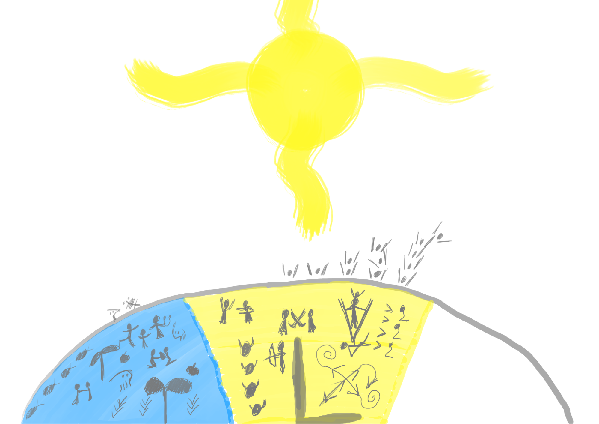

jan wawa li suli e sijelo ona. ona li kama utala e jan wawa ante la, jan ale ante li pilin e pakala. ona li pakala e ma, li seli e kasi, li jaki e telo, li moli e pona. ni li tenpo loje.

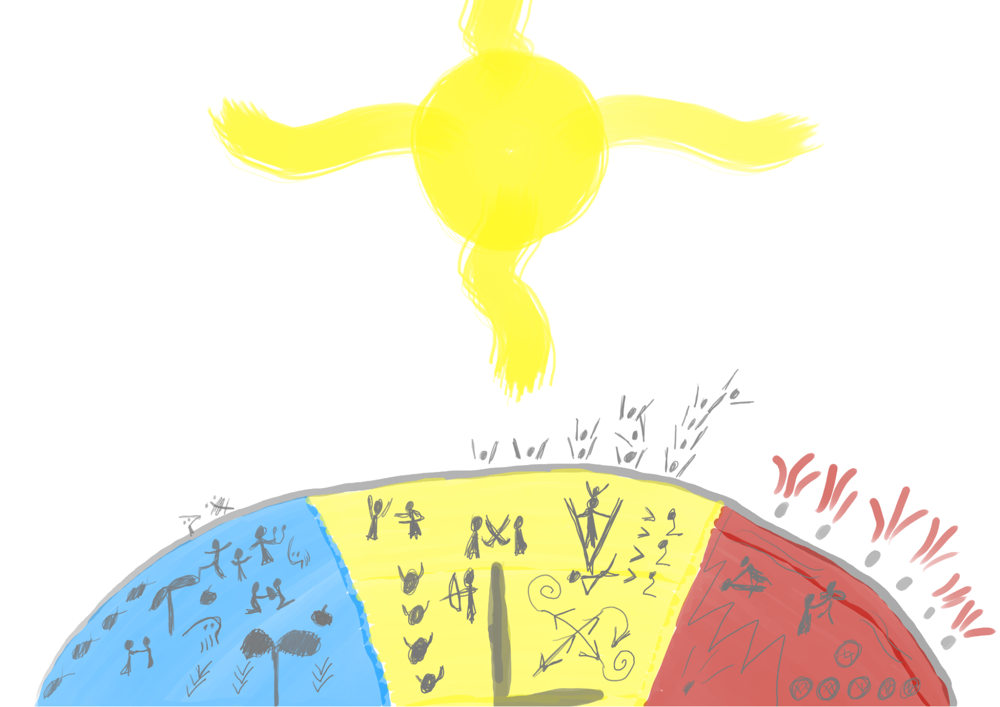

ni ale la, sina toki e ni: seme li ken pini e ike ni? sina kama sona sin e jan suli open. ona li pali e ijo ale la, ona li jan pi suli wawa nanpa wan. ona li ken pini e ijo ale ni. ni la, tomo li tawa mun pi jan wawa. sina lon e mi kin. mi mama e sina. sina mama e mi.

ni la, mi weka a tan ma. mi tu taso li lon tomo.

…

seme la mi pilin ike? mi toki e lon mi la mi pilin ike. mi o toki ala e mi tu taso. mi toki e ni: sina en mi. sina awen lon poka mi.

mi taso li ken ala pona e jan ale lon ma. sina taso kin li ken ala ni. ni la, mi tawa mun pi jan suli wawa. ona li pona\! ona li ken pona e ijo ale. ona li ken ijo ale…

… taso, ona li ken ala kute e ike lon ma. seme la ona li weka a?...

ni la, mi tu li tawa lon tenpo ale a tan ma, li tawa mun lon tenpo ale a sin. mi tu taso o ni…

… a\! mi toki sin e ni. sina en mi. sina awen.

…

pilin sina la, ma li lon ala lon? mun li lon ala lon? mi sona e kule taso. mi sona e sitelen taso. sona sina li weka la, mi wile ala e ni: sina en mi li sona ala lon tawa suli ni mi.

ni la, mi awen e sitelen. sitelen ni li awen e ijo ale. sitelen mute li lon. mi jo ala e sitelen ni la, seme li ken awen lon lawa? mi ken toki e seme lon jan suli wawa?

… ona li lon ala la, mi tu o seme? mi tu… taso…

ike a. mi wile ala e mi tu taso. mi wile e mi e sina. sina en mi. mi tu taso la, sina weka la, mi wan taso. mi wile ala e ni.

o awen lon mi. o awen lon sitelen. o awen lon tomo. o pakala ala e nasin ona. o lupa ala e poka tomo. o moli ala lon pimeja suli lete. seme a la sina sitelen e ni? sina wile e ni anu seme? mi wile e sina. o toki ala e wile weka. sina wile e mi kin. mi pilin ike suli. seme a la mi pilin e ni?

…

mi sona. sina sona ala sona? o sona: mi ken ala.

mi ken ala lon taso. mi wile sitelen lon poka sina. mi wile moku lon poka sina. mi wile lape lon poka sina. mi ken ala mi taso\! mi jo e sona pi mi taso la, mi ken ala ijo ale. seme li ken sona e mi? seme li ken sona e ijo ale?

mi ken ala jan pini.

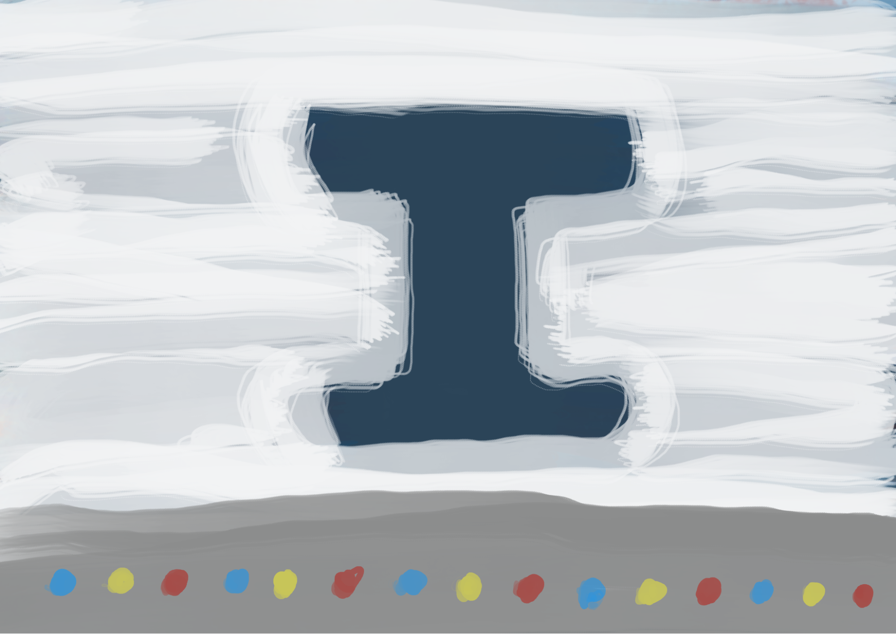