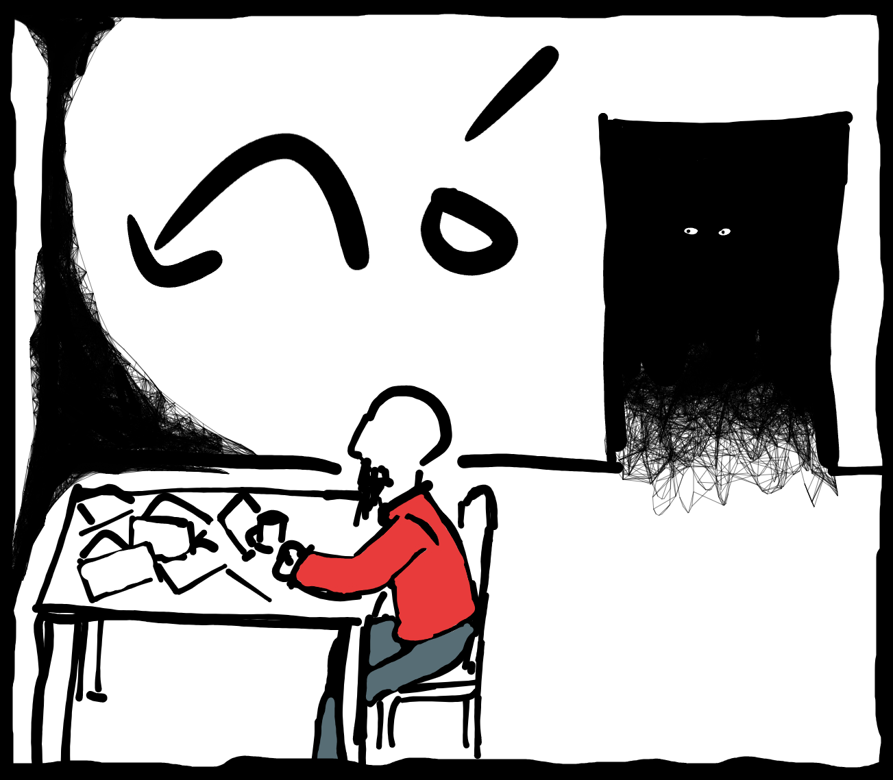
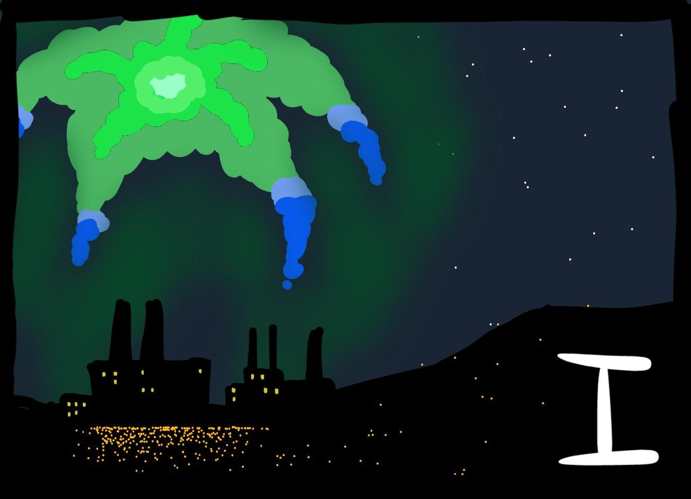

sina tawa tomo ni zz tan ni-ala ni

kulupu utala li wile e ni3 zz sina kama lon ona   
{:.sptan-o-indent}

ni5
{:.sptan-o-right}

pona zz zz zz ni2 la kulupu li wile e sona   
sina sona+ala sona sitelen 
{:.sptan-o-indent}

sona+ala
{:.sptan-o-right}

ike-ala  zz zz  mi ken sitelen 
{:.sptan-o-indent}

nanpa wan la   
sina jo+ala jo e jaki5 pi (insa_sijelo_)
{:.sptan-o-indent}

jo+ala lon tenpo ni 
{:.sptan-o-right}

sina jo+ala jo e jan olin1  
li mama+ala mama 
{:.sptan-o-indent}

jo+ala  
mama+ala
{:.sptan-o-right}

sina pali ala pali   
li kama ala kama e mani tan pali sina   
{:.sptan-o-indent}

mi pali lon tomo pali [jo=:=nena,,,=]  
taso tomo ni 2li pana ala e mani tawa jan pali  
{:.sptan-o-right}  

 a sina pali e ilo utala   
 ni2 li pona    
 pini la   
 nimi sina li seme 
{:.sptan-o-indent}

a mi jan [len=.=jan=.=]
{:.sptan-o-right}

pona-pona   zz zz sina pana e sona wile ale   
jan [len=]   zz zz o jo e lipu+ni   
zz zz zz zz zz o pana e ona tawa jan [lawa=:=]  
zz zz zz zz zz lon tomo loje lon poka pi tomo-ni   
{:.sptan-o-indent}

mi ni5  zz o awen pona 
{:.sptan-o-right}

n n  zz zz  o moli ala
{:.sptan-o-indent}

ona li pini toki la   
sina tawa tomo loje   
sina lukin e jan ala lon insa zz zz   taso sina kute e mu lape lon monsi tomo 

sina mu1

toki a   
jan [lawa=:=] li lon seme 
{:.sptan-o-indent}

sina kute e mu pi (pini_lape_)

a   zz zz  seme a  
sina toki tawa mianu seme  
{:.sptan-o-right}  

sina jan [lawa=:=]anu seme 
{:.sptan-o-indent}

n n mi jan [lawa =]  
o awen   
{:.sptan-o-right}

sina awen   
la tenpo lili la jan lon len loje li kama insa tawa sina   
anpa sinpin ona li jo e linja-mute jaki4  
ona li jo e linja-ala lon sewi lawa 

kulupu utala anu seme 
{:.sptan-o-right}

 ni6  
 o jo e lipu+ni  
 jan lon tomo poka li toki e ni   
zz zz o pana e lipu tawa jan [lawa=]  
{:.sptan-o-indent}

a o pana 
{:.sptan-o-right}

n(zz_zz_)
{:.sptan-o-right}

n(zz_zz_zz_zz_zz_zz_)
{:.sptan-o-right}

ale li pona lon lipu  
la sina lon kulupu utala a  
kama-pona  
{:.sptan-o-right}  

 jan [lawa=] o   
 tan seme la suno ni la   
 jan+ala ante li lon   
 tomo+ni en tomo+pini la mi taso lon insa   
 mi lukin ala e jan ante lon weka   
 {:.sptan-o-indent}

a(
{:.sptan-o-right}

mute la  
jan ale li lon utala  
jan mute ala li awen lon ma ni  
{:.sptan-o-right}  

sina sona ala e ni2 tan seme 
{:.sptan-o-right}

mi tan tomo poki   
tenpo pini la mi pali e ijo+ike la jan li poki e mi  
tenpo poki la mi pali e ilo utala lon tomo pali   
tenpo lon la tenpo poki mi li pini   
zz zz la mi weka la ona li pana e mi tawa kulupu utala   
taso jan ale pi (ma_tomo_) li lon utala la   
kulupu utala li awen wile li jan sin tan seme   
ma ike li anpa e mi anu seme 
{:.sptan-o-indent}

anpa ala a  
mi kama anpa e ona lon tenpo kama poka  
taso awen la kulupu utala li wile e jan sin wawa sama sina  
jan sin li ijo+pona lon utala lon utala ala  
ona li kama e wawa  
{:.sptan-o-right}  

sina toki lon   
mi wile sona taso  
{:.sptan-o-indent}

pona  zz zz ni2 la sina sona 
{:.sptan-o-right}

tenpo suno tu wan kama la tomo li kama  
li tawa e sina tawa ma utala  
taso tenpo ni la o tawa kulupu sina  
{:.sptan-o-right}  

o awen pona jan [lawa=] o 
{:.sptan-o-indent}

sina tawa weka   
sewi li open kama pimeja   
sina kute e mu jan ala   
sina lukin e suno ala tan tomo 

sina kama tawa tomo sina 
{:.sptan-o-suli}

sina pana kalama e luka sina tawa lupa tomo 

kalama ala 
{:.sptan-o-blockmarg}

lon tenpo suli 
{:.sptan-o-blockmarg}

sina pana sin   
kepeken wawa mute   
sina mu1  

mama o   
mi lon a   
{:.sptan-o-indent}

sina kute e kalama lili lon insa 

lupa li kama open+lili 

sina wile e seme
{:.sptan-o-blockmarg.sptan-o-right}

mama [ijo=sama=.=] o   zz zz mi lon   
mi poki+ala 
{:.sptan-o-indent}

n 
sina awen ala awen 
{:.sptan-o-right}

ona 
{:.sptan-o-blockmarg.sptan-o-indent}

ona li pana e mi tawa kulupu utala
taso 	la sina tawa weka lon tenpo sin

mama [ijo=] o   
mama [linja=.=nasa=.=]li lon seme 
{:.sptan-o-blockmarg.sptan-o-indent}

len[linja=] li moli  
ona li moli lon utala  
ona li lon utala tan ni  
sina lon ala utala  
sina lon poki  
sina poki e sina lon tenpo utala a  
{:.sptan-o-right}  

mama o 
{:.sptan-o-indent}  

o lukin e sewi   
o lukin e suno laso lon sewi pimeja 
{:.sptan-o-right}  

suno li seme 
{:.sptan-o-indent}  

ona li toki e ni  
utala li pini  
ma ike li anpa e mi  
jan ale moli li moli tawa ijo ala  
{:.sptan-o-right}  

mi ala li mama sina  
ni li tomo sina ala  
o alasa e tomo sin  
tomo li jo+ala e jan  
la o awen lon ona  
taso sina awen-ala lon tomo+ni  
{:.sptan-o-right}  

sina kama tawa tomo sina 
{:.sptan-o-suli}  

sina pana kalama e luka sina tawa lupa tomo   
sina mu1

mama o 
{:.sptan-o-indent}  

 

mi lon 
{:.sptan-o-indent}  

suno li open lon insa tomo   
sina kute e kalama noka   
lupa li open   

jan lili mi o
{:.sptan-o-blockmarg.sptan-o-right}  

mama li selo e sina kepeken sijelo ona 

o kama insa jan lili o  
mi pali e moku tawa sina   
{:.sptan-o-right}  

sina kama insa   
ona li pali e moku e telo seli   
sina moku wawa e ona   
ona li moku lili   
taso moku lon poki la   
ona li suli sewi   

jan lili o  
sina awen ala awen  
sina weka lon tenpo suli  
la mi  
{:.sptan-o-right}  

mi awen zz mama o   
{:.sptan-o-indent}  

mi awen lon poka sina   
{:.sptan-o-indent}  

suno kama la   
sina en mama li tawa ma pi (jan_moli_)  
sina pana e kasi suwi e telo tawa ma ni   
mama [linja=.=nasa=.=] li lon anpa ona   

    jan mama . jan olin . jan utala

    [linja_insa_nasa_alasa_]

    li lape lon anpa pi ma ni

    ona li moli utala lon tenpo sike ona nanpa mute wan

    walo awen . sijelo . waso weka .   sike pi utala suli

sina lon tomo la   
sina moku e ko2 pan e kasi lili pi (laso _mute _ala _)  
suno wan la sina moku lon tenpo wan taso   
sina wile moku lon tenpo mute la moku li mute-pona ala   

       

suno nanpa tu la 
{:.sptan-o-suli}  

mama li pana tawa sina e lipu ni   
ona li toki e ni3   zz zz  sina ken kama jo e moku   
la sina tawa tomo esun 

jan wan li lon insa   
lukin la ona li lawa e tomo   
li esun e moku tawa jan wile 

ona li toki   

 toki a   
 mi sona+ala sona e sina   
 pilin la mi sona   
{:.sptan-o-indent}  

ken la sina sona e mi  
kala [ijo=sama=.=] li mama mi  
{:.sptan-o-right}  

a (zz\_sina jan+lili pi (kala_[_ijo=]  
jan [len=.=jan=.=]anu seme   
mi lukin e sina lon tenpo pini   
tenpo pini ni2 la sina lili   
taso tenpo lon la sina suli a   
mi lukin ala e sina lon tenpo suli   
ni2 li tan seme   
{:.sptan-o-indent}  

a mi lon ma weka  
lon tomo sona  
{:.sptan-o-right}  

tomo sona a   
ni2 li pona  zz ma li wile e jan sona   
taso sina pini lon tomo sona la   
sina kama lon kulupu utala anu seme   
{:.sptan-o-indent}  

kama  
lon la suno wan kama la mi tawa ma utala  
taso  
{:.sptan-o-right}  

a jan [len=] o lukin zz o lukin e weka tomo a 
{:.sptan-o-indent}  

lupa la sina lukin e ni   
lon nasin la tomo suli wan li kama   
ona li tawa kepeken tenpo suli   
jan+mute a li lon insa ona   

ni5 li seme  
jan li lon insa tan seme  
{:.sptan-o-right}  

ona li jan+ike a   
kulupu utala li toki tawa ona e ni   
zz zz o kama   
taso ona li alasa tawa weka li kama ala   
tan pakala pi (jan_sama_ona_la utala li awen  
zz zz zz zz zz zz ma ni li awen anpa   
{:.sptan-o-indent}  

tan monsi pi (supa_pali_) la  
jan esun li kama jo e poki suli   
kiwen+lili mute li lon insa   

o kama 
{:.sptan-o-indent.sptan-o-blockmarg}  

ona en sina li tawa nasin   
jan ante kin li tawa nasin tan tomo ona   
lukin la jan ale pi (ma_tomo_) li lon 

tomo li kama tawa sina   
poka sina la jan esun li kama jo e kiwen wan   
zz zz zz zz zz  li pana wawa e ona   
kiwen li utala e jan wan lon poki   
{:.sptan-o-blockmarg}  

jan esun li mu1

sina o   
sina ale jaki4 o   
tan sina la jan olin mi li weka lon utala a   
taso sina weka ala  
{:.sptan-o-indent}  

jan [len=] o  pana e kiwen 
{:.sptan-o-indent.sptan-o-blockmarg}  

sina pana ala  zz taso ona li lukin ala e sina   
zz zz zz zz zz zz li pana e kiwen sin 

jan+pona mi li moku ala   
jan+pona mi li moli 
{:.sptan-o-indent.sptan-o-blockmarg}  

jan [len =]o 
sina pana ala tan seme 
{:.sptan-o-indent}  

ni la jan ale lon nasin li pana e kiwen   
zz zz zz zz zz zz li utala e jan lon tomo tawa   
zz zz zz zz zz zz li mu   
 jan esun li lukin e sina li awen   
sina kama jo e kiwen   
sina pana   

ona li utala e jan+ala   
taso jan esun li awen toki

 a ni2 li ike ala   
o pana sin zz o pana sin   
mi jo e kiwen mute a   
{:.sptan-o-indent}  

sina jo e kiwen sin 
sina pana sin 

a 
{:.sptan-o-blockmarg}  

kiwen li utala e jan+wan lon luka 

a1 pana pona a   
ni2 la o mu 
{:.sptan-o-indent}  

seme 
{:.sptan-o-right}  

o mu e tan   
tan seme la ona li ike tawa sina   
seme li ike e pilin sina   
{:.sptan-o-indent}  

n (zz_)  
mi sona ala  
{:.sptan-o-right}  

sina sona a   
ijo+ala ike li kama tawa sina anu seme   
o alasa sona   
ijo seme li ike   
{:.sptan-o-indent}  

mama mi 
mama [linja=.=nasa=.=] mi 
{:.sptan-o-right.sptan-o-blockmarg}  

ona li moli lon utala 
{:.sptan-o-right}  

ona li moli lon utala 

ni6 a   
ni6 li ijo+ike pona   
la o toki   
zz o mu   
ona o sona   
mama sina li moli tan ona   
o pana e kiwen sin   
{:.sptan-o-indent}  

sina pana   
kepeken wawa   
kiwen li utala e jan lon noka   
sina mu1

sina o 
{:.sptan-o-right}  

mama mi li moli tan sina a  
ona li moli lon utala  
ona li lon utala tan ni  
sina lon ala a  
{:.sptan-o-right}  

pona a  
o pana sin
{:.sptan-o-indent}  

sina pana sin   
ona li utala e jan sin lon insa sijelo 

jan+pona ale mi li weka  
ona ale li weka li utala  
sina taso li awen  
{:.sptan-o-right}  

sina pana sin  
la jan wan li kama pana e telo loje tan lawa ona 

mi tawa utala a  
sina o  
mi tawa utala  
mi weka tan mama mi lon tenpo sike tu wan  
la mi kama sin  
la ona li pana e mi a tawa utala  
sina awen taso mi tawa  
jan jaki1 o kute e mi  
mi  
mi tawa  
{:.sptan-o-right.sptan-o-blockmarg}  

tomo li weka   
sina lukin tawa jan esun lon poka sina 

ona li tawa seme  
ona li moli ala moli  
{:.sptan-o-right}  

 jan pi (tawa_weka_) sama ona li tawa tomo [jo=:=nena,,,=]  
 sina sona ala sona e ona  ona li tomo pali pi(ilo_utala_)  
 utala li lon la jan ale pi (ken_pali_) o pali  
 ken la ona li pini la pakala wile li kama tawa ona  
 {:.sptan-o-indent}  

tomo li kama la 
 {:.sptan-o-suli}  

mama li weka li pali   
zz li sona+ala e ni   
sina tawa

jan li tan tomo tawa tawa lupa pi (tomo_sina_)  
la sina open e lupa  
ona li toki  

ni li tomo pi (jan_[_len=.=jan=.=] anu seme 
 {:.sptan-o-indent}  

mi jan [len=]  
 {:.sptan-o-right}  
 
o insa 
{:.sptan-o-indent}  

sina kama insa la tomo li kama tawa   
insa li pimeja   
kon li seli a 

jan ante mute li lon poka   
li toki ala li mu ala   
pimeja la sina ken ala lukin-pona e ona   
taso lukin pi (pona-ala_) la ona ale li lili sama sina   
ken la lon la suli sina la ona mute li lili   
sina sona ala   
lon la sina wile lape   
taso lukin li open kama pini la   
tawa tomo li pini

sina awen 
{:.sptan-o-blockmarg}  

tomo li pini tawa tan seme 

ala li tawa   
ala li kalama 
{:.sptan-o-blockmarg}  

sina lukin lon poka sina la   
jan ala ante li lon tomo   
sinamu1   

jan pi (tawa_tomo_o)  
mi tawa ala tan seme   
jan ante li tawa seme   
{:.sptan-o-indent}    

kalama li ala la sina kama lon noka   
sina open e lupa tomo 

a   
sina lon poka pi (tomo_loje_)  
jan ale li lon insa li toki tawa jan [lawa=] anu seme   
taso lupa pi (tomo_loje_) li pini li ken ala open   
a taso lupa lukin wan li open   
la sina ken lukin insa 

jan [lawa=] li lon insa   
jan+ala ante 

tenpo pimeja li kama open   
taso suno ala li kama tan insa  
jan [lawa=] li lon supa pali ona li moku e telo pimeja   
li toki   

ni5 la ona li tawa seme 
{:.sptan-o-right}    

ona li toki tawa jan seme   
jan ala ante li lon tomo 

n sina lawa e ni2  
ni2 li pali pi (mi_ala_)  
{:.sptan-o-right}    

taso mi anu ala e ni  
mi  
{:.sptan-o-right.sptan-o-blockmarg}  

ni5 ni5  
sina sona  
jan ala a li wile  
taso  
{:.sptan-o-right}  

  

a  
lon lupa lon monsi tomo la jan li lon   
jan [lawa=] li toki tawa jan ni2  
pimeja la sina ken lukin e lukin-ona taso 

taso 
{:.sptan-o-right}  

mi jan lawa ala  
la ni2 li kama ijo mi tan seme  
sina a li pali e ni2  
{:.sptan-o-right}  

jaki2 jaki7 jaki8 jaki6 jaki jaki4  
jaki5 jaki1 jaki7
{:.sptan-o-indent}  

mi wile  
taso  
{:.sptan-o-right}  

jaki4  
jaki7 jaki2 jaki jaki8 jaki1  
zz zz jaki6 jaki7 jaki2
{:.sptan-o-indent}  

la ale li pona anu seme  
mi  
{:.sptan-o-right}  

jaki jaki3 jaki4 jaki7 jaki8
{:.sptan-o-indent}  

  
 
 

jan seme  
{:.sptan-o-right}  

jan [lawa=] li lon ala 

lukin li lukin e sina   
li toki tawa sina 

jan seme li pali e ni2 a   
mi pilin monsuta 
{:.sptan-o-indent}  

jaki3 jaki8 jaki1 jaki jaki5 jaki7  
{:.sptan-o-right}  

tawa tomo li pini 
{:.sptan-o-suli}  

weka la jan wan li mu1

ale o   
ale o wekazz o weka a 
{:.sptan-o-indent}  

sina open e lukin sina   
poka la jan ale lon tomo tawa li kama lon noka   
li tan insa tawa pimeja lon weka tomo   
sina awen lili lon insa   
sina kute e ni   
tomo ante li kama   
kute la jan mute li lon ona   
zz zz zz zz li mu li musi   
ona li kama tawa tomo ni tawa jan lon poka la   
mu musi li kama wawa   
tenpo sama la   
mu ilo suli pakala wawa mute a li kama   
tomo ante li tawa   
kute sina li pilin ike wawa 

kalama ale li weka la sina kama weka   
suno laso wawa li suno e sewi e ma 

a 

sina pana e noka sina lon sijelo jan 

 

sina lukin ala anpa   
weka la sina lukin e suno ante  
lukin la suno ni6 li tan jan anu tomo   
la sina tawa ona   
kalama ala la tenpo suli la kute pakala la suno laso la sina tawa ona   
la sina kama lukin e ona   
ona li tomo poki pali [jo=:=nena=,,,]

suno li tan jan ale lon weka tomo   
ona li jan ale pi (ma_tomo_)  
zz li jo e ilo utala e palisa seli e ilo kalama   
zz li mu e toki pakala tawa jan lon insa   
zz li alasa pakala e selo poki   
zz la ona li ken kama insa   

monsi pi (kulupu_ utala_ ni2_ la   
lukin pi (sijelo_ala_)  
sama lukin lon tomo pi (jan_ [_ lawa=])  
li utala e monsi pi (jan_ni2_) kepeken linja utala   
li mu sama ni3zz ona aleli wan   
e ni   

tan o  zz tan o   
sina pali e ni2 a   
tan o  zz tan o   
 ni2 li pali sina    
tan o  zz tan o   
 sina monsuta e mi   
tan o  zz tan o   
sina aleo moli   
{:.sptan-o-tan-o.sptan-o-indent}  

sina kama tawa poka kulupu la sina kute e ni   
zzzz jan kin li mu e ni2  
zzzz a ona li mu e ni2 tawa jan lon tomo poki   
jan lon tomo poki li jan ike   
zzzzzzzz li moli ala  zz la jan ante pona li moli   
zzzzzzzz ona li jan ike a   
zzzzzzzzzzzzzzzzzz sama sina   

sina kama lon kulupu   
sina open mu sama ona   

jan [len=]o 
{:.sptan-o-right}  

tan o zz tan o  
sina pali e ni2 a 
{:.sptan-o-tan-o.sptan-o-indent}  

jan [len=] o sina lon seme 
{:.sptan-o-right}  

tan o zz tan o   
 ni2 li pali sina 
{:.sptan-o-tan-o.sptan-o-indent}  

jan [len=] o pini toki e ni5
{:.sptan-o-right}  

tan o zz tan o   
 sina monsuta e mi
 {:.sptan-o-tan-o.sptan-o-indent}  

toki sina li lon ala 
{:.sptan-o-right}  

tan o zz tan o   
 sina aleo 	
 {:.sptan-o-tan-o.sptan-o-indent}  

jan lili mi o
{:.sptan-o-right}  

mama [ijo=] a3
 {:.sptan-o-indent}  

jan lili mi o sina toki pi (lon_ala_)
{:.sptan-o-right}  

taso   
taso mi 
 {:.sptan-o-indent}  

o kama lon poka mi jan lili o  
utala li pini  
sina lukin anpa tan seme  
o pilin pona tan ni  
sina tan ala  
{:.sptan-o-right}  

”SINA kama tawa tomo ni tan ni ala ni:  
kulupu utala li wile e ni: sina kama lon ona?”

”ni.”
{:.tan-o-right}

”pona. ni la kulupu li wile e sona.  
sina sona ala sona sitelen?”

”sona ala”
{:.tan-o-right}

”ike ala; mi ken sitelen. nanpa wan la:  
sina jo ala jo e jaki pi insa sijelo?

”jo ala lon tenpo ni.”
{:.tan-o-right}

”sina jo ala jo e jan olin, li mama ala mama?”

”jo ala, mama ala.”
{:.tan-o-right}

”sina pali ala pali, li kama ala kama e mani tan pali sina?”

”mi pali lon tomo pali Jonen, taso tomo ni li pana ala e mani tawa jan pali.”
{:.tan-o-right}

”a, sina pali e ilo utala! ni li pona.  
pini la, nimi sina li seme?”

”a! mi jan Leja.”
{:.tan-o-right}

”pona pona. sina pana e sona wile ale!  
jan Leja, o jo e lipu ni, o pana e ona tawa jan Lawa,  
lon tomo loje lon poka pi tomo ni.”

”mi ni. o awen pona!”
{:.tan-o-right}

”n n, o moli ala.”

 

ona li pini toki la, sina tawa tomo loje. sina lukin e jan ala lon insa, taso sina kute e mu lape lon monsi tomo.

sina mu:  
”toki a! jan Lawa li lon seme?”

sina kute e mu pi pini lape.

”a!? seme a? sina toki tawa mi anu seme?”
{:.tan-o-right}

”sina jan Lawa anu seme?

”n n mi jan Lawa. o awen;”
{:.tan-o-right}

sina awen, la tenpo lili la jan lon len loje li kama insa tawa sina. anpa sinpin ona li jo e linja mute jaki. ona li jo e linja ala lon sewi lawa.

”kulupu utala anu seme?”
{:.tan-o-right}

”ni. o jo e lipu ni; jan lon tomo poka li toki e ni:  
‘o pana e lipu tawa jan Lawa’.”

a o awen...
{:.tan-o-right}

nnn...
{:.tan-o-right}

nnnnnnnnnnnn...
{:.tan-o-right}

”ale li pona lon lipu, la sina lon kulupu utala a!  
kama pona.”
{:.tan-o-right}

”jan Lawa o, tan seme la suno ni la jan ala ante li lon?  
tomo ni en tomo pini la mi tawo lon insa, mi lukin ala e jan ante lon weka.”

”a..
{:.tan-o-right}

mute la..  
jan ale li lon utala;  
jan mute ala li awen lon ma ni. sina sona ala e ni tan seme?”
{:.tan-o-right}

”mi tan tomo poki.  
tenpo pini la mi pali e ijo ike la jan li poki e mi.  
tenpo poki la mi pali e ilo utala lon tomo pali.  
tenpo lon la, tenpo poki mi li pini, la mi weka,  
la ona li pana e mi tawa kulupu utala.  
taso jan ale lon ma tomo li lon utala la,  
kulupu utala li awen wile e jan sin tan seme? ma ike li anpa e mi anu seme?”  

”anpa ala a! mi kama anpa e ona, lon tenpo kama poka.  
taso awen la kulupu utala li wile e jan sin wawa sama sina.  
jan sin li ijo pona! lon utala, lon utala ala.  
ona li kama e wawa.”
{:.tan-o-right}

”sina toki lon. mi wile sona taso.”

”pona. ni la sina sona.  
tenpo suno TW kama la, tomo li kama, li tawa e sina tawa ma utala.  
taso tenpo ni la, o tawa kulupu sina.”
{:.tan-o-right}

”o awen pona jan Lawa o!”

sina tawa weka. sewi li open kama pimeja.  
sina kute e mu jan ala. sina lukin e suno ala tan tomo.  
SINA tawa tomo sina, sina pana kalama e luka sina tawa lupa tomo.

kalama ala.

  

lon tenpo suli.

   

sina pana sin, kepeken wawa mute, sina mu:

”mama o! mi lon a!”

sina kute e kalama lili lon insa. lupa li kama open lili.

”sina wile e seme?”
{:.tan-o-right}

”mama Isa o, mi lon,  
mi poki ala...!”

”n. sina awen ala awen?”
{:.tan-o-right}

    
"ona... 
    ona li pana e mi tawa kulupu utala, taso-”

    
”la sina tawa weka lon tenpo sin.”

”mama Isa o, mama Lina li lon seme?”

”mama Lina li moli.  
ona li moli lon utala.  
ona li lon utala tan ni: sina lon ala utala.  
sina lon poki.  
sina poki e sina, lon tenpo utala a!”
{:.tan-o-right}

”mama o...”

”o lukin e sewi.  
o lukin e suno laso lon sewi pimeja.”  
{:.tan-o-right}

”suno li seme?”

”ona li toki e ni: utala li pini, ma ike li anpa e mi.  
jan ale moli li moli tawa ijo ala.  
mi ala li mama sina.  
ni li tomo sina ala.  
o alasa e tomo sin.  
tomo li jo ala e jan,  
la o awen lon ona,  
taso sina awen ala lon tomo ni.
{:.tan-o-right}

SINA kama tawa tomo sina,  
sina pana kalama e luka sina tawa lupa tomo,  
sina mu:

”mama o!...

mi lon!”

suno li open lon insa tomo, sina kute e kalama noka; lupa li open.

”jan lili mi o!”
{:.tan-o-right}

mama li selo e sina kepeken sijelo ona.

”o kama insa, jan lili o; mi pali e moku tawa sina.”
{:.tan-o-right}

sina kama insa. ona li pali e moku e telo seli. sina moku wawa e ona.  
ona li moku lili, taso moku lon poki la, ona li suli sewi.

”jan lili o, sina awen ala awen?  
sina weka lon tenpo suli, la mi-”
{:.tan-o-right}

”mi awen, mama o. mi awen lon poka sina.”

 

suno kama la, sina en mama li tawa ma pi jan moli.  
sina pana e kasi suwi e telo tawa ma ni: mama Lina li lon anpa ona.

jan mama · jan olin · jan utala  
LINA  
li lape lon anpa pi ma ni.  
ona li moli utala lon tenpo sike ona nanpa MW  
walo awen · sijelo · waso weka · sike pi utala suli
{:.tan-o-center}

sina lon tomo la, sina moku e ko pan e kasi lili pi laso mute ala.  
suno wan la sina moku lon tenpo wan taso. sina wile moku lon tenpo mute la moku li mute pona ala.

SUNO nanpa tu la,  
mama li pana tawa sina e lipu ni: ona li toki e ni:  
sina ken kama jo e moku,  
la sina tawa tomo esun.

jan wan li lon insa. lukin la ona li lawa e tomo, li esun e moku tawa jan wile.  
ona li toki:

”toki a. mi sona ala sona e sina? pilin la mi sona.”

ken la sina sona e mi. kala Isa li mama mi.
{:.tan-o-right}

”aaaaa sina jan lili pi kala Isa!  
jan Leja anu seme? mi lukin e sina lon tenpo pini.  
tenpo pini ni la sina lili, taso tenpo lon la sina suli a!  
mi lukin ala e sina lon tenpo suli. ni li tan seme?”

”a mi lon ma weka, lon tomo sona.”
{:.tan-o-right}

”tomo sona a! ni li pona. ma li wile e jan sona.  
taso sina pini lon tomo sona la, sina tawa kulupu utala anu seme?”

”tawa.  
lon la suno wan kama la mi tawa ma utala, taso-”
{:.tan-o-right}

”a, jan Leja o lukin! o lukin e weka tomo a!”

lupa la sina lukin e ni: lon nasin la tomo suli wan li tawa. ona li tawa kepeken tenpo suli. jan mute a li lon insa ona.

”ni li seme? jan li lon insa tan seme?”
{:.tan-o-right}

”ona li jan ike a. kulupu utala li toki tawa ona e ni: o kama,  
taso ona li alasa tawa weka, li kama ala.  
tan pakala pi jan sama ona la utala li awen, ma ni li awen anpa.”

tan monsi pi supa pali la, jan esun li kama jo e poki suli. kiwen lili mute li lon insa.

”o kama.”

ona en sina li tawa nasin. jan ante kin li tawa nasin tan tomo ona. lukin la jan ale pi ma tomo li lon.

  

tomo li kama tawa sina.  
poka sina la jan esun li kama jo e kiwen wan, li pana wawa e ona.  
kiwen li utala e jan wan lon poki.

jan esun li mu:  
”sina o!  
sina ale jaki o! tan sina la jan olin mi li weka lon utala a!  
taso sina weka ala!

jan Leja o, pana e kiwen.”

sina pana ala, taso ona li lukin ala e sina, li pana e kiwen sin.

”jan pona mi li moku ala! jan pona mi li moli!

jan Leja o, sina pana ala tan seme?”

 

ni la jan ale lon nasin li pana e kiwen, li utala e jan lon tomo tawa, li mu.  
jan esun li lukin e sina li awen. sina kama jo e kiwen, sina pana.

ona li utala e jan ala, taso jan esun li awen toki.

”a, ni li ike ala. o pana sin! o pana sin!  
mi jo e kiwen mute a.”

sina jo e kiwen sin,  
sina pana sin.

a!  
kiwen li utala e jan wan lon luka.

”a a! pana pona a!  
ni la o mu!”

”seme?”
{:.tan-o-right}

”o mu e tan. tan seme la ona li ike tawa sina?  
seme li ike e pilin sina?”

”nnn… mi sona ala.”
{:.tan-o-right}

”sina sona a! ijo ala ike li kama tawa sina anu seme?  
o alasa sona: ijo seme li ike?”

”mama mi...  
mama Lina mi.  
ona li moli lon utala.”
{:.tan-o-right}

”ni a! ni li ijo ike pona. la o toki! o mu!  
ona o sona: mama sina li moli tan ona.  
o pana e kiwen sin!”

sina pana.  
kepeken wawa.  
kiwen li utala e jan lon noka.  
sina mu:

”sina o!
{:.tan-o-right}

mama mi li moli tan sina a!  
ona li lon utala tan ni:  
sina lon ala a!”
{:.tan-o-right}

”pona a. o pana sin.”

sina pana sin. ona li utala e jan sin lon insa sijelo.

”jan pona ale mi li weka! ona ale li weka li utala!  
sina taso li awen!”
{:.tan-o-right}

sina pana sin,  
la jan wan li kama pana e telo loje tan lawa ona.

”mi tawa utala a!  
sina o,  
mi tawa utala!  
mi weka tan mama mi lon tenpo sike tu wan,  
la mi kama sin,  
la ona li pana e mi a tawa utala!  
sina awen taso mi tawa!  
jan jaki o kute e mi!  
mi-  
mi tawa!...
{:.tan-o-right}

tomo li weka.  
sina lukin tawa jan esun lon poka sina.

ona li tawa seme?  
ona li moli ala moli?
{:.tan-o-right}

”jan pi tawa weka sama ona li tawa tomo Jonen---  
sina sona ala sona e ona? ona li tomo pali pi ilo utala.  
utala li lon la jan ale pi ken pali o pali.  
ken la ona li pini la pakala wile li kama tawa ona.

TOMO li kama la,  
mama li weka li pali, li sona ala e ni:  
sina tawa.

jan li tan tomo tawa, tawa lupa pi tomo sina,  
la sina open e lupa..  
ona li toki:

”ni li tomo pi jan Leja anu seme?”

mi jan Leja.
{:.tan-o-right}

”o insa.”

sina tawa insa la tomo li kama tawa.  
insa li pimeja. kon li seli a.

jan ante mute li lon poka, li toki ala, li mu ala.  
pimeja la sina ken ala lukin pona e ona,  
taso lukin pi pona ala la, ona ale li lili sama sina.  
ken la lon la suli sina la ona mute li lili. sina sona ala.  
lon la sina wile lape, taso lukin li open kama pini la, tawa tomo li pini.

sina awen.

 

tomo li pini tawa tan seme?

ala li tawa, ala li kalama.

 

sina lukin lon poka sina la, jan ala ante li lon tomo.  
sina mu:  
”jan pi tawa tomo o, mi tawa ala tan seme?  
jan ante li tawa seme?”

kalama li ala la sina kama lon noka, sina open e lupa tomo.

a;  
sina lon poka pi tomo loje. jan ale li lon insa, li toki tawa jan Lawa anu seme.  
taso lupa pi tomo loje li pini li ken ala open.  
a, taso lupa lukin wan li open, la sina ken lukin insa.

jan Lawa li lon insa.  
jan ala ante.

tenpo pimeja li kama open, taso suno ala li kkama tan insa.  
jan Lawa li lon supa pali ona li moku e telo pimeja,  
li toki:

”ni la ona li tawa seme?”
{:.tan-o-right}

ona li toki tawa jan seme? jan ala ante li lon tomo.

”n, sina lawa e ni. ni li pali pi mi ala.”
{:.tan-o-right}

   

”taso mi anu ala e ni!  
mi-”
{:.tan-o-right}

   

”ni, ni; sina sona.  
jan ala a li wile, taso..”
{:.tan-o-right}

a, lon lupa lon monsi tomo la jan li lon. jan lawa li toki tawa jan ni. pimeja la, sina ken lukin e lukin ona taso.

”taso...  
mi jan lawa ala.  
la ni li kama ijo mi tan seme? sina a li pali e ni!”
{:.tan-o-right}

”mumumu mu mumu

mum mu mumu”

”mi wile,  
taso…”
{:.tan-o-right}

”mumumu mu mumu mum

mu mumumumu mu mumu

mu mumu”

”la ale li pona, anu seme? mi=”
{:.tan-o-right}

”mumu mu mumumum”

    

”jan seme?”
{:.tan-o-right}

jan lawa li lon ala.  
lukin li lukin e sina,  
li toki tawa sina.

”jan seme li pali e ni a?  
mi pilin monsuta.”

”mum mumum mu mumu”
{:.tan-o-right}

TAWA tomo li pini.  
weka la jan wan li mu:  
”ale o! ale o, weka! o weka a!

sina open e lukin sina. poka la jan ale lon tomo tawa li kama lon noka, li tan insa tawa pimeja lon weka tomo. sina awen lili lon insa.  
sina kute e ni:  
tomo ante li kama.  
kute la jan mute li lon ona, li mu li musi.  
ona li kama tawa tomo ni tawa jan lon poka la,  
mu musi li kama wawa.  
tenpo sama la,

mu ilo suli pakala wawa mute a li kama.  
tomo ante li tawa, kute sina li pilin ike wawa.

 

kalama ale li weka la sina kama weka.  
suno laso wawa li suno e sewi e ma.

a.

sina pana e noka sina lon sijelo jan.

sina lukin ala anpa.  
weka la, sina lukin e suno ante.  
lukin la suno ni li tan jan anu tomo,  
la sina tawa ona.  
kalama ala la tenpo suli la kute pakala la suno laso la sina tawa ona,  
la sina kama lukin e ona.  
ona li tomo poki pali Jonen.

suno li tan jan ale lon weka tomo.  
ona li jan ale pi ma tomo,  
li jo e ilo utala e palisa seli e ilo kalama,  
li mu e toki pakala tawa jan lon insa,  
li alasa pakala e selo poki  
la ona li ken kama insa.

monsi pi kulupu utala ni la,  
lukin pi sijelo ala---sama lukin lon tomo pi jan Lawa---  
li utala e monsi pi jan ni kepeken linja utala,  
li mu sama ni: ona mute li wan,  
e ni:

*”tan o, tan o!*  
*sina pali e ni a!*  
*tan o, tan o!*  
*ni li pali sina!*  
*tan o, tan o!*  
*sina monsuta e mi!*  
*tan o, tan o!*  
*sina ale o moli!”*

sina kama tawa poka kulupu la, sina kute e ni:  
jan kin li mu e ni.  
a, ona li mu e ni tawa jan lon tomo poki!  
jan lon tomo poki li jan ike, li moli ala, la jan ante pona li moli.  
ona li jan ike a.  
sama sina.

sina kama lon kulupu, sina open mu sama ona.

”jan Leja o!”
{:.tan-o-right}

*”tan o, tan o!*  
*sina pali e ni a!”*

”jan Leja o, sina lon seme?”
{:.tan-o-right}

*”tan o, tan o!*  
*ni li pali sina!”*

”jan Leja o, pini toki e ni!”
{:.tan-o-right}

*”tan o, tan o!*  
*sina monsuta e mi!”*

”toki sina li lon ala!”
{:.tan-o-right}

*”tan o, tan o!*  
*sina ale o-”*

”jan lili mi o!”
{:.tan-o-right}

mama Isa?

”jan lili mi o, sina toki pi lon ala.”
{:.tan-o-right}

taso-  
taso mi-

o kama lon poka mi jan lili o.  
utala li pini.  
sina lukin anpa tan seme?  
o pilin pona tan ni:  
sina tan ala.
{:.tan-o-right}

