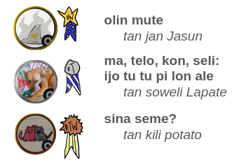

# utala musi lipu #MAMTT/#LTW/#LL

jan Lakuse li toki wawa e ni tawa kulupu pi toki pona: o pana e lipu sulisina e lipu lili sina tawa mi a! lipu o toki pona e ijo musi pi lon ala. [sina ken lukin e ale pi toki wile ona lon ni](/lawa/lawa-tok.md).

kulupu li pana e lipu lili  <abbr title="15">LLL</abbr>!

kulupu li pana e lipu suli <abbr title="14">LLTT</abbr>!

jan Tepo en jan Lakuse li pana e ona ale tawa lipu ni 'utala.pona.la' la kulupu li ken lukin e lipu. 

sina wile la o lukin [nasin pi pana pilin](/pana-pilin/pilin_tok.md).

## lipu seme li pona nanpa wan tawa kulupu?

### lipu lili musi

<ol>
  <li><a href="lipu-lili.html#olin-mute">olin mute</a> tan jan Jasun</li>
  <li><a href="lipu-lili.html#ma-kon-telo-seli">ma, telo, kon, seli: ijo tu tu pi lon ale</a>, tan soweli Lapate</li>
  <li><a href="lipu-lili.html#sina-seme">sina seme?</a>, tan kili potato</li>
</ol>

### lipu suli musi

<ol>
  <li><a href="lipu-suli/mi-jan.html">mi jan</a>, tan jan Seko</li>
  <li><a href="lipu-suli/mi-wile-e-sona-sin">mi wile e sona sin</a>, tan jan Sepulon</li>
  <li><a href="lipu-suli/jan-Eto-li-alasa-e-pipi.html">jan Eto li alasa e pipi</a>, tan lipamanka</li>
</ol>

## suno pi toki pona

suno pi toki pona la jan Lakuse li toki e pona pi lipu ale li toki e ni: lipu seme li pona nanpa wan!

[sina ken kute e toki ona pi suno pi toki pona kepeken ilo Jutu](https://youtu.be/m58ZTYwzj2g?list=PLjOmpMyMxd8SrubgbRcfuUxOpmToxq5Go). kin la sina ken lukin e ni: [jan Lakuse li toki la ona li pana lukin e seme](https://docs.google.com/presentation/d/1nq6vQW3883FbQY5isBta0DrT3HWoJfMnnNrrMNzaweg/edit#slide=id.g2f13b6126c9_2_117). 

[nasin CC-BY-SA 4.0](https://creativecommons.org/licenses/by-sa/4.0/) li lawa e lipu ale

<h2><a href="lipu-lili.html">o lukin e lipu lili ale lon ni</a></h2>

## o lukin e lipu suli ale lon ni:




























