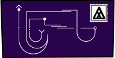
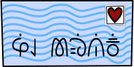
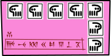
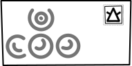
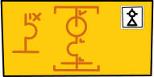
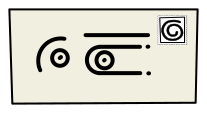
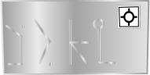

## 0

mi open e lukin&#x3000; &#x3000;&#x3000;&#x3000;suno li sin&#x3000; &#x3000;&#x3000;&#x3000;ale li sin&#x3000; &#x3000;ni li tenpo pona&#x3000; mi wile pali

mi pana e len pali tawa(mi)&#x3000; mi jo e poki pali pona&#x3000; mi pana e supa len tawa lawa mi&#x3000; ona li musi tawa lukin la&#x3000; &#x3000;&#x3000;&#x3000;&#x3000;&#x3000;ale li sona e mi pali

mi open e lupa&#x3000; &#x3000;&#x3000;&#x3000;suno li pona&#x3000; &#x3000;&#x3000;&#x3000;kon li pona&#x3000; &#x3000;mi wile tawa pali&#x3000; lawa li wile toki tawa(mi)

tomo mute ala li lon poka&#x3000; &#x3000;ma li lili&#x3000; insa ma la&#x3000; &#x3000;&#x3000;telo li tawa&#x3000; &#x3000;&#x3000;&#x3000;li poka tu e ma

* →1&#x3000;</a><a href="#W">mi tawa poka pi(telo lili)</a>
* →2&#x3000;</a><a href="#T">mi tawa sewi nena</a>
* →3&#x3000;</a><a href="#TW">mi tawa anpa nena</a>
* →4&#x3000;</a><a href="#TT">mi tawa weka telo</a>
* →5&#x3000;</a><a href="#L">mi tawa poka pi(telo suli)</a>

## 1

noka pi(pilin+pona) la mi tawa&#x3000; &#x3000;mi kama lon poka telo&#x3000; &#x3000;&#x3000;&#x3000;&#x3000;ona li tawa-pona lon poka mi&#x3000; &#x3000;mi awen tawa la&#x3000; &#x3000;&#x3000;&#x3000;&#x3000;mi kama lon tomo

mi mu mu1&#x3000; &#x3000;te mu to&#x3000; kute la kalama li kama tan insa&#x3000; &#x3000;ona mu1&#x3000; &#x3000;&#x3000;&#x3000; te ken ala to&#x3000; a taso ni li lon ala wile mi&#x3000; &#x3000;mi mu1&#x3000; &#x3000;&#x3000;&#x3000;te ken seme li ala seme to&#x3000; ona mu1 te mi ken ala toki tawa(sina)&#x3000; &#x3000;&#x3000;&#x3000;mi pali a mute&#x3000; &#x3000;&#x3000;&#x3000;mi pali a suli&#x3000; &#x3000;&#x3000;&#x3000;ike la pini li kama ala&#x3000; &#x3000;&#x3000;&#x3000;o weka to

a&#x3000; &#x3000;ona li wile+ala e mi

* →2&#x3000;</a><a href="#T">mi tawa sewi nena</a>
* →3&#x3000;</a><a href="#TW">mi tawa anpa nena</a>
* →4&#x3000;</a><a href="#TT">mi tawa weka telo</a>
* →5&#x3000;</a><a href="#L">mi tawa poka pi(telo suli)</a>

## 2

&#x3000;&#x3000;&#x3000;&#x3000;nena li suli sewi&#x3000; taso mi en noka mi li ken a&#x3000; wawa la mi awen tawa sewi

&#x3000;sewi la pipi li lon

* →6&#x3000;</a><a onclick="document.getElementById('lipuale').classList.add('jolipu')" href="#LW">mi toki tawa(pipi)</a>

## 3 

&#x3000;&#x3000;nena li suli sewi&#x3000; taso anpa nena li wile+ala e wawa&#x3000; mi kama lon poka nena la&#x3000; &#x3000;&#x3000;&#x3000;&#x3000;&#x3000;tomo li lon

tomo li sama poki mute&#x3000; poki wan li lon sewi pi(poki ante)&#x3000; &#x3000;&#x3000;li lon poka poki&#x3000; &#x3000;&#x3000;li lon anpa poki&#x3000; mute a&#x3000; lupa mute kin li lon tomo

mi kama lon poka tomo la mi mu mu1&#x3000; &#x3000;&#x3000;te mu to&#x3000; lupa li kama open&#x3000; tawa lupa la&#x3000; &#x3000;&#x3000;mi lukin&#x3000; lon lupa la&#x3000; &#x3000;&#x3000;jan li lukin e mi&#x3000; tan lupa la&#x3000; &#x3000;&#x3000;soweli mute mute mute li kama&#x3000; soweli li lon ale&#x3000; &#x3000;li luka e noka mi &#x3000; &#x3000;li alasa e kasi poka &#x3000; &#x3000;li pana e selo-ona tawa jan lupa &#x3000; &#x3000;li lon poka tomo &#x3000; &#x3000;li lon sewi tomo &#x3000; &#x3000;li lon monsi mi &#x3000; &#x3000;li lon lawa pi(jan tomo) &#x3000; &#x3000;li seli e sijelo ona lon suno &#x3000; &#x3000;li mu &#x3000; &#x3000;li kalama ala &#x3000; &#x3000;li wile moku &#x3000; &#x3000;li lape taso &#x3000; &#x3000;li tawa wawa &#x3000; &#x3000;li tawa(insa tomo) &#x3000; &#x3000;li utala lili &#x3000; &#x3000;li pakala e poki kiwen kasi &#x3000; &#x3000;li pana e ko jaki2 &#x3000; &#x3000;li weka e kasi tan uta&#x3000; mute a

jan mu1&#x3000; &#x3000;&#x3000;te lon a&#x3000; &#x3000;&#x3000;&#x3000;mu to&#x3000; ona li awen lukin e mi&#x3000; &#x3000;li lawa e soweli ale kepeken tawa luka wan taso&#x3000; soweli li tawa(insa tomo)&#x3000; &#x3000;&#x3000;&#x3000;&#x3000;anu seme&#x3000; soweli li tawa pi(wawa ala)&#x3000; tenpo la ona li ken tawa insa

jan li lukin

* →7&#x3000;</a><a href="#LT">mi toki tawa(jan)</a>
* →8&#x3000;</a><a href="#LTW">mi tawa poka pi(telo lili)</a>
* →2&#x3000;</a><a href="#T">mi tawa sewi nena</a>
* →4&#x3000;</a><a href="#TT">mi tawa weka telo</a>
* →5&#x3000;</a><a href="#L">mi tawa poka pi(telo suli)</a>

## 4

selo ma la&#x3000; &#x3000;&#x3000;mi ken lukin e tomo wan&#x3000; &#x3000;mi tawa(ona)&#x3000; mi weka tan telo la&#x3000; &#x3000;&#x3000;&#x3000;&#x3000;mi kama lon tomo pi(selo ma

mi mu mu1&#x3000; &#x3000;&#x3000;&#x3000;te mu to&#x3000; mi awen&#x3000; &#x3000;a&#x3000; tenpo la kalama li lon insa tomo&#x3000; lupa poka li open lili&#x3000; toki li kama mu1&#x3000; &#x3000;&#x3000;&#x3000;te toki a&#x3000;&#x3000; &#x3000;&#x3000;&#x3000;&#x3000;lupa mi li pakala lili&#x3000;</a> to

mi ken ala kute pona e ona&#x3000; mi mu1&#x3000; &#x3000;&#x3000;te o toki sin to&#x3000; ona mu1 &#x3000; &#x3000;&#x3000;te a sina ken ala kute pona e mi anu seme&#x3000;</a> to

mi kama ala ken toki tawa ona

* →1&#x3000;</a><a href="#W">mi tawa poka pi(telo lili)</a>
* →2&#x3000;</a><a href="#T">mi tawa sewi nena</a>
* →3&#x3000;</a><a href="#TW">mi tawa anpa nena</a>
* →4&#x3000;</a><a href="#TT">mi tawa weka telo</a>
* →9&#x3000;</a><a href="#LTT">mi tawa poka pi(telo suli)</a>

## 5
kon li tawa lili e len mi&#x3000; &#x3000;mi tawa telo&#x3000; &#x3000;mi awen tawa lon poka telo&#x3000; &#x3000;sama la&#x3000; &#x3000;&#x3000;telo li tawa lon poka mi&#x3000; mi mu1&#x3000; &#x3000;&#x3000;te telo o&#x3000; &#x3000;&#x3000;&#x3000;toki to&#x3000; telo li kalama suwi

mi kama lon poka nasin&#x3000; nasin li pini lon selo telo la&#x3000; &#x3000;&#x3000;&#x3000;&#x3000;&#x3000;&#x3000;sinpin li lon&#x3000; poka telo ante la&#x3000; &#x3000;&#x3000;&#x3000;sinpin sama en nasin ante li lon&#x3000; &#x3000;sinpin ni tu li ken kama supa&#x3000; &#x3000;&#x3000;&#x3000;&#x3000;li ken nasin lon sewi telo&#x3000; &#x3000;&#x3000;&#x3000;&#x3000;li ken wan e nasin tu&#x3000; taso ona li sinpin&#x3000; mi ken ala tawa poka telo ante&#x3000; tomo+lili li lon poka sinpin

ni li tomo pi(lawa nasin&#x3000; ilo insa li ken supa e sinpin&#x3000; ilo la tonsi li lape suwi

* →10&#x3000;</a><a href="#LL">mi wile pini e lape-pona ona</a>
* →1&#x3000;</a><a href="#W">mi tawa poka pi(telo lili)</a>
* →2&#x3000;</a><a href="#T">mi tawa sewi nena</a>
* →3&#x3000;</a><a href="#TW">mi tawa anpa nena</a>
* →4&#x3000;</a><a href="#TT">mi tawa weka telo</a>

## 6
mi mu1&#x3000; &#x3000;&#x3000;te toki&#x3000; &#x3000;&#x3000;&#x3000;pipi o to&#x3000; pipi mu1&#x3000; &#x3000;&#x3000;te&#x3000;a sina lon&#x3000; &#x3000;&#x3000;sina lon la o kute pona&#x3000; &#x3000;&#x3000;sina kute pona la lipu mute li tawa(mi)&#x3000; &#x3000;&#x3000;lipu li tawa mi la mi jo e lipu mute&#x3000; &#x3000;&#x3000;mi jo e lipu la lipu li toki e nimi&#x3000; &#x3000;&#x3000;lipu li toki la nimi li toki e tomo&#x3000; &#x3000;&#x3000;nimi li toki la lipu li wile tawa tomo nimi&#x3000; &#x3000;&#x3000;lipu li wile la o pana e ona ale tawa tomo wile ona&#x3000; &#x3000;&#x3000;sina pana e ona la pali sina li pini&#x3000;to</a>

ni li pali mi&#x3000; mi mu1&#x3000; &#x3000;&#x3000;te pona&#x3000; &#x3000;&#x3000;&#x3000;mi open e pali to&#x3000; pipi mu1&#x3000; &#x3000;&#x3000;te&#x3000;o awen&#x3000; &#x3000;&#x3000;&#x3000;sina awen la o kute&#x3000; &#x3000;&#x3000;&#x3000;sina kute la o pana ala e lipu tawa tomo pi(wile ala)&#x3000;to</a>

lon&#x3000; mi mu1&#x3000; &#x3000;&#x3000;te mi sona e pali to&#x3000; pipi mu1&#x3000; &#x3000;&#x3000;te &#x3000;sina sona la o pali &#x3000;to</a>

mi jo e →lipuwile&#x3000;</a><a href="#lipuwile">lipu mute</a></a>lipu mute</a>

* →11&#x3000;</a><a href="#LLW">mi tawa poka pi(telo lili)</a>
* →12&#x3000;</a><a href="#LLT">mi tawa anpa nena</a>
* →13&#x3000;</a><a href="#LLTW">mi tawa weka telo</a>
* →14&#x3000;</a><a href="#LLTT">mi tawa poka pi(telo suli)</a>

## 7

mi mu1&#x3000; &#x3000;&#x3000;te a tomo sina li pona to&#x3000; ona li lukin e mi mu1&#x3000; &#x3000;&#x3000;&#x3000;&#x3000;&#x3000;te a ona li ken jo e ijo+mi mute ale to&#x3000; ona li awen lukin

* →15&#x3000;</a><a href="#LLL">te o toki e soweli sina ale to</a>
* →16&#x3000;</a><a href="#LLLW">te o toki e sina to</a>
* →8&#x3000;</a><a href="#LTW">mi tawa poka pi(telo lili)</a>
* →2&#x3000;</a><a href="#T">mi tawa sewi nena</a>
* →4&#x3000;</a><a href="#TT">mi tawa weka telo</a>
* →5&#x3000;</a><a href="#L">mi tawa poka pi(telo suli)</a>

## 8

noka pi(pilin+pona) la mi tawa&#x3000; &#x3000;mi kama lon poka telo&#x3000; &#x3000;ona li tawa-pona lon poka mi&#x3000; mi awen tawa la&#x3000; &#x3000;&#x3000;mi kama lon tomo

mi mu mu1&#x3000; &#x3000;&#x3000;&#x3000;te mu to&#x3000; kute la kalama li kama tan insa&#x3000; ona mu1&#x3000; &#x3000;&#x3000;te ken ala to&#x3000; a taso ni li lon ala wile mi&#x3000; mi mu1&#x3000; &#x3000;&#x3000;te ken seme li ala seme to&#x3000; ona mu1&#x3000; &#x3000;&#x3000; te mi ken ala toki tawa(sina)&#x3000; &#x3000;&#x3000;&#x3000;mi pali a mute&#x3000; &#x3000;&#x3000;&#x3000;mi pali a suli&#x3000; &#x3000;&#x3000;&#x3000;ike la pini li kama ala&#x3000; &#x3000;&#x3000;&#x3000;o weka to

&#x3000;a&#x3000; ona li wile+ala e mi

ilo waso li tawa lon sewi&#x3000; &#x3000;&#x3000;&#x3000;&#x3000;kepeken kalama

* →17&#x3000;</a><a href="#LLLT">mi lukin toki tawa waso ilo</a>
* →1&#x3000;</a><a href="#W">mi tawa poka pi(telo lili)</a>
* →2&#x3000;</a><a href="#T">mi tawa sewi nena</a>
* →3&#x3000;</a><a href="#TW">mi tawa anpa nena</a>
* →4&#x3000;</a><a href="#TT">mi tawa weka telo</a>
* →5&#x3000;</a><a href="#L">mi tawa poka pi(telo suli)</a>

## 9

kon li tawa lili e len mi&#x3000; &#x3000;mi tawa telo&#x3000; &#x3000;mi awen tawa lon poka telo&#x3000; sama la&#x3000; &#x3000;telo li tawa lon poka mi&#x3000; mi mu1&#x3000; &#x3000;&#x3000;te telo o&#x3000; &#x3000;&#x3000;&#x3000;toki to&#x3000; telo li kalama suwi

mi kama lon poka nasin&#x3000; nasin li pini lon selo telo la&#x3000; &#x3000;&#x3000;&#x3000;&#x3000;&#x3000;&#x3000;sinpin li lon&#x3000; poka telo ante la&#x3000; &#x3000;&#x3000;&#x3000;sinpin sama en nasin ante li lon&#x3000; sinpin ni tu li ken kama supa&#x3000; &#x3000;&#x3000;&#x3000;li ken nasin lon sewi telo &#x3000; &#x3000;&#x3000;&#x3000;li ken wan e nasin tu&#x3000; taso ona li sinpin&#x3000; mi ken ala tawa poka telo ante&#x3000; tomo+lili li lon poka sinpin

ni li tomo pi(lawa nasin&#x3000; ilo insa li ken supa e sinpin&#x3000; ilo la tonsi li lape suwi

ilo waso li tawa lon sewi kepeken kalama

* →10&#x3000;</a><a href="#LL">mi wile pini e lape-pona tonsi</a>
* →18&#x3000;</a><a href="#LLLTW">mi lukin toki tawa(waso ilo)</a>
* →1&#x3000;</a><a href="#W">mi tawa poka pi(telo lili)</a>
* →2&#x3000;</a><a href="#T">mi tawa sewi nena</a>
* →3&#x3000;</a><a href="#TW">mi tawa anpa nena</a>
* →4&#x3000;</a><a href="#TT">mi tawa weka telo</a>

## 10

mi luka wawa kalama e selo tomo&#x3000; &#x3000;tomo li tawa lili&#x3000; &#x3000;&#x3000;li kalama&#x3000; taso lape li wawa&#x3000; &#x3000;&#x3000;li awen&#x3000; kalama mi taso li ken ala pakala e lape

* →1&#x3000;</a><a href="#W">mi tawa poka pi(telo lili)</a>
* →2&#x3000;</a><a href="#T">mi tawa sewi nena</a>
* →3&#x3000;</a><a href="#TW">mi tawa anpa nena</a>
* →4&#x3000;</a><a href="#TT">mi tawa weka telo</a>

## 11

noka pi(pilin+pona) la&#x3000; &#x3000;&#x3000;&#x3000;&#x3000;mi tawa&#x3000; mi kama lon poka telo&#x3000; ona li tawa-pona lon poka mi&#x3000; mi awen tawa la mi kama lon tomo

mi mu mu1&#x3000; &#x3000;&#x3000;&#x3000;te mu to&#x3000; kute la kalama li kama tan insa&#x3000; ona mu1&#x3000; &#x3000;&#x3000;te mi ken ala toki tawa(sina)&#x3000; &#x3000;&#x3000;&#x3000;pali mute li lon&#x3000; &#x3000;&#x3000;&#x3000;mi pali&#x3000; &#x3000;&#x3000;&#x3000;mi awen pali to

* →19&#x3000;</a><a href="#LLLTT">te sina pali seme to</a>
* →20&#x3000;</a><a href="#M">mi pana e lipu tawa(ona)</a>
* →12&#x3000;</a><a href="#LLT">mi tawa anpa nena</a>
* →13&#x3000;</a><a href="#LLTW">mi tawa weka telo</a>
* →14&#x3000;</a><a href="#LLTT">mi tawa poka pi(telo suli)</a>

## 12

&#x3000;&#x3000;nena li suli sewi&#x3000; taso anpa nena li wile+ala e wawa&#x3000; mi kama lon poka nena la&#x3000; &#x3000;&#x3000;&#x3000;&#x3000;&#x3000;tomo li lon

tomo li sama poki mute&#x3000; poki wan li lon sewi pi(poki ante)&#x3000; &#x3000;&#x3000;li lon poka poki&#x3000; &#x3000;&#x3000;li lon anpa poki&#x3000; mute a&#x3000; lupa mute kin li lon tomo

mi kama lon poka tomo la&#x3000; &#x3000;&#x3000;&#x3000;&#x3000;&#x3000;mi mu mu1&#x3000; &#x3000;te mu to&#x3000; lupa li kama open&#x3000; tawa lupa la&#x3000; &#x3000;&#x3000;mi lukin&#x3000; lon lupa la&#x3000; &#x3000;&#x3000;jan li lukin e mi&#x3000; tan lupa la&#x3000; &#x3000;&#x3000;soweli mute mute mute li kama&#x3000; soweli li lon ale &#x3000; &#x3000;li luka e noka mi&#x3000; &#x3000;li alasa e kasi poka&#x3000; &#x3000;li pana e selo-ona tawa jan lupa&#x3000; &#x3000;li lon poka tomo&#x3000; &#x3000;li lon sewi tomo&#x3000; &#x3000;li lon monsi mi&#x3000; &#x3000;li lon lawa pi(jan tomo)&#x3000; &#x3000;li seli e sijelo ona lon suno&#x3000; &#x3000;li mu&#x3000; &#x3000;li kalama ala&#x3000; &#x3000;li wile moku&#x3000; &#x3000;li lape taso&#x3000; &#x3000;li tawa wawa&#x3000; &#x3000;li tawa(insa tomo)&#x3000; &#x3000;li utala lili&#x3000; &#x3000;li pakala e poki kiwen kasi&#x3000; &#x3000;li pana e ko jaki3&#x3000; &#x3000;li weka e kasi tan uta&#x3000; mute a

ona mu1 &#x3000; &#x3000;&#x3000;te lon a&#x3000; &#x3000;&#x3000;&#x3000;mu to&#x3000; ona li lawa e soweli ale kepeken tawa luka wan taso&#x3000; soweli li tawa(insa tomo)&#x3000; &#x3000;&#x3000;&#x3000;&#x3000;anu seme&#x3000; soweli li tawa pi(wawa ala&#x3000; tenpo la ona li ken tawa insa

<ul><li>→21&#x3000;</a><a href="#MW">mi toki tawa(jan)</a></li>
<li class="lipuloje">→22&#x3000;</a><a href="#MT">mi pana e lipu tawa(jan)</a></li>
<li>→11&#x3000;</a><a href="#LLW">mi tawa poka pi(telo lili)</a></li>
<li>→12&#x3000;</a><a href="#LLT">mi tawa anpa nena</a></li>
<li>→13&#x3000;</a><a href="#LLTW">mi tawa weka telo</a></li>
<li>→23&#x3000;</a><a href="#MTW">mi tawa poka pi(telo suli)</a></li></ul>

## 13

selo ma la&#x3000; &#x3000;&#x3000;mi ken lukin e tomo wan&#x3000; mi tawa(ona)&#x3000; mi weka tan telo la&#x3000; &#x3000;&#x3000;&#x3000;&#x3000;mi kama lon tomo pi(selo ma

mi mu mu1&#x3000; &#x3000;&#x3000;&#x3000;te mu to&#x3000; mi awen&#x3000; &#x3000;&#x3000;a&#x3000; tenpo la kalama li lon insa tomo&#x3000; lupa poka li kama open&#x3000; insa la&#x3000; &#x3000;linja mute li lon&#x3000; &#x3000;&#x3000;&#x3000;li lukin e mi&#x3000; ona mu1 &#x3000; &#x3000;&#x3000;te a toki to

<ul><li>→24&#x3000;</a><a href="#MTT">mi toki tawa linja mute</a></li>
<li class="lipupimeja">→25&#x3000;</a><a href="#ML">mi pana e lipu tawa(linja mute)</a></li>
<li>→26&#x3000;</a><a href="#MLW">mi tawa poka pi(telo lili)</a></li>
<li>→12&#x3000;</a><a href="#LLT">mi tawa anpa nena</a></li>
<li>→14&#x3000;</a><a href="#LLTT">mi tawa poka pi(telo suli)</a></li></ul>

## 14

kon li tawa lili e len mi&#x3000; &#x3000;mi tawa telo&#x3000; &#x3000;mi awen tawa lon poka telo&#x3000; sama la&#x3000; &#x3000;telo li tawa lon poka mi&#x3000; mi mu1&#x3000; &#x3000;te telo o&#x3000; &#x3000;&#x3000;toki to&#x3000; telo li kalama suwi

mi kama lon poka nasin&#x3000; nasin li pini lon selo telo la&#x3000; &#x3000;&#x3000;&#x3000;&#x3000;&#x3000;&#x3000;sinpin li lon&#x3000; poka telo ante la&#x3000; &#x3000;&#x3000;&#x3000;sinpin sama en nasin ante li lon&#x3000; sinpin ni tu li ken kama supa&#x3000; &#x3000;&#x3000;&#x3000;li ken nasin lon sewi telo&#x3000; &#x3000;&#x3000;&#x3000;li ken wan e nasin tu&#x3000; taso ona li sinpin&#x3000; mi ken ala tawa poka telo ante&#x3000; tomo+lili li lon poka sinpin

ni li tomo pi(lawa nasin&#x3000; ilo insa li ken supa e sinpin&#x3000; ilo la tonsi li lape suwi

* →27&#x3000;</a><a href="#MLT">mi wile pini e lape-pona ona</a>
* →46&#x3000;</a><a href="#MMLW">mi pana e lipu tawa(ona)</a>
* →11&#x3000;</a><a href="#LLW">mi tawa poka pi(telo lili)</a>
* →12&#x3000;</a><a href="#LLT">mi tawa anpa nena</a>
* →13&#x3000;</a><a href="#LLTW">mi tawa weka telo</a>

## 15

ona li lukin e mi mu1&#x3000; &#x3000;te ona li soweli pona&#x3000; &#x3000;&#x3000;soweli pi(pona mute&#x3000; &#x3000;&#x3000;soweli pona mute&#x3000; &#x3000;&#x3000;mi pana e nimi tawa ona ale&#x3000; &#x3000;&#x3000;ona li soweli [wan:weka.li:]&#x3000; &#x3000;&#x3000;&#x3000;li soweli [tu:weka.li:]&#x3000; &#x3000;&#x3000;&#x3000;li soweli [tu:wan:weka.li:]&#x3000; &#x3000;&#x3000;&#x3000;li soweli [tu:tu:weka.li:]&#x3000; &#x3000;&#x3000;&#x3000;li soweli [luka:weka.li:]&#x3000; &#x3000;&#x3000;&#x3000;li soweli [luka:wan:weka.li:]&#x3000; &#x3000;&#x3000;&#x3000;li soweli [luka:tu:weka.li:]&#x3000; &#x3000;&#x3000;&#x3000;li soweli [luka:tu:wan:weka.li:]&#x3000; &#x3000;&#x3000;&#x3000;li soweli [luka:tu:tu:weka.li:]&#x3000; &#x3000;&#x3000;&#x3000;li soweli [luka:luka:weka.li:]&#x3000; &#x3000;&#x3000;&#x3000;li soweli [luka:luka:wan:weka.li:]&#x3000; &#x3000;&#x3000;&#x3000;li soweli [luka:luka:tu:weka.li:]&#x3000; &#x3000;&#x3000;&#x3000;li soweli [luka:luka:tu:wan:weka.li:]&#x3000; &#x3000;&#x3000;&#x3000;li soweli [luka:luka:tu:tu:weka.li:]&#x3000; &#x3000;&#x3000;&#x3000;li soweli [luka:luka:luka:weka.li:]&#x3000; &#x3000;&#x3000;&#x3000;li soweli [luka:luka:luka:wan:weka.li:]&#x3000; &#x3000;&#x3000;&#x3000;li soweli [luka:luka:luka:tu:weka.li:]&#x3000; &#x3000;&#x3000;&#x3000;li soweli [luka:luka:luka:tu:wan:weka.li:]&#x3000; &#x3000;&#x3000;&#x3000;li soweli [luka:luka:luka:tu:tu:weka.li:]&#x3000; &#x3000;&#x3000;&#x3000;li soweli [mute:weka.li:]&#x3000; &#x3000;&#x3000;&#x3000;li soweli [mute:wan:weka.li:]&#x3000; &#x3000;&#x3000;&#x3000;li soweli [mute:tu:weka.li:]&#x3000; &#x3000;&#x3000;&#x3000;li soweli [mute:tu:wan:weka.li:]&#x3000; &#x3000;&#x3000;&#x3000;li soweli [mute:tu:tu:weka.li:]&#x3000; &#x3000;&#x3000;&#x3000;li soweli [mute:luka:weka.li:]&#x3000; &#x3000;&#x3000;&#x3000;li soweli [mute:luka:wan:weka.li:]&#x3000; &#x3000;&#x3000;&#x3000;li soweli [mute:luka:tu:weka.li:]&#x3000; &#x3000;&#x3000;&#x3000;li soweli [mute:luka:tu:wan:weka.li:]&#x3000; &#x3000;&#x3000;&#x3000;li soweli [mute:luka:tu:tu:weka.li:]&#x3000; &#x3000;&#x3000;&#x3000;li soweli [mute:luka:luka:weka.li:]&#x3000; &#x3000;&#x3000;&#x3000;li soweli [mute:luka:luka:wan:weka.li:]&#x3000; &#x3000;&#x3000;&#x3000;li soweli [mute:luka:luka:tu:weka.li:]&#x3000; &#x3000;&#x3000;&#x3000;li soweli [mute:luka:luka:tu:wan:weka.li:]&#x3000; &#x3000;&#x3000;&#x3000;li soweli [mute:luka:luka:tu:tu:weka.li:]&#x3000; &#x3000;&#x3000;&#x3000;li soweli [mute:luka:luka:luka:weka.li:]&#x3000; &#x3000;&#x3000;&#x3000;li soweli [mute:luka:luka:luka:wan:weka.li:]&#x3000; &#x3000;&#x3000;&#x3000;li soweli [mute:luka:luka:luka:tu:weka.li:]&#x3000; &#x3000;&#x3000;&#x3000;li soweli [mute:luka:luka:luka:tu:wan:weka.li:]&#x3000; &#x3000;&#x3000;&#x3000;li soweli [mute:luka:luka:luka:tu:tu:weka.li:]&#x3000; &#x3000;&#x3000;&#x3000;li soweli [mute:mute:weka.li:]&#x3000; &#x3000;&#x3000;&#x3000;li soweli [mute:mute:wan:weka.li:]&#x3000; &#x3000;&#x3000;&#x3000;li soweli [mute:mute:tu:weka.li:]&#x3000; &#x3000;&#x3000;&#x3000;li soweli [mute:mute:tu:wan:weka.li:]&#x3000; &#x3000;&#x3000;&#x3000;li soweli [mute:mute:tu:tu:weka.li:]&#x3000; &#x3000;&#x3000;&#x3000;li soweli [mute:mute:luka:weka.li:]&#x3000; &#x3000;&#x3000;&#x3000;li soweli [mute:mute:luka:wan:weka.li:]&#x3000; &#x3000;&#x3000;&#x3000;li soweli [mute:mute:luka:tu:weka.li:]&#x3000; &#x3000;&#x3000;&#x3000;li soweli [mute:mute:luka:tu:wan:weka.li:]&#x3000; &#x3000;&#x3000;&#x3000;li soweli [mute:mute:luka:tu:tu:weka.li:]&#x3000; &#x3000;&#x3000;&#x3000;li soweli [mute:mute:luka:luka:weka.li:]&#x3000; &#x3000;&#x3000;&#x3000;li soweli [mute:mute:luka:luka:wan:weka.li:]&#x3000; &#x3000;&#x3000;&#x3000;li soweli [mute:mute:luka:luka:tu:weka.li:]&#x3000; &#x3000;&#x3000;&#x3000;li soweli [mute:mute:luka:luka:tu:wan:weka.li:]&#x3000; &#x3000;&#x3000;&#x3000;li soweli [mute:mute:luka:luka:tu:tu:weka.li:]&#x3000; &#x3000;&#x3000;&#x3000;li soweli [mute:mute:luka:luka:luka:weka.li:]&#x3000; &#x3000;&#x3000;&#x3000;li soweli [mute:mute:luka:luka:luka:wan:weka.li:]&#x3000; &#x3000;&#x3000;&#x3000;li soweli [mute:mute:luka:luka:luka:tu:weka.li:]&#x3000; &#x3000;&#x3000;&#x3000;li soweli [mute:mute:luka:luka:luka:tu:wan:weka.li:]&#x3000; &#x3000;&#x3000;&#x3000;li soweli [mute:mute:luka:luka:luka:tu:tu:weka.li:]&#x3000; &#x3000;&#x3000;&#x3000;li soweli [mute:mute:mute:weka.li:]&#x3000; &#x3000;&#x3000;&#x3000;li soweli [mute:mute:mute:wan:weka.li:]&#x3000; &#x3000;&#x3000;&#x3000;li soweli [mute:mute:mute:tu:weka.li:]&#x3000; &#x3000;&#x3000;&#x3000;li soweli [mute:mute:mute:tu:wan:weka.li:]&#x3000; &#x3000;&#x3000;&#x3000;li soweli [mute:mute:mute:tu:tu:weka.li:]&#x3000; &#x3000;&#x3000;&#x3000;li soweli [mute:mute:mute:luka:weka.li:]&#x3000; &#x3000;&#x3000;&#x3000;li soweli [mute:mute:mute:luka:wan:weka.li:]&#x3000; &#x3000;&#x3000;&#x3000;li soweli [mute:mute:mute:luka:tu:weka.li:]&#x3000; &#x3000;&#x3000;&#x3000;li soweli [mute:mute:mute:luka:tu:wan:weka.li:]&#x3000; &#x3000;&#x3000;&#x3000;li soweli [mute:mute:mute:luka:tu:tu:weka.li:]&#x3000; &#x3000;&#x3000;&#x3000;li soweli [mute:mute:mute:luka:luka:weka.li:]&#x3000; &#x3000;&#x3000;&#x3000;li soweli [mute:mute:mute:luka:luka:wan:weka.li:]&#x3000; &#x3000;&#x3000;&#x3000;li soweli [mute:mute:mute:luka:luka:tu:weka.li:]&#x3000; &#x3000;&#x3000;&#x3000;li soweli [mute:mute:mute:luka:luka:tu:wan:weka.li:]&#x3000; &#x3000;&#x3000;&#x3000;li soweli [mute:mute:mute:luka:luka:tu:tu:weka.li:]&#x3000; &#x3000;&#x3000;&#x3000;li soweli [mute:mute:mute:luka:luka:luka:weka.li:]&#x3000; &#x3000;&#x3000;&#x3000;li soweli [mute:mute:mute:luka:luka:luka:wan:weka.li:]&#x3000; &#x3000;&#x3000;&#x3000;li soweli [mute:mute:mute:luka:luka:luka:tu:weka.li:]&#x3000; &#x3000;&#x3000;&#x3000;li soweli [mute:mute:mute:luka:luka:luka:tu:wan:weka.li:]&#x3000; &#x3000;&#x3000;&#x3000;li soweli [mute:mute:mute:luka:luka:luka:tu:tu:weka.li:]&#x3000; &#x3000;&#x3000;&#x3000;li soweli [mute:mute:mute:mute:weka.li:]&#x3000; &#x3000;&#x3000;&#x3000;li soweli [mute:mute:mute:mute:wan:weka.li:]&#x3000; &#x3000;&#x3000;&#x3000;li soweli [mute:mute:mute:mute:tu:weka.li:]&#x3000; &#x3000;&#x3000;&#x3000;li soweli [mute:mute:mute:mute:tu:wan:weka.li:]&#x3000; &#x3000;&#x3000;&#x3000;li soweli [mute:mute:mute:mute:tu:tu:weka.li:]&#x3000; &#x3000;&#x3000;&#x3000;li soweli [mute:mute:mute:mute:luka:weka.li:]&#x3000; &#x3000;&#x3000;&#x3000;li soweli [mute:mute:mute:mute:luka:wan:weka.li:]&#x3000; &#x3000;&#x3000;&#x3000;li soweli [mute:mute:mute:mute:luka:tu:weka.li:]&#x3000; &#x3000;&#x3000;&#x3000;li soweli [mute:mute:mute:mute:luka:tu:wan:weka.li:]&#x3000; &#x3000;&#x3000;&#x3000;li soweli [mute:mute:mute:mute:luka:tu:tu:weka.li:]&#x3000; &#x3000;&#x3000;&#x3000;li soweli [mute:mute:mute:mute:luka:luka:weka.li:]&#x3000; &#x3000;&#x3000;&#x3000;li soweli [mute:mute:mute:mute:luka:luka:wan:weka.li:]&#x3000; &#x3000;&#x3000;&#x3000;li soweli [mute:mute:mute:mute:luka:luka:tu:weka.li:]&#x3000; &#x3000;&#x3000;&#x3000;li soweli [mute:mute:mute:mute:luka:luka:tu:wan:weka.li:]&#x3000; &#x3000;&#x3000;&#x3000;li soweli [mute:mute:mute:mute:luka:luka:tu:tu:weka.li:]&#x3000; &#x3000;&#x3000;&#x3000;li soweli [mute:mute:mute:mute:luka:luka:luka:weka.li:]&#x3000; &#x3000;&#x3000;&#x3000;li soweli [mute:mute:mute:mute:luka:luka:luka:wan:weka.li:]&#x3000; &#x3000;&#x3000;&#x3000;li soweli [mute:mute:mute:mute:luka:luka:luka:tu:weka.li:]&#x3000; &#x3000;&#x3000;&#x3000;li soweli [mute:mute:mute:mute:luka:luka:luka:tu:wan:weka.li:]&#x3000; &#x3000;&#x3000;&#x3000;li soweli [mute:mute:mute:mute:luka:luka:luka:tu:tu:weka.li:] to

* →16&#x3000;</a><a href="#LLLW">te o toki e sina to</a>
* →8&#x3000;</a><a href="#LTW">mi tawa poka pi(telo lili)</a>
* →2&#x3000;</a><a href="#T">mi tawa sewi nena</a>
* →4&#x3000;</a><a href="#TT">mi tawa weka telo</a>
* →5&#x3000;</a><a href="#L">mi tawa poka pi(telo suli)</a>

## 16

ona li kama tawa(mi)&#x3000; mi lukin e lukin ona&#x3000; ona li lukin e lukin mi&#x3000; lukin [soweli..lipu:] li toki mu1&#x3000; &#x3000;&#x3000;te mi jan [soweli..lipu:]&#x3000; &#x3000;&#x3000;&#x3000;tomo mi la soweli en lipu sona li lon to

* →15&#x3000;</a><a href="#LLL">te o toki e soweli sina ale to</a>
* →8&#x3000;</a><a href="#LTW">mi tawa poka pi(telo lili)</a>
* →2&#x3000;</a><a href="#T">mi tawa sewi nena</a>
* →4&#x3000;</a><a href="#TT">mi tawa weka telo</a>
* →5&#x3000;</a><a href="#L">mi tawa poka pi(telo suli)</a>

## 17

ilo waso li tawa lon nasin sike&#x3000; &#x3000;&#x3000;&#x3000;&#x3000;lon sewi ma&#x3000; taso mi mu tawa ona la&#x3000; &#x3000;&#x3000;&#x3000;&#x3000;&#x3000;ilo li ante e nasin&#x3000; &#x3000;&#x3000;&#x3000;&#x3000;&#x3000;&#x3000;li tawa lon sewi mi&#x3000; mi mu1&#x3000; &#x3000;te mu to

waso ilo li toki mu1&#x3000; &#x3000;&#x3000;te a&#x3000; &#x3000;&#x3000;&#x3000;sina anpa o&#x3000; &#x3000;&#x3000;&#x3000;sewi li pona&#x3000; &#x3000;&#x3000;&#x3000;sina ken la&#x3000; &#x3000;&#x3000;&#x3000;&#x3000;&#x3000;o tawa sewi sama mi to&#x3000; mi mu1&#x3000; &#x3000;te mi ken ala&#x3000; &#x3000;&#x3000;mi jo ala e ilo to&#x3000; waso mu1&#x3000; &#x3000;&#x3000;te a to

* →1&#x3000;</a><a href="#W">mi tawa poka pi(telo lili)</a>
* →2&#x3000;</a><a href="#T">mi tawa sewi nena</a>
* →3&#x3000;</a><a href="#TW">mi tawa anpa nena</a>
* →4&#x3000;</a><a href="#TT">mi tawa weka telo</a>
* →5&#x3000;</a><a href="#L">mi tawa poka pi(telo suli)</a>

## 18

ilo waso li tawa lon nasin sike&#x3000; &#x3000;&#x3000;&#x3000;&#x3000;lon sewi ma&#x3000; taso mi mu tawa ona la&#x3000; &#x3000;&#x3000;&#x3000;&#x3000;&#x3000;ilo li ante e nasin&#x3000; &#x3000;&#x3000;&#x3000;&#x3000;&#x3000;&#x3000;li tawa lon sewi mi&#x3000; mi mu1&#x3000; &#x3000;te mu to

waso ilo li toki mu1&#x3000; &#x3000;&#x3000;te a&#x3000; &#x3000;&#x3000;&#x3000;sina anpa o&#x3000; &#x3000;&#x3000;&#x3000;sewi li pona&#x3000; &#x3000;&#x3000;&#x3000;sina ken la o tawa sewi sama mi to&#x3000; mi mu1&#x3000; &#x3000;te mi ken ala&#x3000; &#x3000;&#x3000;mi jo ala e ilo to&#x3000; waso mu1&#x3000; &#x3000;&#x3000;te a to

* →1&#x3000;</a><a href="#W">mi tawa poka pi(telo lili)</a>
* →2&#x3000;</a><a href="#T">mi tawa sewi nena</a>
* →3&#x3000;</a><a href="#TW">mi tawa anpa nena</a>
* →4&#x3000;</a><a href="#TT">mi tawa weka telo</a>
* →5&#x3000;</a><a href="#L">mi tawa poka pi(telo suli)</a>

## 19

pali [wile.len:] li toki mu1&#x3000; &#x3000;&#x3000;te mi jan [wile.len:]&#x3000; &#x3000;&#x3000;&#x3000;mi pali e len&#x3000; &#x3000;&#x3000;&#x3000;mi pona e len&#x3000; &#x3000;&#x3000;&#x3000;mi sin e len&#x3000; &#x3000;&#x3000;&#x3000;mi mama e len&#x3000; &#x3000;&#x3000;&#x3000;ale li wile e len&#x3000; &#x3000;&#x3000;&#x3000;mi ken pali&#x3000; &#x3000;&#x3000;&#x3000;mi pali&#x3000; &#x3000;&#x3000;&#x3000;taso mi jo ala e kule&#x3000; &#x3000;&#x3000;&#x3000;kule ala la&#x3000; &#x3000;&#x3000;&#x3000;&#x3000;&#x3000;pali mi li kama mute&#x3000; &#x3000;&#x3000;&#x3000;mute&#x3000; &#x3000;&#x3000;&#x3000;mute to

* →20&#x3000;</a><a href="#M">mi pana e lipu tawa(ona)</a>
* →12&#x3000;</a><a href="#LLT">mi tawa anpa nena</a>
* →13&#x3000;</a><a href="#LLTW">mi tawa weka telo</a>
* →14&#x3000;</a><a href="#LLTT">mi tawa poka pi(telo suli)</a>

## 20

mi jo e lipu mute lon poki mi&#x3000; mi alasa e lipu

<li class="lipulaso">→28&#x3000;</a><a onclick="weka('laso')" href="#MLTW">mi pana e lipu laso</a></li>
<li class="lipuloje">→29&#x3000;</a><a onclick="weka('loje')" href="#MLTT">mi pana e lipu loje</a></li>
<li class="lipupimeja">→30&#x3000;</a><a onclick="weka('pimeja')" href="#MLL">mi pana e lipu pimeja</a></li>
<li class="lipuwalo">→31&#x3000;</a><a onclick="weka('walo')" href="#MLLW">mi pana e lipu walo</a></li>
<li class="lipujelo">→32&#x3000;</a><a onclick="weka('jelo')" href="#MLLT">mi pana e lipu jelo</a></li>
<li class="lipupiselonasa">→33&#x3000;</a><a onclick="weka('piselonasa')" href="#MLLTW">mi pana e lipu pi(selo nasa</a></li>
<li class="lipusuno">→34&#x3000;</a><a onclick="weka('suno')" href="#MLLTT">mi pana e lipu suno</a></li>
* →35&#x3000;</a><a href="#MLLL">mi pana ala e lipu</a>

## 21

mi mu1 &#x3000; &#x3000;te a tomo sina li pona to&#x3000; ona li lukin e mi mu1&#x3000; &#x3000;&#x3000;te a ona li ken jo e ijo mi mute ale to&#x3000; ona li awen lukin

<ul><li>→36&#x3000;</a><a href="#MLLLW">te o toki e soweli sina ale to</a></li>
<li>→37&#x3000;</a><a href="#MLLLT">te o toki e sina to</a></li>
<li class="lipuloje">→22&#x3000;</a><a href="#MT">mi pana e lipu tawa(ona)</a></li>
<li>→26&#x3000;</a><a href="#MLW">mi tawa poka pi(telo lili)</a></li>
<li>→13&#x3000;</a><a href="#LLTW">mi tawa weka telo</a></li>
<li>→14&#x3000;</a><a href="#LLTT">mi tawa poka pi(telo suli)</a></li></ul>

## 22

mi jo e lipu mute lon poki mi&#x3000; mi alasa e lipu

<li class="lipulaso">→39&#x3000;</a><a onclick="weka('laso')" href="#MLLLTT">mi pana e lipu laso</a></li>
<li class="lipuloje">→40&#x3000;</a><a onclick="weka('loje')" href="#MM">mi pana e lipu loje</a></li>
<li class="lipupimeja">→41&#x3000;</a><a onclick="weka('pimeja')" href="#MMW">mi pana e lipu pimeja</a></li>
<li class="lipuwalo">→42&#x3000;</a><a onclick="weka('walo')" href="#MMT">mi pana e lipu walo</a></li>
<li class="lipujelo">→43&#x3000;</a><a onclick="weka('jelo')" href="#MMTW">mi pana e lipu jelo</a></li>
<li class="lipupiselonasa">→44&#x3000;</a><a onclick="weka('piselonasa')" href="#MMTT">mi pana e lipu pi(selo nasa</a></li>
<li class="lipusuno">→45&#x3000;</a><a onclick="weka('suno')" href="#MML">mi pana e lipu suno</a></li>
* →35&#x3000;</a><a href="#MLLL">mi pana ala e lipu</a>

## 23

kon li tawa lili e len mi&#x3000; &#x3000;mi tawa telo&#x3000; &#x3000;mi awen tawa lon poka telo&#x3000; sama la&#x3000; &#x3000;telo li tawa lon poka mi&#x3000; mi mu1&#x3000; &#x3000;te telo o&#x3000; &#x3000;&#x3000;toki to&#x3000; telo li kalama suwi

mi kama lon poka nasin&#x3000; nasin li pini lon selo telo la&#x3000; &#x3000;&#x3000;&#x3000;&#x3000;&#x3000;&#x3000;sinpin li lon&#x3000; poka telo ante la&#x3000; &#x3000;&#x3000;&#x3000;sinpin sama en nasin ante li lon&#x3000; &#x3000;&#x3000;sinpin ni tu li ken kama supa&#x3000; &#x3000;&#x3000;&#x3000;&#x3000;&#x3000;li ken nasin lon sewi telo&#x3000; &#x3000;&#x3000;&#x3000;&#x3000;&#x3000;li ken wan e nasin tu&#x3000; &#x3000;taso ona li sinpin&#x3000; mi ken ala tawa poka telo ante&#x3000; tomo+lili li lon poka sinpin

ni li tomo pi(lawa nasin&#x3000; ilo insa li ken supa e sinpin&#x3000; ilo la&#x3000; &#x3000;tonsi li lape suwi

ilo waso li tawa lon sewi kepeken kalama

* →27&#x3000;</a><a href="#MLT">mi wile pini e lape-pona tonsi</a>
* →46&#x3000;</a><a href="#MMLW">mi pana e lipu tawa(tonsi)</a>
* →47&#x3000;</a><a href="#MMLT">mi lukin toki tawa waso ilo</a>
* →11&#x3000;</a><a href="#LLW">mi tawa poka pi(telo lili)</a>
* →12&#x3000;</a><a href="#LLT">mi tawa anpa nena</a>
* →13&#x3000;</a><a href="#LLTW">mi tawa weka telo</a>

## 24

mi mu1&#x3000; &#x3000;te a linja sina li pona suli to&#x3000; linja-mute mu1&#x3000; &#x3000;&#x3000;te lon&#x3000; &#x3000;&#x3000;&#x3000;mi suli e ona la&#x3000; &#x3000;&#x3000;&#x3000;&#x3000;&#x3000;&#x3000;&#x3000;ona li pona tawa(mi) tan suli&#x3000; &#x3000;&#x3000;&#x3000;ona li len e ale mi&#x3000; &#x3000;&#x3000;&#x3000;linja mi li pona tawa sina la&#x3000; &#x3000;&#x3000;&#x3000;&#x3000;&#x3000;&#x3000;&#x3000;&#x3000;&#x3000;mi pilin pona to

lon la&#x3000; &#x3000;mi ken lukin e noka taso lon anpa pi(linja mute&#x3000; &#x3000;suli pona&#x3000; &#x3000;pona suli&#x3000; mi mu1&#x3000; &#x3000;te mi wile sona e nimi sina to&#x3000; linja-mute [suli.linja:] li toki mu1&#x3000; &#x3000;&#x3000;te mi jan [suli.linja:] to

<ul><li class="lipupimeja">→25&#x3000;</a><a href="#ML">mi pana e lipu tawa(linja mute)</a></li>
<li>→26&#x3000;</a><a href="#MLW">mi tawa poka pi(telo lili)</a></li>
<li>→12&#x3000;</a><a href="#LLT">mi tawa anpa nena</a></li>
<li>→14&#x3000;</a><a href="#LLTT">mi tawa poka pi(telo suli)</a></li></ul>

## 25

mi jo e lipu mute lon poki mi&#x3000; mi alasa e lipu

<li class="lipulaso">→49&#x3000;</a><a onclick="weka('laso')" href="#MMLTT">mi pana e lipu laso</a></li>
<li class="lipuloje">→50&#x3000;</a><a onclick="weka('loje')" href="#MMLL">mi pana e lipu loje</a></li>
<li class="lipupimeja">→51&#x3000;</a><a onclick="weka('pimeja')" href="#MMLLW">mi pana e lipu pimeja</a></li>
<li class="lipuwalo">→52&#x3000;</a><a onclick="weka('walo')" href="#MMLLT">mi pana e lipu walo</a></li>
<li class="lipujelo">→53&#x3000;</a><a onclick="weka('jelo')" href="#MMLLTW">mi pana e lipu jelo</a></li>
<li class="lipupiselonasa">→54&#x3000;</a><a onclick="weka('piselonasa')" href="#MMLLTT">mi pana e lipu pi(selo nasa</a></li>
<li class="lipusuno">→55&#x3000;</a><a onclick="weka('suno')" href="#MMLLL">mi pana e lipu suno</a></li>
* →35&#x3000;</a><a href="#MLLL">mi pana ala e lipu</a>

## 26

noka pi(pilin+pona) la mi tawa&#x3000; mi kama lon poka telo&#x3000; &#x3000;ona li tawa-pona lon poka mi&#x3000; mi awen tawa la mi kama lon tomo

mi mu mu1&#x3000; &#x3000;&#x3000;te mu to&#x3000; kute la kalama li kama tan insa&#x3000; ona mu1&#x3000; &#x3000;&#x3000;te mi ken ala toki tawa(sina)&#x3000; &#x3000;&#x3000;&#x3000;pali mute li lon&#x3000; &#x3000;&#x3000;&#x3000;mi pali&#x3000; &#x3000;&#x3000;&#x3000;mi awen pali to

ilo waso li tawa lon sewi kepeken kalama

* →19&#x3000;</a><a href="#LLLTT">te sina pali seme to</a>
* →20&#x3000;</a><a href="#M">mi pana e lipu tawa(ona pali)</a>
* →47&#x3000;</a><a href="#MMLT">mi lukin toki tawa waso ilo</a>
* →12&#x3000;</a><a href="#LLT">mi tawa anpa nena</a>
* →13&#x3000;</a><a href="#LLTW">mi tawa weka telo</a>
* →14&#x3000;</a><a href="#LLTT">mi tawa poka pi(telo suli)</a>

## 27

mi luka wawa kalama e selo tomo&#x3000; &#x3000;tomo li tawa lili&#x3000; &#x3000;&#x3000;li kalama&#x3000; taso lape li wawa&#x3000; &#x3000;&#x3000;li awen&#x3000; kalama mi taso li ken ala pakala e lape

seme li ken&#x3000; &#x3000;a&#x3000; poka telo ante la&#x3000; &#x3000;sinpin nasin ante la&#x3000; &#x3000;&#x3000;&#x3000;&#x3000;mi lukin e ilo kalama&#x3000; &#x3000;ona li ken kalama wawa&#x3000; &#x3000;kalama wawa li ken pini e lape ale a&#x3000; &#x3000;taso mi lon ala poka ona

* →46&#x3000;</a><a href="#MMLW">mi pana e lipu tawa(ona)</a>
* →11&#x3000;</a><a href="#LLW">mi tawa poka pi(telo lili)</a>
* →12&#x3000;</a><a href="#LLT">mi tawa anpa nena</a>
* →13&#x3000;</a><a href="#LLTW">mi tawa weka telo</a>

## 28

mi wile pana e lipu tawa(ona)&#x3000; taso pali [wile.len:] li pini wawa e pana mi mu1&#x3000; &#x3000;&#x3000;&#x3000;te a taso o lukin&#x3000; &#x3000;&#x3000;&#x3000;&#x3000;lipu+ni o tawa mi ala&#x3000; &#x3000;&#x3000;&#x3000;&#x3000;o lukin e nimi&#x3000; &#x3000;&#x3000;&#x3000;&#x3000;lipu+ni li wile tawa(tomo ante)&#x3000;to

* →56&#x3000;</a><a href="#MMLLLW">mi pakala a</a>

## 29

mi wile pana e lipu tawa(ona)&#x3000; taso pali [wile.len:] li pini wawa e pana mi mu1&#x3000; &#x3000;&#x3000;&#x3000;te a taso o lukin&#x3000; &#x3000;&#x3000;&#x3000;&#x3000;lipu+ni o tawa mi ala&#x3000; &#x3000;&#x3000;&#x3000;&#x3000;o lukin e nimi&#x3000; &#x3000;&#x3000;&#x3000;&#x3000;lipu+ni li wile tawa(tomo ante)&#x3000;to

* →56&#x3000;</a><a href="#MMLLLW">mi pakala a</a>

## 30

mi wile pana e lipu tawa(ona)&#x3000; taso pali [wile.len:] li pini wawa e pana mi mu1&#x3000; &#x3000;&#x3000;&#x3000;te a taso o lukin&#x3000; &#x3000;&#x3000;&#x3000;&#x3000;lipu+ni o tawa mi ala&#x3000; &#x3000;&#x3000;&#x3000;&#x3000;o lukin e nimi&#x3000; &#x3000;&#x3000;&#x3000;&#x3000;lipu+ni li wile tawa(tomo ante)&#x3000;to

* →56&#x3000;</a><a href="#MMLLLW">mi pakala a</a>

## 31

mi wile pana e lipu tawa(ona)&#x3000; taso pali [wile.len:] li pini wawa e pana mi mu1&#x3000; &#x3000;&#x3000;&#x3000;te a taso o lukin&#x3000; &#x3000;&#x3000;&#x3000;&#x3000;lipu+ni o tawa mi ala&#x3000; &#x3000;&#x3000;&#x3000;&#x3000;o lukin e nimi&#x3000; &#x3000;&#x3000;&#x3000;&#x3000;lipu+ni li wile tawa(tomo ante)&#x3000;to

* →56&#x3000;</a><a href="#MMLLLW">mi pakala a</a>

## 32

mi wile pana e lipu tawa(ona)&#x3000; taso pali [wile.len:] li pini wawa e pana mi mu1&#x3000; &#x3000;&#x3000;&#x3000;te a taso o lukin&#x3000; &#x3000;&#x3000;&#x3000;&#x3000;lipu+ni o tawa mi ala&#x3000; &#x3000;&#x3000;&#x3000;&#x3000;o lukin e nimi&#x3000; &#x3000;&#x3000;&#x3000;&#x3000;lipu+ni li wile tawa(tomo ante)&#x3000;to

* →56&#x3000;</a><a href="#MMLLLW">mi pakala a</a>

## 33

mi wile pana e lipu tawa(ona)&#x3000; taso pali [wile.len:] li pini wawa e pana mi mu1&#x3000; &#x3000;&#x3000;&#x3000;te a taso o lukin&#x3000; &#x3000;&#x3000;&#x3000;&#x3000;lipu+ni o tawa mi ala&#x3000; &#x3000;&#x3000;&#x3000;&#x3000;o lukin e nimi&#x3000; &#x3000;&#x3000;&#x3000;&#x3000;lipu+ni li wile tawa(tomo ante)&#x3000;to

* →56&#x3000;</a><a href="#MMLLLW">mi pakala a</a>

## 34

mi wile pana e lipu tawa(ona)&#x3000; taso pali [wile.len:] li pini wawa e pana mi mu1&#x3000; &#x3000;&#x3000;&#x3000;te a taso o lukin&#x3000; &#x3000;&#x3000;&#x3000;&#x3000;lipu+ni o tawa mi ala&#x3000; &#x3000;&#x3000;&#x3000;&#x3000;o lukin e nimi&#x3000; &#x3000;&#x3000;&#x3000;&#x3000;lipu+ni li wile tawa(tomo ante)&#x3000;to

* →56&#x3000;</a><a href="#MMLLLW">mi pakala a</a>

## 35

&#x3000;a&#x3000; lipu+seme li pona&#x3000; mi sona+ala&#x3000; mi wile+ala pana e lipu pi(wile ala)&#x3000; mi awen jo e lipu

* →76&#x3000;</a><a href="#MMMLLLW">mi tawa tomo pi(kiwen wawa</a>
* →77&#x3000;</a><a href="#MMMLLLT">mi tawa ma kili</a>
* →79&#x3000;</a><a href="#MMMLLLTT">mi tawa ma pi(poka telo</a>
* →80&#x3000;</a><a href="#MMMM">mi tawa tomo sike</a>
* →81&#x3000;</a><a href="#MMMMW">mi tawa lupa ma</a>

## 36

ona li lukin e mi mu1&#x3000; &#x3000;te ona li soweli pona&#x3000; &#x3000;&#x3000;soweli pi(pona mute&#x3000; &#x3000;&#x3000;soweli pona mute&#x3000; &#x3000;&#x3000;mi pana e nimi tawa ona ale&#x3000; &#x3000;&#x3000;ona li soweli [wan:weka.li:]&#x3000; &#x3000;&#x3000;&#x3000;li soweli [tu:weka.li:]&#x3000; &#x3000;&#x3000;&#x3000;li soweli [tu:wan:weka.li:]&#x3000; &#x3000;&#x3000;&#x3000;li soweli [tu:tu:weka.li:]&#x3000; &#x3000;&#x3000;&#x3000;li soweli [luka:weka.li:]&#x3000; &#x3000;&#x3000;&#x3000;li soweli [luka:wan:weka.li:]&#x3000; &#x3000;&#x3000;&#x3000;li soweli [luka:tu:weka.li:]&#x3000; &#x3000;&#x3000;&#x3000;li soweli [luka:tu:wan:weka.li:]&#x3000; &#x3000;&#x3000;&#x3000;li soweli [luka:tu:tu:weka.li:]&#x3000; &#x3000;&#x3000;&#x3000;li soweli [luka:luka:weka.li:]&#x3000; &#x3000;&#x3000;&#x3000;li soweli [luka:luka:wan:weka.li:]&#x3000; &#x3000;&#x3000;&#x3000;li soweli [luka:luka:tu:weka.li:]&#x3000; &#x3000;&#x3000;&#x3000;li soweli [luka:luka:tu:wan:weka.li:]&#x3000; &#x3000;&#x3000;&#x3000;li soweli [luka:luka:tu:tu:weka.li:]&#x3000; &#x3000;&#x3000;&#x3000;li soweli [luka:luka:luka:weka.li:]&#x3000; &#x3000;&#x3000;&#x3000;li soweli [luka:luka:luka:wan:weka.li:]&#x3000; &#x3000;&#x3000;&#x3000;li soweli [luka:luka:luka:tu:weka.li:]&#x3000; &#x3000;&#x3000;&#x3000;li soweli [luka:luka:luka:tu:wan:weka.li:]&#x3000; &#x3000;&#x3000;&#x3000;li soweli [luka:luka:luka:tu:tu:weka.li:]&#x3000; &#x3000;&#x3000;&#x3000;li soweli [mute:weka.li:]&#x3000; &#x3000;&#x3000;&#x3000;li soweli [mute:wan:weka.li:]&#x3000; &#x3000;&#x3000;&#x3000;li soweli [mute:tu:weka.li:]&#x3000; &#x3000;&#x3000;&#x3000;li soweli [mute:tu:wan:weka.li:]&#x3000; &#x3000;&#x3000;&#x3000;li soweli [mute:tu:tu:weka.li:]&#x3000; &#x3000;&#x3000;&#x3000;li soweli [mute:luka:weka.li:]&#x3000; &#x3000;&#x3000;&#x3000;li soweli [mute:luka:wan:weka.li:]&#x3000; &#x3000;&#x3000;&#x3000;li soweli [mute:luka:tu:weka.li:]&#x3000; &#x3000;&#x3000;&#x3000;li soweli [mute:luka:tu:wan:weka.li:]&#x3000; &#x3000;&#x3000;&#x3000;li soweli [mute:luka:tu:tu:weka.li:]&#x3000; &#x3000;&#x3000;&#x3000;li soweli [mute:luka:luka:weka.li:]&#x3000; &#x3000;&#x3000;&#x3000;li soweli [mute:luka:luka:wan:weka.li:]&#x3000; &#x3000;&#x3000;&#x3000;li soweli [mute:luka:luka:tu:weka.li:]&#x3000; &#x3000;&#x3000;&#x3000;li soweli [mute:luka:luka:tu:wan:weka.li:]&#x3000; &#x3000;&#x3000;&#x3000;li soweli [mute:luka:luka:tu:tu:weka.li:]&#x3000; &#x3000;&#x3000;&#x3000;li soweli [mute:luka:luka:luka:weka.li:]&#x3000; &#x3000;&#x3000;&#x3000;li soweli [mute:luka:luka:luka:wan:weka.li:]&#x3000; &#x3000;&#x3000;&#x3000;li soweli [mute:luka:luka:luka:tu:weka.li:]&#x3000; &#x3000;&#x3000;&#x3000;li soweli [mute:luka:luka:luka:tu:wan:weka.li:]&#x3000; &#x3000;&#x3000;&#x3000;li soweli [mute:luka:luka:luka:tu:tu:weka.li:]&#x3000; &#x3000;&#x3000;&#x3000;li soweli [mute:mute:weka.li:]&#x3000; &#x3000;&#x3000;&#x3000;li soweli [mute:mute:wan:weka.li:]&#x3000; &#x3000;&#x3000;&#x3000;li soweli [mute:mute:tu:weka.li:]&#x3000; &#x3000;&#x3000;&#x3000;li soweli [mute:mute:tu:wan:weka.li:]&#x3000; &#x3000;&#x3000;&#x3000;li soweli [mute:mute:tu:tu:weka.li:]&#x3000; &#x3000;&#x3000;&#x3000;li soweli [mute:mute:luka:weka.li:]&#x3000; &#x3000;&#x3000;&#x3000;li soweli [mute:mute:luka:wan:weka.li:]&#x3000; &#x3000;&#x3000;&#x3000;li soweli [mute:mute:luka:tu:weka.li:]&#x3000; &#x3000;&#x3000;&#x3000;li soweli [mute:mute:luka:tu:wan:weka.li:]&#x3000; &#x3000;&#x3000;&#x3000;li soweli [mute:mute:luka:tu:tu:weka.li:]&#x3000; &#x3000;&#x3000;&#x3000;li soweli [mute:mute:luka:luka:weka.li:]&#x3000; &#x3000;&#x3000;&#x3000;li soweli [mute:mute:luka:luka:wan:weka.li:]&#x3000; &#x3000;&#x3000;&#x3000;li soweli [mute:mute:luka:luka:tu:weka.li:]&#x3000; &#x3000;&#x3000;&#x3000;li soweli [mute:mute:luka:luka:tu:wan:weka.li:]&#x3000; &#x3000;&#x3000;&#x3000;li soweli [mute:mute:luka:luka:tu:tu:weka.li:]&#x3000; &#x3000;&#x3000;&#x3000;li soweli [mute:mute:luka:luka:luka:weka.li:]&#x3000; &#x3000;&#x3000;&#x3000;li soweli [mute:mute:luka:luka:luka:wan:weka.li:]&#x3000; &#x3000;&#x3000;&#x3000;li soweli [mute:mute:luka:luka:luka:tu:weka.li:]&#x3000; &#x3000;&#x3000;&#x3000;li soweli [mute:mute:luka:luka:luka:tu:wan:weka.li:]&#x3000; &#x3000;&#x3000;&#x3000;li soweli [mute:mute:luka:luka:luka:tu:tu:weka.li:]&#x3000; &#x3000;&#x3000;&#x3000;li soweli [mute:mute:mute:weka.li:]&#x3000; &#x3000;&#x3000;&#x3000;li soweli [mute:mute:mute:wan:weka.li:]&#x3000; &#x3000;&#x3000;&#x3000;li soweli [mute:mute:mute:tu:weka.li:]&#x3000; &#x3000;&#x3000;&#x3000;li soweli [mute:mute:mute:tu:wan:weka.li:]&#x3000; &#x3000;&#x3000;&#x3000;li soweli [mute:mute:mute:tu:tu:weka.li:]&#x3000; &#x3000;&#x3000;&#x3000;li soweli [mute:mute:mute:luka:weka.li:]&#x3000; &#x3000;&#x3000;&#x3000;li soweli [mute:mute:mute:luka:wan:weka.li:]&#x3000; &#x3000;&#x3000;&#x3000;li soweli [mute:mute:mute:luka:tu:weka.li:]&#x3000; &#x3000;&#x3000;&#x3000;li soweli [mute:mute:mute:luka:tu:wan:weka.li:]&#x3000; &#x3000;&#x3000;&#x3000;li soweli [mute:mute:mute:luka:tu:tu:weka.li:]&#x3000; &#x3000;&#x3000;&#x3000;li soweli [mute:mute:mute:luka:luka:weka.li:]&#x3000; &#x3000;&#x3000;&#x3000;li soweli [mute:mute:mute:luka:luka:wan:weka.li:]&#x3000; &#x3000;&#x3000;&#x3000;li soweli [mute:mute:mute:luka:luka:tu:weka.li:]&#x3000; &#x3000;&#x3000;&#x3000;li soweli [mute:mute:mute:luka:luka:tu:wan:weka.li:]&#x3000; &#x3000;&#x3000;&#x3000;li soweli [mute:mute:mute:luka:luka:tu:tu:weka.li:]&#x3000; &#x3000;&#x3000;&#x3000;li soweli [mute:mute:mute:luka:luka:luka:weka.li:]&#x3000; &#x3000;&#x3000;&#x3000;li soweli [mute:mute:mute:luka:luka:luka:wan:weka.li:]&#x3000; &#x3000;&#x3000;&#x3000;li soweli [mute:mute:mute:luka:luka:luka:tu:weka.li:]&#x3000; &#x3000;&#x3000;&#x3000;li soweli [mute:mute:mute:luka:luka:luka:tu:wan:weka.li:]&#x3000; &#x3000;&#x3000;&#x3000;li soweli [mute:mute:mute:luka:luka:luka:tu:tu:weka.li:]&#x3000; &#x3000;&#x3000;&#x3000;li soweli [mute:mute:mute:mute:weka.li:]&#x3000; &#x3000;&#x3000;&#x3000;li soweli [mute:mute:mute:mute:wan:weka.li:]&#x3000; &#x3000;&#x3000;&#x3000;li soweli [mute:mute:mute:mute:tu:weka.li:]&#x3000; &#x3000;&#x3000;&#x3000;li soweli [mute:mute:mute:mute:tu:wan:weka.li:]&#x3000; &#x3000;&#x3000;&#x3000;li soweli [mute:mute:mute:mute:tu:tu:weka.li:]&#x3000; &#x3000;&#x3000;&#x3000;li soweli [mute:mute:mute:mute:luka:weka.li:]&#x3000; &#x3000;&#x3000;&#x3000;li soweli [mute:mute:mute:mute:luka:wan:weka.li:]&#x3000; &#x3000;&#x3000;&#x3000;li soweli [mute:mute:mute:mute:luka:tu:weka.li:]&#x3000; &#x3000;&#x3000;&#x3000;li soweli [mute:mute:mute:mute:luka:tu:wan:weka.li:]&#x3000; &#x3000;&#x3000;&#x3000;li soweli [mute:mute:mute:mute:luka:tu:tu:weka.li:]&#x3000; &#x3000;&#x3000;&#x3000;li soweli [mute:mute:mute:mute:luka:luka:weka.li:]&#x3000; &#x3000;&#x3000;&#x3000;li soweli [mute:mute:mute:mute:luka:luka:wan:weka.li:]&#x3000; &#x3000;&#x3000;&#x3000;li soweli [mute:mute:mute:mute:luka:luka:tu:weka.li:]&#x3000; &#x3000;&#x3000;&#x3000;li soweli [mute:mute:mute:mute:luka:luka:tu:wan:weka.li:]&#x3000; &#x3000;&#x3000;&#x3000;li soweli [mute:mute:mute:mute:luka:luka:tu:tu:weka.li:]&#x3000; &#x3000;&#x3000;&#x3000;li soweli [mute:mute:mute:mute:luka:luka:luka:weka.li:]&#x3000; &#x3000;&#x3000;&#x3000;li soweli [mute:mute:mute:mute:luka:luka:luka:wan:weka.li:]&#x3000; &#x3000;&#x3000;&#x3000;li soweli [mute:mute:mute:mute:luka:luka:luka:tu:weka.li:]&#x3000; &#x3000;&#x3000;&#x3000;li soweli [mute:mute:mute:mute:luka:luka:luka:tu:wan:weka.li:]&#x3000; &#x3000;&#x3000;&#x3000;li soweli [mute:mute:mute:mute:luka:luka:luka:tu:tu:weka.li:] to

<ul><li>→37&#x3000;</a><a href="#MLLLT">te o toki e sina to</a></li>
<li class="lipuloje">→22&#x3000;</a><a href="#MT">mi pana e lipu tawa(ona)</a></li>
<li>→26&#x3000;</a><a href="#MLW">mi tawa poka pi(telo lili)</a></li>
<li>→12&#x3000;</a><a href="#LLT">mi tawa anpa nena</a></li>
<li>→14&#x3000;</a><a href="#LLTT">mi tawa poka pi(telo suli)</a></li></ul>

## 37

ona li kama tawa(mi)&#x3000; &#x3000;mi lukin e lukin ona&#x3000; &#x3000;ona li lukin e lukin mi&#x3000; lukin [soweli..lipu:] li toki mu1&#x3000; &#x3000;&#x3000;te mi jan [soweli..lipu:]&#x3000; &#x3000;&#x3000;&#x3000;tomo mi la soweli en lipu sona li lon to

<ul><li>→15&#x3000;</a><a href="#LLL">te o toki e soweli sina ale to</a></li>
<li class="lipuloje">→22&#x3000;</a><a href="#MT">mi pana e lipu tawa(ona)</a></li>
<li>→26&#x3000;</a><a href="#MLW">mi tawa poka pi(telo lili)</a></li>
<li>→12&#x3000;</a><a href="#LLT">mi tawa anpa nena</a></li>
<li>→14&#x3000;</a><a href="#LLTT">mi tawa poka pi(telo suli)</a></li></ul>

## 38

waso [ilo lon:] li toki&#x3000; &#x3000;&#x3000; te mi jan [ilo lon:]&#x3000; &#x3000;&#x3000;&#x3000;mi tawa lon sewi ma&#x3000; &#x3000;&#x3000;&#x3000;&#x3000;&#x3000;lon nasin sike&#x3000; &#x3000;&#x3000;&#x3000;sike li suli la&#x3000; &#x3000;&#x3000;&#x3000;&#x3000;&#x3000;&#x3000;mi lon sewi tomo lon poka telo tu taso&#x3000; &#x3000;&#x3000;&#x3000;&#x3000;&#x3000;&#x3000;&#x3000;&#x3000;&#x3000;&#x3000;lon ma ante ala to

* →57&#x3000;</a><a href="#MMLLLT">te o toki e ilo sina to</a>
* →11&#x3000;</a><a href="#LLW">mi tawa poka pi(telo lili)</a>
* →12&#x3000;</a><a href="#LLT">mi tawa anpa nena</a>
* →13&#x3000;</a><a href="#LLTW">mi tawa weka telo</a>
* →14&#x3000;</a><a href="#LLTT">mi tawa poka pi(telo suli)</a>

## 39

lukin [soweli..lipu:] li toki mu1&#x3000; &#x3000;&#x3000;te a sina pana pona&#x3000; &#x3000;&#x3000;&#x3000;taso lipu+ni li wile+ala tawa(mi)&#x3000; &#x3000;&#x3000;&#x3000;o lukin e nimi ona&#x3000; &#x3000;&#x3000;&#x3000;ona li wile tawa(tomo ante)&#x3000;to

* →56&#x3000;</a><a href="#MMLLLW">mi pakala a</a>

## 40

lukin [soweli..lipu:] li toki mu1&#x3000; &#x3000;&#x3000;te a sina pana pona&#x3000; &#x3000;&#x3000;&#x3000;ni li lipu+pona&#x3000; &#x3000;&#x3000;&#x3000;sina wile ala wile pana e lipu tawa tomo mute to&#x3000; mi mu1&#x3000; &#x3000;te wile to&#x3000; lukin mu1&#x3000; &#x3000;&#x3000;te mi jo e lipu sona mute la&#x3000; &#x3000;&#x3000;&#x3000;&#x3000;&#x3000;&#x3000;&#x3000;&#x3000;&#x3000;mi sona mute&#x3000; &#x3000;&#x3000;&#x3000;sina jo e lipu seme to

mi kama e lipu tan poki mi&#x3000; lukin [soweli..lipu:] li toki mu1&#x3000; &#x3000; &#x3000;&#x3000;te mi ken toki e nimi pi(lipu wan)&#x3000; &#x3000;&#x3000;&#x3000;ona li toki e jan [suli.linja:] to

mi mu1 &#x3000; &#x3000;te sona+pona a to

* →26&#x3000;</a><a href="#MLW">mi tawa poka pi(telo lili)</a>
* →13&#x3000;</a><a href="#LLTW">mi tawa weka telo</a>
* →14&#x3000;</a><a href="#LLTT">mi tawa poka pi(telo suli)</a>

## 41

lukin [soweli..lipu:] li toki mu1&#x3000; &#x3000;&#x3000;te a sina pana pona&#x3000; &#x3000;&#x3000;&#x3000;taso lipu+ni li wile+ala tawa(mi)&#x3000; &#x3000;&#x3000;&#x3000;o lukin e nimi ona&#x3000; &#x3000;&#x3000;&#x3000;ona li wile tawa(tomo ante)&#x3000;to

* →56&#x3000;</a><a href="#MMLLLW">mi pakala a</a>

## 42

lukin [soweli..lipu:] li toki mu1&#x3000; &#x3000;&#x3000;te a sina pana pona&#x3000; &#x3000;&#x3000;&#x3000;taso lipu+ni li wile+ala tawa(mi)&#x3000; &#x3000;&#x3000;&#x3000;o lukin e nimi ona&#x3000; &#x3000;&#x3000;&#x3000;ona li wile tawa(tomo ante)&#x3000;to

* →56&#x3000;</a><a href="#MMLLLW">mi pakala a</a>

## 43

lukin [soweli..lipu:] li toki mu1&#x3000; &#x3000;&#x3000;te a sina pana pona&#x3000; &#x3000;&#x3000;&#x3000;taso lipu+ni li wile+ala tawa(mi)&#x3000; &#x3000;&#x3000;&#x3000;o lukin e nimi ona&#x3000; &#x3000;&#x3000;&#x3000;ona li wile tawa(tomo ante)&#x3000;to

* →56&#x3000;</a><a href="#MMLLLW">mi pakala a</a>

## 44

lukin [soweli..lipu:] li toki mu1&#x3000; &#x3000;&#x3000;te a sina pana pona&#x3000; &#x3000;&#x3000;&#x3000;taso lipu+ni li wile+ala tawa(mi)&#x3000; &#x3000;&#x3000;&#x3000;o lukin e nimi ona&#x3000; &#x3000;&#x3000;&#x3000;ona li wile tawa(tomo ante)&#x3000;to

* →56&#x3000;</a><a href="#MMLLLW">mi pakala a</a>

## 45

lukin [soweli..lipu:] li toki mu1&#x3000; &#x3000;&#x3000;te a sina pana pona&#x3000; &#x3000;&#x3000;&#x3000;taso lipu+ni li wile+ala tawa(mi)&#x3000; &#x3000;&#x3000;&#x3000;o lukin e nimi ona&#x3000; &#x3000;&#x3000;&#x3000;ona li wile tawa(tomo ante)&#x3000;to

* →56&#x3000;</a><a href="#MMLLLW">mi pakala a</a>

## 46

&#x3000;mi wile pana e lipu tawa(tonsi)&#x3000; taso lupa+ala li open lon tomo&#x3000; mi ken ala pana

* →27&#x3000;</a><a href="#MLT">mi wile pini e lape-pona tonsi</a>
* →11&#x3000;</a><a href="#LLW">mi tawa poka pi(telo lili)</a>
* →12&#x3000;</a><a href="#LLT">mi tawa anpa nena</a>
* →13&#x3000;</a><a href="#LLTW">mi tawa weka telo</a>

## 47

ilo waso li tawa lon nasin sike&#x3000; &#x3000;&#x3000;&#x3000;&#x3000;lon sewi ma&#x3000; taso mi mu tawa ona la&#x3000; &#x3000;&#x3000;&#x3000;&#x3000;&#x3000;ilo li ante e nasin&#x3000; &#x3000;&#x3000;&#x3000;&#x3000;&#x3000;&#x3000;li tawa lon sewi mi&#x3000; mi mu1&#x3000; &#x3000;te mu to

waso ilo li toki mu1&#x3000; &#x3000;&#x3000;te a&#x3000; &#x3000;&#x3000;&#x3000;sina anpa o&#x3000; &#x3000;&#x3000;&#x3000;sewi li pona&#x3000; &#x3000;&#x3000;&#x3000;sina ken la o tawa sewi sama mi to&#x3000; mi mu1&#x3000; &#x3000;te mi ken ala&#x3000; &#x3000;&#x3000;mi jo ala e ilo to&#x3000; waso mu1&#x3000; &#x3000;&#x3000;te a to

* →38&#x3000;</a><a href="#MLLLTW">te o toki e sina to</a>
* →57&#x3000;</a><a href="#MMLLLT">te o toki e ilo sina to</a>
* →11&#x3000;</a><a href="#LLW">mi tawa poka pi(telo lili)</a>
* →12&#x3000;</a><a href="#LLT">mi tawa anpa nena</a>
* →13&#x3000;</a><a href="#LLTW">mi tawa weka telo</a>
* →14&#x3000;</a><a href="#LLTT">mi tawa poka pi(telo suli)</a>

## 48

ni li nanpa pona a&#x3000; ilo li open&#x3000; mi ken tawa e sinpin&#x3000; mi tawa poka telo&#x3000; &#x3000;supa li lon&#x3000; &#x3000;mi pana e ona tawa telo la&#x3000; &#x3000;&#x3000;&#x3000;&#x3000;&#x3000;&#x3000;&#x3000;mi ken tawa lon telo

mi tawa supa wan&#x3000; mi tawa e ona lon ma&#x3000; mi en supa li kama lon poka telo&#x3000; &#x3000;supa li lon telo&#x3000; &#x3000;mi tawa(ona)&#x3000; pona&#x3000; &#x3000;mi kama tawa lon telo&#x3000; &#x3000;mi ken a tawa poka telo ante

mi lukin e ma monsi&#x3000; &#x3000;kulupu li kama&#x3000; &#x3000;&#x3000;a&#x3000; &#x3000;ona kin li wile ala wile tawa lon telo

tawa li wile e tenpo&#x3000; taso ona li kama pini&#x3000; mi lon selo telo

poka telo la tomo pi(pali [wile.len:]) li lon&#x3000; →220&#x3000;</a><a href="#AAM">mi tawa(ona)</a>

## 49

luka li kama tan insa pi(linja suli mute)&#x3000; luka li pilin e lipu pi(pana mi)&#x3000; linja mute li toki mu1&#x3000; &#x3000;&#x3000;te a sina pana e lipu+ni tawa(mi) tan seme&#x3000; &#x3000;&#x3000;&#x3000;ona li wile tawa(tomo ante)&#x3000;to

* →56&#x3000;</a><a href="#MMLLLW">mi pakala a</a>

## 50

luka li kama tan insa pi(linja suli mute)&#x3000; luka li pilin e lipu pi(pana mi)&#x3000; linja mute li toki mu1&#x3000; &#x3000;&#x3000;te a sina pana e lipu+ni tawa(mi) tan seme&#x3000; &#x3000;&#x3000;&#x3000;ona li wile tawa(tomo ante)&#x3000;to

* →56&#x3000;</a><a href="#MMLLLW">mi pakala a</a>

## 51

luka li kama tan insa pi(linja suli mute)&#x3000; luka li pilin e lipu pi(pana sina&#x3000; linja mute li toki mu1&#x3000; &#x3000;te a sina pana e lipu+ni tawa(mi) la&#x3000; &#x3000;&#x3000;&#x3000;&#x3000;&#x3000;&#x3000;&#x3000;&#x3000;&#x3000;sina suwi e tenpo mi&#x3000; &#x3000;&#x3000;lipu+pona en sina pona to

mi mu1&#x3000; &#x3000;te pona to&#x3000; linja-mute mu1&#x3000; &#x3000;&#x3000;te taso seme li wile e lipu tawa(tomo mi)&#x3000; &#x3000;&#x3000;&#x3000;lipu li toki+ala e ona to&#x3000; mi mu1&#x3000; &#x3000;te mi sona+ala to

linja mu1&#x3000; &#x3000;te ike ala&#x3000; &#x3000;&#x3000;taso sina pana la&#x3000; &#x3000;&#x3000;&#x3000;&#x3000;&#x3000;mi kin li wile pana&#x3000; &#x3000;&#x3000;o jo e linja wan tan mi to

mi sona+ala wile kepeken linja suli ni

* →59&#x3000;</a><a href="#MMLLLTT">mi en linja suli wan li tawa poka pi(telo lili)</a>
* →60&#x3000;</a><a href="#MMM">mi en linja suli wan li tawa anpa nena</a>
* →61&#x3000;</a><a href="#MMMW">mi en linja suli wan li tawa poka pi(telo suli)</a>

## 52

luka li kama tan insa pi(linja suli mute)&#x3000; luka li pilin e lipu pi(pana mi)&#x3000; linja mute li toki mu1&#x3000; &#x3000;&#x3000;te a sina pana e lipu+ni tawa(mi) tan seme&#x3000; &#x3000;&#x3000;&#x3000;ona li wile tawa(tomo ante)&#x3000;to

* →56&#x3000;</a><a href="#MMLLLW">mi pakala a</a>

## 53

luka li kama tan insa pi(linja suli mute)&#x3000; luka li pilin e lipu pi(pana mi)&#x3000; linja mute li toki mu1&#x3000; &#x3000;&#x3000;te a sina pana e lipu+ni tawa(mi) tan seme&#x3000; &#x3000;&#x3000;&#x3000;ona li wile tawa(tomo ante)&#x3000;to

* →56&#x3000;</a><a href="#MMLLLW">mi pakala a</a>

## 54

luka li kama tan insa pi(linja suli mute)&#x3000; luka li pilin e lipu pi(pana mi)&#x3000; linja mute li toki mu1&#x3000; &#x3000;&#x3000;te a sina pana e lipu+ni tawa(mi) tan seme&#x3000; &#x3000;&#x3000;&#x3000;ona li wile tawa(tomo ante)&#x3000;to

* →56&#x3000;</a><a href="#MMLLLW">mi pakala a</a>

## 55

luka li kama tan insa pi(linja suli mute)&#x3000; luka li pilin e lipu pi(pana mi)&#x3000; linja mute li toki mu1&#x3000; &#x3000;&#x3000;te a sina pana e lipu+ni tawa(mi) tan seme&#x3000; &#x3000;&#x3000;&#x3000;ona li wile tawa(tomo ante)&#x3000;to

* →56&#x3000;</a><a href="#MMLLLW">mi pakala a</a>

## 56

pipi li kama lon poka mi&#x3000; mi mu1&#x3000; &#x3000;te mi pakala a to&#x3000; pipi mu1&#x3000; &#x3000;te sina pakala la pali sina li kama ala pini pona&#x3000; &#x3000;&#x3000;pali sina li kama ala pini la pali li awen&#x3000; &#x3000;&#x3000;pali li awen la sina wile awen pali&#x3000; &#x3000;&#x3000;sina wile awen pali la sina wile pali pona&#x3000; &#x3000;&#x3000;sina wile pali pona la sina wile e lape&#x3000; &#x3000;&#x3000;sina lape la sijelo sina li pona&#x3000; &#x3000;&#x3000;sijelo li pona la sina ken pali pona&#x3000; &#x3000;&#x3000;sina pali pona la ni li tan lape&#x3000; &#x3000;&#x3000;ni li tan lape la o lukin e tenpo&#x3000; &#x3000;&#x3000;sina lukin e tenpo la sina kama lukin e pimeja&#x3000; &#x3000;&#x3000;sina lukin e pimeja la sina sona e tenpo lape&#x3000; &#x3000;&#x3000;sina sona e tenpo lape la o lape to</a>

* →0&#x3000;</a><a href="#X">mi lape</a>

## 57

waso li toki mu1&#x3000; &#x3000;te ilo mi li pona a&#x3000; &#x3000;&#x3000;ona li tawa kepeken kalama&#x3000; &#x3000;&#x3000;mi awen kalama la&#x3000; &#x3000;&#x3000;&#x3000;&#x3000;&#x3000;ona li awen tawa&#x3000; &#x3000;&#x3000;&#x3000;&#x3000;&#x3000;&#x3000;li awen lon sewi&#x3000; &#x3000;&#x3000;mi kalama pona&#x3000; ni la mi awen lon sewi to

* →38&#x3000;</a><a href="#MLLLTW">te o toki e sina to</a>
* →11&#x3000;</a><a href="#LLW">mi tawa poka pi(telo lili)</a>
* →12&#x3000;</a><a href="#LLT">mi tawa anpa nena</a>
* →13&#x3000;</a><a href="#LLTW">mi tawa weka telo</a>
* →14&#x3000;</a><a href="#LLTT">mi tawa poka pi(telo suli)</a>

## 58

mi jo e lipu mute lon poki mi&#x3000; mi alasa e lipu

<li class="lipulaso">→62&#x3000;</a><a onclick="weka('laso')" href="#MMMT">mi pana e lipu laso</a></li>
<li class="lipuloje">→63&#x3000;</a><a onclick="weka('loje')" href="#MMMTW">mi pana e lipu loje</a></li>
<li class="lipupimeja">→64&#x3000;</a><a onclick="weka('pimeja')" href="#MMMTT">mi pana e lipu pimeja</a></li>
<li class="lipuwalo">→65&#x3000;</a><a onclick="weka('walo')" href="#MMML">mi pana e lipu walo</a></li>
<li class="lipujelo">→66&#x3000;</a><a onclick="weka('jelo')" href="#MMMLW">mi pana e lipu jelo</a></li>
<li class="lipupiselonasa">→67&#x3000;</a><a onclick="weka('piselonasa')" href="#MMMLT">mi pana e lipu pi(selo nasa</a></li>
<li class="lipusuno">→68&#x3000;</a><a onclick="weka('suno')" href="#MMMLTW">mi pana e lipu suno</a></li>
* →35&#x3000;</a><a href="#MLLL">mi pana ala e lipu</a>

## 59

mi lon poka telo&#x3000; mi jo e linja suli&#x3000; &#x3000;mi wile seme e ona&#x3000; &#x3000;mi wile ona e seme

lon poka mi la&#x3000; &#x3000;&#x3000;&#x3000;jan pali li lon tomo&#x3000; lon sewi mi la&#x3000; &#x3000;&#x3000;&#x3000;ilo waso li tawa&#x3000; ilo li kepeken kalama

* →69&#x3000;</a><a href="#MMMLTT">mi pana e linja tawa jan pali</a>
* →70&#x3000;</a><a href="#MMMLL">mi pana e linja tawa waso ilo</a>
* →60&#x3000;</a><a href="#MMM">mi en linja suli wan li tawa anpa nena</a>
* →61&#x3000;</a><a href="#MMMW">mi en linja suli wan li tawa poka pi(telo suli)</a>

## 60

mi lon poka nena&#x3000; lukin [soweli..lipu:] li lon&#x3000; &#x3000;&#x3000;&#x3000;&#x3000;&#x3000;&#x3000;&#x3000;&#x3000;li lukin e mi&#x3000; soweli mute li lon ale ona&#x3000; &#x3000;&#x3000;li lon poka ona &#x3000; &#x3000;&#x3000;li lukin ala e mi&#x3000; lukin mu1&#x3000; &#x3000;te a sina pana o&#x3000; &#x3000;&#x3000;sina jo e linja tan seme to&#x3000; mi mu1&#x3000; &#x3000;te jan [suli.linja:] li pana e ona tawa(mi)&#x3000; &#x3000;&#x3000;taso mi sona+ala e wile mi lon ona to&#x3000; lukin mu1&#x3000; &#x3000;te o alasa pona e wile to

* →61&#x3000;</a><a href="#MMMW">mi en linja suli wan li tawa poka pi(telo suli)</a>
* →59&#x3000;</a><a href="#MMLLLTT">mi en linja suli wan li tawa poka pi(telo lili)</a>

## 61

mi lon poka telo&#x3000; mi jo e linja suli&#x3000; mi wile seme e ona&#x3000; mi wile ona e seme

lon poka mi la&#x3000; &#x3000;&#x3000;&#x3000;sinpin nasin en tomo+lili li lon&#x3000; lon weka mi lon poka telo ante la&#x3000; &#x3000;&#x3000;&#x3000;&#x3000;&#x3000;&#x3000;&#x3000;ilo kalama li lon

* →71&#x3000;</a><a href="#MMMLLW">mi pana e linja tawa sinpin nasin</a>
* →72&#x3000;</a><a href="#MMMLLT">mi pana e linja tawa tomo+lili</a>
* →73&#x3000;</a><a href="#MMMLLTW">mi pana e linja tawa ilo kalama</a>
* →59&#x3000;</a><a href="#MMLLLTT">mi en linja suli wan li tawa poka pi(telo lili)</a>
* →60&#x3000;</a><a href="#MMM">mi en linja suli wan li tawa anpa nena</a>

## 62

mi mu1&#x3000; &#x3000;te o jo e lipu+ni a to&#x3000; taso mi lon ma&#x3000; waso li lon ilo lon sewi&#x3000; &#x3000;&#x3000;&#x3000;ike ala&#x3000; waso li lili e kalama pi(ilo ona)&#x3000; &#x3000;li kama anpa pona e ilo&#x3000; ona li lon mi lon tenpo lili taso&#x3000; taso ona li kama e lipu lon luka ona

waso mu1&#x3000; &#x3000;&#x3000;te lipu+ni li toki+ala e mi tawa(mi)&#x3000; &#x3000;&#x3000;ona li toki e nimi ante to

* →56&#x3000;</a><a href="#MMLLLW">mi pakala a</a>

## 63

mi mu1&#x3000; &#x3000;te o jo e lipu+ni a to&#x3000; taso mi lon ma&#x3000; waso li lon ilo lon sewi&#x3000; &#x3000;&#x3000;&#x3000;ike ala&#x3000; waso li lili e kalama pi(ilo ona)&#x3000; &#x3000;li kama anpa pona e ilo&#x3000; ona li lon mi lon tenpo lili taso&#x3000; taso ona li kama e lipu lon luka ona

waso mu1&#x3000; &#x3000;&#x3000;te lipu+ni li toki+ala e mi tawa(mi&#x3000; &#x3000;&#x3000;ona li toki e nimi ante to

* →56&#x3000;</a><a href="#MMLLLW">mi pakala a</a>

## 64

mi mu1&#x3000; &#x3000;te o jo e lipu+ni a to&#x3000; taso mi lon ma&#x3000; waso li lon ilo lon sewi&#x3000; &#x3000;&#x3000;&#x3000;ike ala&#x3000; waso li lili e kalama pi(ilo ona)&#x3000; &#x3000;li kama anpa pona e ilo&#x3000; ona li lon mi lon tenpo lili taso&#x3000; taso ona li kama e lipu lon luka ona

waso mu1&#x3000; &#x3000;&#x3000;te lipu+ni li toki+ala e mi tawa(mi)&#x3000; &#x3000;&#x3000;ona li toki e nimi ante to

* →56&#x3000;</a><a href="#MMLLLW">mi pakala a</a>

## 65

mi mu1&#x3000; &#x3000;te o jo e lipu+ni a to&#x3000; taso mi lon ma&#x3000; waso li lon ilo lon sewi&#x3000; &#x3000;&#x3000;&#x3000;ike ala&#x3000; waso li lili e kalama pi(ilo ona)&#x3000; &#x3000;li kama anpa pona e ilo&#x3000; ona li lon mi lon tenpo lili taso&#x3000; taso ona li kama e lipu lon luka ona

waso mu1&#x3000; &#x3000;&#x3000;te lipu+ni li toki+ala e mi tawa(mi)&#x3000; &#x3000;&#x3000;ona li toki e nimi ante to

* →56&#x3000;</a><a href="#MMLLLW">mi pakala a</a>

## 66

mi mu1&#x3000; &#x3000;te o jo e lipu+ni a to&#x3000; taso mi lon ma&#x3000; waso li lon ilo lon sewi&#x3000; &#x3000;&#x3000;&#x3000;ike ala&#x3000; waso li lili e kalama pi(ilo ona)&#x3000; &#x3000;li kama anpa pona e ilo&#x3000; ona li lon mi lon tenpo lili taso&#x3000; taso ona li kama e lipu lon luka ona

waso mu1&#x3000; &#x3000;&#x3000;te lipu+ni li toki+ala e mi tawa(mi)&#x3000; &#x3000;&#x3000;ona li toki e nimi ante to

* →56&#x3000;</a><a href="#MMLLLW">mi pakala a</a>

## 67

mi mu1&#x3000; &#x3000;te o jo e lipu+ni a to&#x3000; taso mi lon ma&#x3000; waso li lon ilo lon sewi&#x3000; &#x3000;&#x3000;&#x3000;ike ala&#x3000; waso li lili e kalama pi(ilo ona)&#x3000; &#x3000;li kama anpa pona e ilo&#x3000; ona li lon mi lon tenpo lili taso&#x3000; taso ona li kama e lipu lon luka ona

waso mu1&#x3000; &#x3000;&#x3000;te a lipu+ni li pona&#x3000; &#x3000;&#x3000;&#x3000;&#x3000;&#x3000;&#x3000;li toki+pona&#x3000; &#x3000;&#x3000;&#x3000;taso ona li tan seme&#x3000; &#x3000;&#x3000;&#x3000;sina sona ala sona to&#x3000; mi mu1&#x3000; &#x3000;te sona+ala to

waso mu1&#x3000; &#x3000;&#x3000;te a&#x3000; &#x3000;&#x3000;&#x3000;ni li seme&#x3000; &#x3000;&#x3000;&#x3000;nanpa li lon lipu&#x3000; &#x3000;&#x3000;&#x3000;te tu to&#x3000; &#x3000;&#x3000;&#x3000;to

* →76&#x3000;</a><a href="#MMMLLLW">mi tawa tomo pi(kiwen wawa</a>
* →77&#x3000;</a><a href="#MMMLLLT">mi tawa ma kili</a>
* →79&#x3000;</a><a href="#MMMLLLTT">mi tawa ma pi(poka telo</a>
* →80&#x3000;</a><a href="#MMMM">mi tawa tomo sike</a>
* →81&#x3000;</a><a href="#MMMMW">mi tawa lupa ma</a>

## 68

mi mu1&#x3000; &#x3000;te o jo e lipu+ni a to&#x3000; taso mi lon ma&#x3000; waso li lon ilo lon sewi&#x3000; &#x3000;&#x3000;&#x3000;ike ala&#x3000; waso li lili e kalama pi(ilo ona)&#x3000; &#x3000;li kama anpa pona e ilo&#x3000; ona li lon mi lon tenpo lili taso&#x3000; taso ona li kama e lipu lon luka ona

waso mu1&#x3000; &#x3000;&#x3000;te lipu+ni li toki+ala e mi tawa(mi)&#x3000; &#x3000;&#x3000;ona li toki e nimi ante to

* →56&#x3000;</a><a href="#MMLLLW">mi pakala a</a>

## 69

mi pana e linja tawa pali [wile.len:] la&#x3000; &#x3000;&#x3000;&#x3000;&#x3000;&#x3000;&#x3000;&#x3000;ona li pilin nasa&#x3000; pali [wile.len:] mu1&#x3000; &#x3000;&#x3000;te mi pali e len&#x3000; &#x3000;&#x3000;&#x3000;mi jo e linja mute&#x3000; &#x3000;&#x3000;&#x3000;mi wile+ala e linja ni to

* →70&#x3000;</a><a href="#MMMLL">mi pana e linja tawa waso ilo</a>
* →60&#x3000;</a><a href="#MMM">mi en linja suli wan li tawa anpa nena</a>
* →61&#x3000;</a><a href="#MMMW">mi en linja suli wan li tawa poka pi(telo suli)</a>

## 70

mi mu1&#x3000; &#x3000;te waso o jo e linja ni to&#x3000; waso [ilo lon:] li pana e oko tawa(lukin ona)&#x3000; &#x3000;&#x3000;&#x3000;&#x3000;&#x3000;&#x3000;li kama ken lukin e linja&#x3000; waso mu1&#x3000; &#x3000;&#x3000;te a&#x3000; &#x3000;&#x3000;&#x3000;mi ken jo e linja&#x3000; &#x3000;&#x3000;&#x3000;taso seme la mi wile&#x3000; &#x3000;&#x3000;&#x3000;sina sona la mi ken jo to

* →69&#x3000;</a><a href="#MMMLTT">mi pana e linja tawa jan pali</a>
* →60&#x3000;</a><a href="#MMM">mi en linja suli wan li tawa anpa nena</a>
* →61&#x3000;</a><a href="#MMMW">mi en linja suli wan li tawa poka pi(telo suli)</a>

## 71

poka telo ni en poka telo ante la&#x3000; &#x3000;&#x3000;&#x3000;&#x3000;&#x3000;&#x3000;&#x3000;sinpin sama li lon&#x3000; sinpin ni tu li ken kama supa&#x3000; &#x3000;&#x3000;&#x3000;li ken nasin lon sewi telo

mi lukin awen e linja lon sinpin&#x3000; taso mi kama ala ken pana

* →72&#x3000;</a><a href="#MMMLLT">mi pana e linja tawa tomo+lili</a>
* →73&#x3000;</a><a href="#MMMLLTW">mi pana e linja tawa ilo kalama</a>
* →59&#x3000;</a><a href="#MMLLLTT">mi en linja suli wan li tawa poka pi(telo lili)</a>
* →60&#x3000;</a><a href="#MMM">mi en linja suli wan li tawa anpa nena</a>

## 72

tomo ni li tomo pi(lawa nasin&#x3000; ilo insa li ken supa e sinpin&#x3000; &#x3000;&#x3000;li ken e nasin tan supa sin&#x3000; &#x3000;&#x3000;&#x3000;&#x3000;&#x3000;&#x3000;lon sewi telo&#x3000; ilo la tonsi li lape

&#x3000;mi lukin awen e linja lon tomo&#x3000; taso mi kama ala ken pana&#x3000; &#x3000;mi wile tawa insa(tomo)&#x3000; taso mi ken ala&#x3000; &#x3000;mi lukin pini e lape pi(tonsi insa) kepeken kalama mi&#x3000; taso kalama mi li wawa ala

* →71&#x3000;</a><a href="#MMMLLW">mi pana e linja tawa sinpin nasin</a>
* →73&#x3000;</a><a href="#MMMLLTW">mi pana e linja tawa ilo kalama</a>
* →59&#x3000;</a><a href="#MMLLLTT">mi en linja suli wan li tawa poka pi(telo lili)</a>
* →60&#x3000;</a><a href="#MMM">mi en linja suli wan li tawa anpa nena</a>

## 73

lon poka telo ante la&#x3000; &#x3000;&#x3000;&#x3000;&#x3000;ilo li lon&#x3000; &#x3000;&#x3000;&#x3000;&#x3000;&#x3000;li ken kalama wawa&#x3000; lape ale li ken kama pini tan kalama ona&#x3000; tonsi li lape lon tomo+lili&#x3000; mi pini e lape ona la&#x3000; &#x3000;&#x3000;&#x3000;&#x3000;&#x3000;ona li ken e nasin lon sewi telo a

taso mi lon ala poka pi(ilo kalama)&#x3000; mi lukin pana e linja tawa ilo kalama&#x3000; &#x3000;&#x3000;&#x3000;&#x3000;&#x3000;tan weka&#x3000; taso linja li suli ni ala

mi kama kute e ijo&#x3000; &#x3000;&#x3000;&#x3000;&#x3000;kalama li lon sewi&#x3000; ilo waso li kama lon sewi mi&#x3000; a

* →74&#x3000;</a><a href="#MMMLLTT">mi pana e linja tawa waso ilo</a>

## 74

mi mu1&#x3000; &#x3000;te mu to&#x3000; waso mu1&#x3000; &#x3000;&#x3000;te a sina anpa o&#x3000; &#x3000;&#x3000;&#x3000;sina wile e seme to&#x3000; mi mu1&#x3000; &#x3000;te o jo e linja ni to&#x3000; waso [ilo lon:] li pana e oko tawa(lukin ona)&#x3000; &#x3000;&#x3000;&#x3000;&#x3000;&#x3000;&#x3000;li kama ken lukin e linja mu1&#x3000; &#x3000;&#x3000;te a&#x3000; &#x3000;&#x3000;&#x3000;mi ken jo e linja&#x3000; &#x3000;&#x3000;&#x3000;taso seme la mi wile to

mi mu1&#x3000; &#x3000;te mi wile e ilo kalama&#x3000; &#x3000;&#x3000;taso mi lon ala poka pona&#x3000; &#x3000;&#x3000;sina pana e linja tawa(ona) la&#x3000; &#x3000;&#x3000;&#x3000;&#x3000;&#x3000;&#x3000;&#x3000;&#x3000;sina ken tawa e ona&#x3000; &#x3000;&#x3000;sina tawa mi la&#x3000; &#x3000;&#x3000;&#x3000;&#x3000;&#x3000;mi ken jo to&#x3000; waso mu1&#x3000; &#x3000;&#x3000;te a mi sona&#x3000; &#x3000;&#x3000;&#x3000;ni^ li pona to

mi lon ma&#x3000; waso li lon ilo lon sewi&#x3000; &#x3000;&#x3000;&#x3000;ike ala&#x3000; waso li lili e kalama pi(ilo ona) li kama anpa pona e ilo&#x3000; ona li lon mi lon tenpo lili taso&#x3000; taso ona li kama e linja lon luka ona

ona li tawa ilo kalama&#x3000; &#x3000;li pana e linja tawa ilo ni&#x3000; ona li tawa(mi)&#x3000; mi kama jo e ilo kalama a

* →75&#x3000;</a><a href="#MMMLLL">mi wile pini e lape-pona tonsi</a>

## 75

mi en ilo kalama li tawa tomo+lili&#x3000; mi open e kalama wawa kepeken ilo&#x3000; lon insa tomo la&#x3000; &#x3000;&#x3000;&#x3000;lape tonsi li pakala&#x3000; tonsi li open e lupa mu1&#x3000; &#x3000;&#x3000;te a ilo kalama mi&#x3000; &#x3000;&#x3000;&#x3000;pona&#x3000; &#x3000;&#x3000;&#x3000;mu&#x3000; &#x3000;&#x3000;&#x3000;a&#x3000; &#x3000;&#x3000;&#x3000;sina wile&#x3000; &#x3000;&#x3000;&#x3000;&#x3000;&#x3000;&#x3000;mu&#x3000; &#x3000;&#x3000;&#x3000;sina wile tawa poka ante&#x3000; &#x3000;&#x3000;&#x3000;&#x3000;&#x3000;&#x3000;&#x3000;anu seme&#x3000; &#x3000;&#x3000;&#x3000;pona&#x3000; &#x3000;&#x3000;&#x3000;o pana&#x3000; &#x3000;&#x3000;&#x3000;o pana e ilo kalama mi to

mi pana e ilo tawa(ona)&#x3000; ona li pini e lupa&#x3000; ilo nasin la&#x3000; &#x3000;&#x3000;ona li luka e ilo supa pi(lawa nasin)

lon poka telo tu la&#x3000; &#x3000;&#x3000;&#x3000;&#x3000;sinpin li kama anpa&#x3000; &#x3000;&#x3000;&#x3000;&#x3000;&#x3000;li kama supa&#x3000; &#x3000;&#x3000;&#x3000;&#x3000;&#x3000;li kama wan&#x3000; supa li nasin&#x3000; mi tawa lon ona&#x3000; mi kama lon poka telo ante

supa li kama tu&#x3000; &#x3000;li tawa sewi&#x3000; &#x3000;li kama sinpin&#x3000; mi lukin e tomo+lili&#x3000; insa la&#x3000; &#x3000;tonsi li lape sin&#x3000; kin la&#x3000; &#x3000;ona li jo e ilo kalama&#x3000; mi ken ala tawa poka telo ante anu seme

taso mi ken tawa tomo ante mute

* →76&#x3000;</a><a href="#MMMLLLW">mi tawa tomo pi(kiwen wawa</a>
* →77&#x3000;</a><a href="#MMMLLLT">mi tawa ma kili</a>
* →78&#x3000;</a><a href="#MMMLLLTW">mi tawa ma pi(ilo tawa</a>
* →79&#x3000;</a><a href="#MMMLLLTT">mi tawa ma pi(poka telo</a>
* →80&#x3000;</a><a href="#MMMM">mi tawa tomo sike</a>
* →81&#x3000;</a><a href="#MMMMW">mi tawa lupa ma</a>

## 76

mi kama lon tomo pi(selo kiwen)&#x3000; selo li kiwen wawa la&#x3000; &#x3000;&#x3000;&#x3000;&#x3000;ilo ala li ken pakala e ona

mi mu mu1&#x3000; &#x3000;te mu to&#x3000; ala li kama&#x3000; mi mu mute mu1&#x3000; &#x3000;te mu mu mu to&#x3000; lupa li open lili&#x3000; mi lukin e ala lon lupa&#x3000; kalama lili li tan lupa mu1&#x3000; &#x3000;te sina jan+ala jan suli mi to

a kalama li tan anpa&#x3000; mi lukin e anpa la&#x3000; &#x3000;&#x3000;&#x3000;&#x3000;mi lukin e jan pi(kama tenpo)

* →82&#x3000;</a><a href="#MMMMT">te jan to</a>
* →83&#x3000;</a><a href="#MMMMTW">te jan+ala to</a>
* →77&#x3000;</a><a href="#MMMLLLT">mi tawa ma kili</a>
* →78&#x3000;</a><a href="#MMMLLLTW">mi tawa ma pi(ilo tawa</a>
* →79&#x3000;</a><a href="#MMMLLLTT">mi tawa ma pi(poka telo</a>
* →80&#x3000;</a><a href="#MMMM">mi tawa tomo sike</a>
* →81&#x3000;</a><a href="#MMMMW">mi tawa lupa ma</a>

## 77

insa pi(tomo mute) la&#x3000; &#x3000;&#x3000;&#x3000;&#x3000;ma laso li lon&#x3000; &#x3000;&#x3000;&#x3000;&#x3000;&#x3000;&#x3000;li jo e kili pi(mute pona&#x3000; insa pi(ma laso) la&#x3000; &#x3000;&#x3000;&#x3000;&#x3000;mi tawa tomo&#x3000; selo tomo li kiwen&#x3000; taso kiwen ni^ la&#x3000; &#x3000;&#x3000;&#x3000;mi ken lukin e insa

lupa li open&#x3000; mi tawa insa&#x3000; insa li seli&#x3000; kili mute mute li lon&#x3000; luka tu li lon anpa ona&#x3000; &#x3000;&#x3000;li jo e ona

<ul><li>→110&#x3000;</a><a href="#ALL">te sina seme to</a></li>
<li class="lipujelo">→111&#x3000;</a><a href="#ALLW">mi pana e lipu tawa(kili mute)</a></li>
<li>→76&#x3000;</a><a href="#MMMLLLW">mi tawa tomo pi(kiwen wawa</a></li>
<li>→78&#x3000;</a><a href="#MMMLLLTW">mi tawa ma pi(ilo tawa</a></li>
<li>→79&#x3000;</a><a href="#MMMLLLTT">mi tawa ma pi(poka telo</a></li>
<li>→80&#x3000;</a><a href="#MMMM">mi tawa tomo sike</a></li>
<li>→81&#x3000;</a><a href="#MMMMW">mi tawa lupa ma</a></li></ul>

## 78

&#x3000;telo li kalama pona&#x3000; &#x3000;kon li pana e kalama lili&#x3000; soweli weka li pana e mu lon tenpo&#x3000; taso mi tawa ma pi(kalama ala

mi kama lon poka pi(ilo tawa&#x3000; mi taso ala li lon&#x3000; waso ala [ilo lon:] kin li lon&#x3000; &#x3000;&#x3000;&#x3000;&#x3000;&#x3000;&#x3000;&#x3000;ona li weka e jaki4 tan ilo

<ul><li>→84&#x3000;</a><a href="#MMMMTT">te a sina pini ala pini e tawa to</a></li>
<li>→91&#x3000;</a><a href="#MMMMLLW">te ma ni li pona ala pona tawa sina to</a></li>
<li class="lipupiselonasa">→58&#x3000;</a><a href="#MMLLLTW">mi pana e lipu tawa(waso ala [ilo lon:]</a></li>
<li>→76&#x3000;</a><a href="#MMMLLLW">mi tawa tomo pi(kiwen wawa</a></li>
<li>→77&#x3000;</a><a href="#MMMLLLT">mi tawa ma kili</a></li>
<li>→79&#x3000;</a><a href="#MMMLLLTT">mi tawa ma pi(poka telo</a></li>
<li>→80&#x3000;</a><a href="#MMMM">mi tawa tomo sike</a></li>
<li>→81&#x3000;</a><a href="#MMMMW">mi tawa lupa ma</a></li></ul>

## 79

lon poka pi(tomo ale) la&#x3000; &#x3000;&#x3000;&#x3000;&#x3000;&#x3000;ma li lon poka telo&#x3000; mi ken ala tawa(ona)&#x3000; sinpin li ken ala e mi&#x3000; ilo li awen e sinpin&#x3000; nanpa li ken lon ilo&#x3000; nanpa pona li lon ilo la&#x3000; &#x3000;&#x3000;&#x3000;&#x3000;&#x3000;ilo li open&#x3000; &#x3000;&#x3000;&#x3000;&#x3000;&#x3000;&#x3000;li ken e mi lon poka telo

mi lukin e ma lon poka sinpin ante&#x3000; supa li lon&#x3000; mi lon supa ni la &#x3000;&#x3000;&#x3000;&#x3000;mi ken tawa lon telo&#x3000; mi ken kama sin lon poka telo ante

* →85&#x3000;</a><a href="#MMMML">mi pana e nanpa</a>
* →86&#x3000;</a><a href="#MMMMLW">mi weka</a>

## 80

mi kama lukin e tomo musi&#x3000; ale li sike lon ona&#x3000; &#x3000;selo-ona li sike&#x3000; &#x3000;lupa ona ale li sike&#x3000; &#x3000;kule mute li lon ona &#x3000; &#x3000;&#x3000;&#x3000;li sike&#x3000; &#x3000;jan li lon sinpin ona&#x3000; &#x3000;&#x3000;li sike

jan sike li toki mu1&#x3000; te a(&#x3000;&#x3000;)&#x3000;to

<ul><li>→87&#x3000;</a><a href="#MMMMLT">te a(&#x3000;&#x3000;&#x3000;&#x3000;&#x3000;)&#x3000;to</a></li>
<li class="lipulaso">→92&#x3000;</a><a href="#MMMMLLT">mi pana e lipu tawa(ona)</a></li>
<li>→76&#x3000;</a><a href="#MMMLLLW">mi tawa tomo pi(kiwen wawa</a></li>
<li>→77&#x3000;</a><a href="#MMMLLLT">mi tawa ma kili</a></li>
<li>→79&#x3000;</a><a href="#MMMLLLTT">mi tawa ma pi(poka telo</a></li>
<li>→81&#x3000;</a><a href="#MMMMW">mi tawa lupa ma</a></li></ul>

## 81

mi tawa&#x3000; mi awen tawa&#x3000; kasi li kama lili&#x3000; &#x3000;li kama ala&#x3000; ma taso li lon&#x3000; lupa suli li kama&#x3000; mi lukin e ona

jan li lon&#x3000; ko mute li lon ale ona&#x3000; jan li toki mu1&#x3000; &#x3000;&#x3000;te toki to&#x3000; mi mu1&#x3000; &#x3000;te a sina seme to&#x3000; jaki5 [ante.telo:] li toki mu1&#x3000; &#x3000;&#x3000;te mi jan [ante.telo:]&#x3000; &#x3000;&#x3000;&#x3000;mi alasa e kiwen musi lon lupa&#x3000; &#x3000;&#x3000;&#x3000;mi kama e kiwen musi la&#x3000; &#x3000;&#x3000;&#x3000;&#x3000;&#x3000;&#x3000;&#x3000;&#x3000;mi pana e ona lon poki mi to&#x3000; mi mu1&#x3000; &#x3000;te sina jo e poki mute to&#x3000; jaki6 mu1&#x3000; &#x3000;&#x3000;te jo to

<ul><li class="lipusuno">→88&#x3000;</a><a href="#MMMMLTW">mi pana e lipu tawa(ona)</a></li>
<li>→76&#x3000;</a><a href="#MMMLLLW">mi tawa tomo pi(kiwen wawa</a></li>
<li>→77&#x3000;</a><a href="#MMMLLLT">mi tawa ma kili</a></li>
<li>→79&#x3000;</a><a href="#MMMLLLTT">mi tawa ma pi(poka telo</a></li>
<li>→80&#x3000;</a><a href="#MMMM">mi tawa tomo sike</a></li></ul>

## 82

lili mu1&#x3000; &#x3000;te seme a&#x3000; &#x3000;&#x3000;sina ona ala&#x3000; &#x3000;&#x3000;sina ala li ona&#x3000; &#x3000;&#x3000;mi sona+ala e jan la&#x3000; &#x3000;&#x3000;&#x3000;&#x3000;&#x3000;&#x3000;&#x3000;mi o toki+ala tawa(ona)&#x3000; &#x3000;&#x3000;o weka to

* →86&#x3000;</a><a href="#MMMMLW">mi weka</a>

## 83

lili mu1&#x3000; &#x3000;te lon a&#x3000; &#x3000;&#x3000;sina ona ala&#x3000; &#x3000;&#x3000;sina ala li ona&#x3000; &#x3000;&#x3000;mi sona+ala e jan la&#x3000; &#x3000;&#x3000;&#x3000;&#x3000;&#x3000;&#x3000;&#x3000;mi o toki+ala tawa(ona)&#x3000; &#x3000;&#x3000;mi sona ala sona e sina to&#x3000; mi mu1&#x3000; &#x3000;te sona+ala to&#x3000; lili mu1&#x3000; &#x3000;te sina sona ala sona e jan suli mi to

* →89&#x3000;</a><a href="#MMMMLTT">te sona to</a>
* →90&#x3000;</a><a href="#MMMMLL">te sona+ala to</a>

## 84

waso ala [ilo lon:] li toki mu1&#x3000; &#x3000;&#x3000;&#x3000;te pini&#x3000; &#x3000;&#x3000;&#x3000;&#x3000;mi en ilo mi en kalama mi li wile lape&#x3000; &#x3000;&#x3000;&#x3000;&#x3000;suno li sin la&#x3000; &#x3000;&#x3000;&#x3000;&#x3000;&#x3000;&#x3000;&#x3000;mi ken open sin e tawa to

<ul><li>→91&#x3000;</a><a href="#MMMMLLW">te ma ni li pona ala pona tawa sina to</a></li>
<li class="lipupiselonasa">→58&#x3000;</a><a href="#MMLLLTW">mi pana e lipu tawa(waso ala [ilo lon:]</a></li>
<li>→76&#x3000;</a><a href="#MMMLLLW">mi tawa tomo pi(kiwen wawa</a></li>
<li>→77&#x3000;</a><a href="#MMMLLLT">mi tawa ma kili</a></li>
<li>→79&#x3000;</a><a href="#MMMLLLTT">mi tawa ma pi(poka telo</a></li>
<li>→80&#x3000;</a><a href="#MMMM">mi tawa tomo sike</a></li>
<li>→81&#x3000;</a><a href="#MMMMW">mi tawa lupa ma</a></li></ul>

## 85

<label class="nojs" for="nanpapona">mi sona e nanpa pona la&#x3000; &#x3000;&#x3000;&#x3000;&#x3000;&#x3000;mi tawa(ona)</label><label class="js" for="nanpapona">mi sona e nanpa pona la&#x3000; &#x3000;&#x3000;&#x3000;&#x3000;&#x3000;mi pana e nanpa</label>&#x3000; &#x3000;&#x3000;&#x3000;&#x3000;&#x3000;<input id="nanpapona" name="nanpapona" required pattern="MMLTW|mmltw|48|mute mute luka tu wan" /><button onclick="if(document.getElementById('nanpapona').checkValidity()){window.location.hash='MMLTW';}">pana</button>

mi sona+ala e nanpa pona la&#x3000; &#x3000;&#x3000;&#x3000;&#x3000;&#x3000;&#x3000;→86&#x3000;</a><a href="#MMMMLW">mi weka</a>

## 86

mi awen tawa

* →76&#x3000;</a><a href="#MMMLLLW">mi tawa tomo pi(kiwen wawa</a>
* →77&#x3000;</a><a href="#MMMLLLT">mi tawa ma kili</a>
* →79&#x3000;</a><a href="#MMMLLLTT">mi tawa ma pi(poka telo</a>
* →80&#x3000;</a><a href="#MMMM">mi tawa tomo sike</a>
* →81&#x3000;</a><a href="#MMMMW">mi tawa lupa ma</a>

## 87

te a(&#x3000;&#x3000;&#x3000;&#x3000;&#x3000;&#x3000;&#x3000;&#x3000;&#x3000;&#x3000;&#x3000;&#x3000;&#x3000;&#x3000;)&#x3000;to

<ul><li>→93&#x3000;</a><a href="#MMMMLLTW">te a(&#x3000;&#x3000;&#x3000;&#x3000;&#x3000;&#x3000;&#x3000;&#x3000;&#x3000;&#x3000;&#x3000;&#x3000;&#x3000;&#x3000;)&#x3000;to</a></li>
<li>→94&#x3000;</a><a href="#MMMMLLTT">te sina seme|a(&#x3000;&#x3000;&#x3000;)&#x3000;to</a></li>
<li class="lipulaso">→92&#x3000;</a><a href="#MMMMLLT">mi pana e lipu tawa(ona)</a></li>
<li>→76&#x3000;</a><a href="#MMMLLLW">mi tawa tomo pi(kiwen wawa</a></li>
<li>→77&#x3000;</a><a href="#MMMLLLT">mi tawa ma kili</a></li>
<li>→79&#x3000;</a><a href="#MMMLLLTT">mi tawa ma pi(poka telo</a></li>
<li>→81&#x3000;</a><a href="#MMMMW">mi tawa lupa ma</a></li></ul>

## 88

mi jo e lipu mute lon poki mi&#x3000; mi alasa e lipu

<li class="lipulaso">→95&#x3000;</a><a onclick="weka('laso')" href="#MMMMLLL">mi pana e lipu laso</a></li>
<li class="lipuwalo">→96&#x3000;</a><a onclick="weka('walo')" href="#MMMMLLLW">mi pana e lipu walo</a></li>
<li class="lipujelo">→97&#x3000;</a><a onclick="weka('jelo')" href="#MMMMLLLT">mi pana e lipu jelo</a></li>
<li class="lipupiselonasa">→98&#x3000;</a><a onclick="weka('piselonasa')" href="#MMMMLLLTW">mi pana e lipu pi(selo nasa</a></li>
<li class="lipusuno">→99&#x3000;</a><a onclick="weka('suno')" href="#MMMMLLLTT">mi pana e lipu suno</a></li>
* →100&#x3000;</a><a href="#A">mi pana ala e lipu</a>

## 89

ona lili li lukin e mi mu1&#x3000; &#x3000;te sina sona e ona la&#x3000; &#x3000;&#x3000;o toki e nimi ona to&#x3000; mi mu1&#x3000; &#x3000;te mi sona+ala e nimi ona to&#x3000; lili mu1&#x3000; &#x3000;te sina toki ike a&#x3000; &#x3000;&#x3000;o weka o weka o weka to

* →86&#x3000;</a><a href="#MMMMLW">mi weka</a>

## 90

lili mu1&#x3000; &#x3000;te a&#x3000; &#x3000;&#x3000;sina sona+ala la &#x3000; &#x3000;&#x3000;&#x3000;&#x3000;&#x3000;mi ken ala toki tawa(sina)&#x3000; &#x3000;&#x3000;sina sona e jan suli mi la&#x3000; &#x3000;&#x3000;&#x3000;&#x3000;&#x3000;&#x3000;&#x3000;&#x3000;o kama sin to

* →86&#x3000;</a><a href="#MMMMLW">mi weka</a>

## 91

waso ala mu1&#x3000; &#x3000;&#x3000;te pona&#x3000; &#x3000;&#x3000;&#x3000;ilo mi li tawa kepeken kalama&#x3000; &#x3000;&#x3000;&#x3000;kalama ala li lon ma mi&#x3000; &#x3000;&#x3000;&#x3000;ona li ken awen&#x3000; &#x3000;&#x3000;&#x3000;&#x3000;li ken lape-pona&#x3000; &#x3000;&#x3000;&#x3000;olin mi li lon ma poka&#x3000; &#x3000;&#x3000;&#x3000;ona li pali lon lupa to

mi mu1&#x3000; &#x3000;te pali ona li jaki7 ala jaki8 e ona to&#x3000; waso ala mu1&#x3000; &#x3000;&#x3000;te jaki9&#x3000; &#x3000;&#x3000;&#x3000;ona li wile pini e pali la&#x3000; &#x3000;&#x3000;&#x3000;&#x3000;&#x3000;&#x3000;&#x3000;&#x3000;ona li wile e telo pona to&#x3000; mi mu1&#x3000; &#x3000;te a telo pi(ma poka) li tawa lon insa pi(tomo mute)&#x3000;to&#x3000; waso ala mu1&#x3000; &#x3000;&#x3000;te taso ona li wile+ala e telo ma&#x3000; &#x3000;&#x3000;&#x3000;ona li wile+ala kama ma&#x3000; &#x3000;&#x3000;&#x3000;ona li wile e telo mije&#x3000; &#x3000;&#x3000;&#x3000;ona li wile kama mije to

<ul><li>→84&#x3000;</a><a href="#MMMMTT">te a sina pini ala pini e tawa to</a></li>
<li class="lipupiselonasa">→58&#x3000;</a><a href="#MMLLLTW">mi pana e lipu tawa(waso ala [ilo lon:]</a></li>
<li>→76&#x3000;</a><a href="#MMMLLLW">mi tawa tomo pi(kiwen wawa</a></li>
<li>→77&#x3000;</a><a href="#MMMLLLT">mi tawa ma kili</a></li>
<li>→79&#x3000;</a><a href="#MMMLLLTT">mi tawa ma pi(poka telo</a></li>
<li>→80&#x3000;</a><a href="#MMMM">mi tawa tomo sike</a></li>
<li>→81&#x3000;</a><a href="#MMMMW">mi tawa lupa ma</a></li></ul>

## 92

mi jo e lipu mute lon poki mi&#x3000; mi alasa e lipu

<li class="lipulaso">→101&#x3000;</a><a onclick="weka('laso')" href="#AW">mi pana e lipu laso</a></li>
<li class="lipuwalo">→102&#x3000;</a><a onclick="weka('walo')" href="#AT">mi pana e lipu walo</a></li>
<li class="lipujelo">→103&#x3000;</a><a onclick="weka('jelo')" href="#ATW">mi pana e lipu jelo</a></li>
<li class="lipupiselonasa">→104&#x3000;</a><a onclick="weka('piselonasa')" href="#ATT">mi pana e lipu pi(selo nasa</a></li>
<li class="lipusuno">→105&#x3000;</a><a onclick="weka('suno')" href="#AL">mi pana e lipu suno</a></li>
* →100&#x3000;</a><a href="#A">mi pana ala e lipu</a>

## 93

te a(&#x3000;&#x3000;)&#x3000;to

<ul><li>→87&#x3000;</a><a href="#MMMMLT">te a(&#x3000;&#x3000;&#x3000;&#x3000;&#x3000;)&#x3000;to</a></li>
<li class="lipulaso">→92&#x3000;</a><a href="#MMMMLLT">mi pana e lipu tawa(ona)</a></li>
<li>→76&#x3000;</a><a href="#MMMLLLW">mi tawa tomo pi(kiwen wawa</a></li>
<li>→77&#x3000;</a><a href="#MMMLLLT">mi tawa ma kili</a></li>
<li>→79&#x3000;</a><a href="#MMMLLLTT">mi tawa ma pi(poka telo</a></li>
<li>→81&#x3000;</a><a href="#MMMMW">mi tawa lupa ma</a></li></ul>

## 94

pilin [utala.lawa:] mu1&#x3000; &#x3000;&#x3000;te a(&#x3000;&#x3000;&#x3000;) mi jan [utala.lawa:]&#x3000; &#x3000;&#x3000;&#x3000;mi pilin to&#x3000; mi mu1&#x3000; &#x3000;te sina pilin seme to&#x3000; pilin mu1&#x3000; &#x3000;&#x3000;te mi sona+ala a(&#x3000;&#x3000;)&#x3000; &#x3000;&#x3000;&#x3000;taso mi a(&#x3000;&#x3000;&#x3000; pilin &#x3000;)&#x3000; &#x3000;&#x3000;&#x3000;mi ken ala pilin ala&#x3000; &#x3000;&#x3000;&#x3000;mi pilin ale&#x3000; &#x3000;&#x3000;&#x3000;pilin mi li suli&#x3000; &#x3000;&#x3000;&#x3000;suli pilin la&#x3000; &#x3000;&#x3000;&#x3000;&#x3000;&#x3000;telo li kama tan oko mi to

<ul><li class="lipulaso">→92&#x3000;</a><a href="#MMMMLLT">mi pana e lipu tawa(ona)</a></li>
<li>→76&#x3000;</a><a href="#MMMLLLW">mi tawa tomo pi(kiwen wawa</a></li>
<li>→77&#x3000;</a><a href="#MMMLLLT">mi tawa ma kili</a></li>
<li>→79&#x3000;</a><a href="#MMMLLLTT">mi tawa ma pi(poka telo</a></li>
<li>→81&#x3000;</a><a href="#MMMMW">mi tawa lupa ma</a></li></ul>

## 95

luka ona li kama jo e lipu&#x3000; &#x3000;&#x3000;li ko lili e lipu&#x3000; ona mu1&#x3000; &#x3000;&#x3000;te a&#x3000; &#x3000;&#x3000;&#x3000;taso lipu+ni li wile+ala tawa(mi)&#x3000; &#x3000;&#x3000;&#x3000;lipu li toki+ala e nimi mi to

* →56&#x3000;</a><a href="#MMLLLW">mi pakala a</a>

## 96

luka ona li kama jo e lipu&#x3000; &#x3000;&#x3000;li ko lili e lipu&#x3000; ona mu1&#x3000; &#x3000;&#x3000;te a&#x3000; &#x3000;&#x3000;&#x3000;taso lipu+ni li wile+ala tawa(mi)&#x3000; &#x3000;&#x3000;&#x3000;lipu li toki+ala e nimi mi to

* →56&#x3000;</a><a href="#MMLLLW">mi pakala a</a>

## 97

luka ona li kama jo e lipu&#x3000; &#x3000;&#x3000;li ko lili e lipu&#x3000; ona mu1&#x3000; &#x3000;&#x3000;te a&#x3000; &#x3000;&#x3000;&#x3000;taso lipu+ni li wile+ala tawa(mi)&#x3000; &#x3000;&#x3000;&#x3000;lipu li toki+ala e nimi mi to

* →56&#x3000;</a><a href="#MMLLLW">mi pakala a</a>

## 98

luka ona li kama jo e lipu&#x3000; &#x3000;&#x3000;li ko lili e lipu&#x3000; ona mu1&#x3000; &#x3000;&#x3000;te a&#x3000; &#x3000;&#x3000;&#x3000;taso lipu+ni li wile+ala tawa(mi)&#x3000; &#x3000;&#x3000;&#x3000;lipu li toki+ala e nimi mi to

* →56&#x3000;</a><a href="#MMLLLW">mi pakala a</a>

## 99

luka ona li kama jo e lipu&#x3000; &#x3000;&#x3000;li ko lili e lipu&#x3000; ona mu1&#x3000; &#x3000;&#x3000;te a&#x3000; &#x3000;&#x3000;&#x3000;pona&#x3000; &#x3000;&#x3000;&#x3000;pona pona&#x3000; &#x3000;&#x3000;&#x3000;a&#x3000; &#x3000;&#x3000;&#x3000;lon&#x3000; &#x3000;&#x3000;&#x3000;lon lon&#x3000; &#x3000;&#x3000;&#x3000;a&#x3000; &#x3000;&#x3000;&#x3000;sona&#x3000; &#x3000;&#x3000;&#x3000;sona sona&#x3000; &#x3000;&#x3000;&#x3000;a&#x3000; &#x3000;&#x3000;&#x3000;musi&#x3000; &#x3000;&#x3000;&#x3000;musi musi&#x3000; &#x3000;&#x3000;&#x3000;nanpa li lon lipu&#x3000; &#x3000;&#x3000;&#x3000;te wan to

&#x3000;&#x3000;&#x3000;a sina pana pona la&#x3000; &#x3000;&#x3000;&#x3000;&#x3000;&#x3000;&#x3000;&#x3000;mi kin li wile pana&#x3000; &#x3000;&#x3000;&#x3000;mi alasa e kiwen musi lon lupa mi ni&#x3000; &#x3000;&#x3000;&#x3000;taso mi jo ala e kiwen musi&#x3000; &#x3000;&#x3000;&#x3000;mi jo e poki taso&#x3000; &#x3000;&#x3000;&#x3000;mi pana e poki tawa(sina)&#x3000; &#x3000;&#x3000;&#x3000;o jo to

taso mi jo e poki sin la &#x3000; &#x3000;&#x3000;&#x3000;&#x3000;&#x3000;&#x3000;mi wile ona e seme

* →106&#x3000;</a><a href="#ALW">mi tawa tomo pi(kiwen wawa</a>
* →107&#x3000;</a><a href="#ALT">mi tawa ma kili</a>
* →108&#x3000;</a><a href="#ALTW">mi tawa ma pi(poka telo</a>
* →109&#x3000;</a><a href="#ALTT">mi tawa tomo sike</a>

## 100

a&#x3000; lipu+seme li pona&#x3000; mi sona+ala&#x3000; mi wile+ala pana e lipu pi(wile ala)&#x3000; mi awen jo e lipu

* →76&#x3000;</a><a href="#MMMLLLW">mi tawa tomo pi(kiwen wawa</a>
* →77&#x3000;</a><a href="#MMMLLLT">mi tawa ma kili</a>
* →79&#x3000;</a><a href="#MMMLLLTT">mi tawa ma pi(poka telo</a>
* →80&#x3000;</a><a href="#MMMM">mi tawa tomo sike</a>
* →81&#x3000;</a><a href="#MMMMW">mi tawa lupa ma</a>

## 101

pilin mu1&#x3000; &#x3000;&#x3000;te a(&#x3000;&#x3000;&#x3000;&#x3000;&#x3000;&#x3000;&#x3000;)&#x3000; &#x3000;&#x3000;&#x3000;sina pana e lipu tawa(mi) a(&#x3000;&#x3000;&#x3000;&#x3000;&#x3000;&#x3000;&#x3000;&#x3000;)&#x3000; &#x3000;&#x3000;&#x3000;pona a(&#x3000;&#x3000;&#x3000;&#x3000;&#x3000;&#x3000;)&#x3000; &#x3000;&#x3000;&#x3000;ni li lipu+pona a(&#x3000;&#x3000;)&#x3000; &#x3000;&#x3000;&#x3000;o lukin nanpa kin li lon ona a|a|a  a|a|a  &#x3000; &#x3000;&#x3000;&#x3000;te mute to

&#x3000;&#x3000;&#x3000;sina pana pona&#x3000; &#x3000;&#x3000;&#x3000;pana pi(pona mute&#x3000; &#x3000;&#x3000;&#x3000;pana pi(pona suli&#x3000; &#x3000;&#x3000;&#x3000;pana pi(pona wawa&#x3000; &#x3000;&#x3000;&#x3000;a(mi kin li wile pana pona)&#x3000; &#x3000;&#x3000;&#x3000;mi jo e telo mute lon tomo mi&#x3000; &#x3000;&#x3000;&#x3000;sina wile la&#x3000; &#x3000;&#x3000;&#x3000;&#x3000;&#x3000;sina ken jo

* →124&#x3000;</a><a href="#AMTT">mi wile e telo akesi</a>
* →125&#x3000;</a><a href="#AML">mi wile e telo kala</a>
* →112&#x3000;</a><a href="#ALLT">mi wile e telo kasi</a>
* →113&#x3000;</a><a href="#ALLTW">mi wile e telo kon</a>
* →114&#x3000;</a><a href="#ALLTT">mi wile e telo kule</a>
* →115&#x3000;</a><a href="#ALLL">mi wile e telo mani</a>
* →116&#x3000;</a><a href="#ALLLW">mi wile e telo meli</a>
* →117&#x3000;</a><a href="#ALLLT">mi wile e telo mije</a>
* →118&#x3000;</a><a href="#ALLLTW">mi wile e telo mun</a>
* →119&#x3000;</a><a href="#ALLLTT">mi wile e telo namako1</a>
* →120&#x3000;</a><a href="#AM">mi wile e telo pan</a>
* →121&#x3000;</a><a href="#AMW">mi wile e telo pipi</a>
* →122&#x3000;</a><a href="#AMT">mi wile e telo pu</a>
* →123&#x3000;</a><a href="#AMTW">mi wile e telo wawa</a>

## 102

pilin mu1&#x3000; &#x3000;&#x3000;te a(&#x3000;&#x3000;&#x3000;&#x3000;&#x3000;&#x3000;&#x3000;)&#x3000; &#x3000;&#x3000;&#x3000;sina pana e lipu tawa(mi) a(&#x3000;&#x3000;&#x3000;&#x3000;&#x3000;&#x3000;&#x3000;&#x3000;)&#x3000; &#x3000;&#x3000;&#x3000;pona a(&#x3000;&#x3000;&#x3000;&#x3000;&#x3000;&#x3000;)&#x3000; &#x3000;&#x3000;&#x3000;taso lipu+ni li wile+ala tawa(mi) a(&#x3000;&#x3000;)&#x3000; &#x3000;&#x3000;&#x3000;ni li nimi mi ala a|a|a|a to

* →56&#x3000;</a><a href="#MMLLLW">mi pakala a</a>

## 103

pilin mu1&#x3000; &#x3000;&#x3000;te a(&#x3000;&#x3000;&#x3000;&#x3000;&#x3000;&#x3000;&#x3000;)&#x3000; &#x3000;&#x3000;&#x3000;sina pana e lipu tawa(mi) a(&#x3000;&#x3000;&#x3000;&#x3000;&#x3000;&#x3000;&#x3000;&#x3000;)&#x3000; &#x3000;&#x3000;&#x3000;pona a(&#x3000;&#x3000;&#x3000;&#x3000;&#x3000;&#x3000;)&#x3000; &#x3000;&#x3000;&#x3000;taso lipu+ni li wile+ala tawa(mi) a(&#x3000;&#x3000;)&#x3000; &#x3000;&#x3000;&#x3000;ni li nimi mi ala a|a|a|a to

* →56&#x3000;</a><a href="#MMLLLW">mi pakala a</a>

## 104

pilin mu1&#x3000; &#x3000;&#x3000;te a(&#x3000;&#x3000;&#x3000;&#x3000;&#x3000;&#x3000;&#x3000;)&#x3000; &#x3000;&#x3000;&#x3000;sina pana e lipu tawa(mi) a(&#x3000;&#x3000;&#x3000;&#x3000;&#x3000;&#x3000;&#x3000;&#x3000;)&#x3000; &#x3000;&#x3000;&#x3000;pona a(&#x3000;&#x3000;&#x3000;&#x3000;&#x3000;&#x3000;)&#x3000; &#x3000;&#x3000;&#x3000;taso lipu+ni li wile+ala tawa(mi) a(&#x3000;&#x3000;)&#x3000; &#x3000;&#x3000;&#x3000;ni li nimi mi ala a|a|a|a to

* →56&#x3000;</a><a href="#MMLLLW">mi pakala a</a>

## 105

pilin mu1&#x3000; &#x3000;&#x3000;te a(&#x3000;&#x3000;&#x3000;&#x3000;&#x3000;&#x3000;&#x3000;)&#x3000; &#x3000;&#x3000;&#x3000;sina pana e lipu tawa(mi) a(&#x3000;&#x3000;&#x3000;&#x3000;&#x3000;&#x3000;&#x3000;&#x3000;)&#x3000; &#x3000;&#x3000;&#x3000;pona a(&#x3000;&#x3000;&#x3000;&#x3000;&#x3000;&#x3000;)&#x3000; &#x3000;&#x3000;&#x3000;taso lipu+ni li wile+ala tawa(mi) a(&#x3000;&#x3000;)&#x3000; &#x3000;&#x3000;&#x3000;ni li nimi mi ala a|a|a|a to

* →56&#x3000;</a><a href="#MMLLLW">mi pakala a</a>

## 106

mi kama lon tomo pi(selo kiwen)&#x3000; selo li kiwen wawa la&#x3000; &#x3000;&#x3000;&#x3000;&#x3000;ilo ala li ken pakala e ona

lupa li open lili taso&#x3000; mi pana e poki tawa sinpin lupa&#x3000; lupa li pini wawa&#x3000; &#x3000;a&#x3000; ona li wile+ala e poki

* →107&#x3000;</a><a href="#ALT">mi tawa ma kili</a>
* →108&#x3000;</a><a href="#ALTW">mi tawa ma pi(poka telo</a>
* →109&#x3000;</a><a href="#ALTT">mi tawa tomo sike</a>

## 107

ma laso li lon&#x3000; &#x3000;&#x3000;li jo e kili pi(mute pona&#x3000; insa pi(ma laso) la&#x3000; &#x3000;&#x3000;&#x3000;&#x3000;mi tawa tomo&#x3000; insa tomo li seli&#x3000; kili mute mute li lon&#x3000; luka tu li lon anpa ona  &#x3000;&#x3000;li jo e kili

mi pana e poki tawa poka luka

jo [poki.kili:] li pilin pona a&#x3000; ona li pana e kili ona ale tawa poki&#x3000; poki [poki.kili:] mu1&#x3000; &#x3000;&#x3000;te sina pana e poki a&#x3000; &#x3000;&#x3000;&#x3000;sina pana e pona suli tawa(mi)&#x3000; &#x3000;&#x3000;&#x3000;mi wile+ala awen jo e kili ale lon luka mi&#x3000; &#x3000;&#x3000;&#x3000;poki li weka e ike ni

&#x3000;&#x3000;&#x3000;a sina pana&#x3000; &#x3000;&#x3000;&#x3000;mi kin o pana&#x3000; &#x3000;&#x3000;&#x3000;mi jo e kili taso&#x3000; &#x3000;&#x3000;&#x3000;mi pana e kili to

mi jo e kili&#x3000; mi moku e ona&#x3000; ona li kili+pona a &#x3000; &#x3000;li suwi&#x3000; telo mute li lon insa&#x3000; a&#x3000; telo kili li tawa insa pi(poki pali mi&#x3000; lipu li lon insa poki mi a&#x3000; &#x3000;ike

telo li kama lon lipu wan taso&#x3000; &#x3000;&#x3000;&#x3000;&#x3000;lipu jelo&#x3000; &#x3000;a(&#x3000;&#x3000;)&#x3000; telo la&#x3000; &#x3000;mi ken lukin e sitelen lon ona&#x3000; te jan [poki.kili:] to

* →126&#x3000;</a><a href="#AMLW">mi pana e lipu jelo tawa poki [poki.kili:]</a>

## 108

lon poka pi(tomo ale) la &#x3000; &#x3000;&#x3000;&#x3000;&#x3000;&#x3000;ma li lon poka telo&#x3000; mi ken ala tawa(ona)&#x3000; sinpin li ken ala e mi

mi ken ala ken kepeken poki lon ni&#x3000; &#x3000;ken ala

* →106&#x3000;</a><a href="#ALW">mi tawa tomo pi(kiwen wawa</a>
* →107&#x3000;</a><a href="#ALT">mi tawa ma kili</a>
* →109&#x3000;</a><a href="#ALTT">mi tawa tomo sike</a>

## 109

mi kama lukin e tomo musi&#x3000; ale li sike lon ona&#x3000; jan sike kin li lon poka ona

ona mu1&#x3000; &#x3000;&#x3000;te a(&#x3000;&#x3000;&#x3000;&#x3000;&#x3000;&#x3000;) sina jo e poki&#x3000; &#x3000;&#x3000;&#x3000;a(&#x3000;&#x3000;&#x3000;&#x3000;&#x3000;) seme la sina en poki li kama&#x3000; &#x3000;&#x3000;&#x3000;sina wile ala wile pana tawa(mi) a(&#x3000;&#x3000;)&#x3000; &#x3000;&#x3000;&#x3000;mi wile+ala e ona&#x3000; &#x3000;&#x3000;&#x3000;wile ala a(&#x3000;&#x3000;&#x3000;&#x3000;)&#x3000;to

ona li wile+ala la&#x3000; &#x3000;&#x3000;&#x3000;&#x3000;mi en poki o weka

* →106&#x3000;</a><a href="#ALW">mi tawa tomo pi(kiwen wawa</a>
* →107&#x3000;</a><a href="#ALT">mi tawa ma kili</a>
* →108&#x3000;</a><a href="#ALTW">mi tawa ma pi(poka telo</a>

## 110

kili mute [poki.kili:] mu1&#x3000; &#x3000;&#x3000;te mi jo e kili mute a&#x3000; &#x3000;&#x3000;&#x3000;mi jan [poki.kili:]&#x3000; &#x3000;&#x3000;&#x3000;kili mi li tawa(ma) la&#x3000; &#x3000;&#x3000;&#x3000;&#x3000;&#x3000;&#x3000;&#x3000;&#x3000;ona li ken kama jaki&#x3000; &#x3000;&#x3000;&#x3000;mi awen e ona la&#x3000; &#x3000;&#x3000;&#x3000;&#x3000;&#x3000;&#x3000;&#x3000;mi jo e ona to&#x3000; &#x3000; mi mu1&#x3000; &#x3000;te ni li ken ike tawa(luka sina)anu seme to&#x3000; kili mu1&#x3000; &#x3000;&#x3000;te ken a&#x3000; &#x3000;&#x3000;&#x3000;mi wile pana e kili mi lon poki&#x3000; &#x3000;&#x3000;&#x3000;mi jo ala e poki to

<ul><li class="lipujelo">→111&#x3000;</a><a href="#ALLW">mi pana e lipu tawa(kili mute)</a></li>
<li>→76&#x3000;</a><a href="#MMMLLLW">mi tawa tomo pi(kiwen wawa</a></li>
<li>→78&#x3000;</a><a href="#MMMLLLTW">mi tawa ma pi(ilo tawa</a></li>
<li>→79&#x3000;</a><a href="#MMMLLLTT">mi tawa ma pi(poka telo</a></li>
<li>→80&#x3000;</a><a href="#MMMM">mi tawa tomo sike</a></li>
<li>→81&#x3000;</a><a href="#MMMMW">mi tawa lupa ma</a></li></ul>

## 111

mi wile pana e lipu tawa kili mute&#x3000; taso kili mute li toki ante mu1&#x3000; &#x3000;&#x3000;te mi jo e kili mute&#x3000; &#x3000;&#x3000;&#x3000;mi ken ala jo e lipu to

* →110&#x3000;</a><a href="#ALL">te sina seme to</a>
* →76&#x3000;</a><a href="#MMMLLLW">mi tawa tomo pi(kiwen wawa</a>
* →78&#x3000;</a><a href="#MMMLLLTW">mi tawa ma pi(ilo tawa</a>
* →79&#x3000;</a><a href="#MMMLLLTT">mi tawa ma pi(poka telo</a>
* →80&#x3000;</a><a href="#MMMM">mi tawa tomo sike</a>
* →81&#x3000;</a><a href="#MMMMW">mi tawa lupa ma</a>

## 112

mi telo kasi e seme

* →127&#x3000;</a><a href="#AMLT">mi tawa tomo pi(kiwen wawa</a>
* →128&#x3000;</a><a href="#AMLTW">mi tawa ma kili</a>
* →129&#x3000;</a><a href="#AMLTT">mi tawa ma pi(ilo tawa</a>
* →130&#x3000;</a><a href="#AMLL">mi tawa ma pi(poka telo</a>
* →131&#x3000;</a><a href="#AMLLW">mi tawa lupa ma</a>
* →132&#x3000;</a><a href="#AMLLT">mi telo kasi e mi</a>

## 113

mi telo kon e seme

* →133&#x3000;</a><a href="#AMLLTW">mi tawa tomo pi(kiwen wawa</a>
* →134&#x3000;</a><a href="#AMLLTT">mi tawa ma kili</a>
* →135&#x3000;</a><a href="#AMLLL">mi tawa ma pi(ilo tawa</a>
* →136&#x3000;</a><a href="#AMLLLW">mi tawa ma pi(poka telo</a>
* →137&#x3000;</a><a href="#AMLLLT">mi tawa lupa ma</a>
* →138&#x3000;</a><a href="#AMLLLTW">mi telo kon e mi</a>

## 114

mi telo kule e seme

* →139&#x3000;</a><a href="#AMLLLTT">mi tawa tomo pi(kiwen wawa</a>
* →140&#x3000;</a><a href="#AMM">mi tawa ma kili</a>
* →141&#x3000;</a><a href="#AMMW">mi tawa ma pi(ilo tawa</a>
* →142&#x3000;</a><a href="#AMMT">mi tawa ma pi(poka telo</a>
* →143&#x3000;</a><a href="#AMMTW">mi tawa lupa ma</a>
* →144&#x3000;</a><a href="#AMMTT">mi telo kule e mi</a>

## 115

mi telo mani e seme

* →145&#x3000;</a><a href="#AMML">mi tawa tomo pi(kiwen wawa</a>
* →146&#x3000;</a><a href="#AMMLW">mi tawa ma kili</a>
* →147&#x3000;</a><a href="#AMMLT">mi tawa ma pi(ilo tawa</a>
* →148&#x3000;</a><a href="#AMMLTW">mi tawa ma pi(poka telo</a>
* →149&#x3000;</a><a href="#AMMLTT">mi tawa lupa ma</a>
* →150&#x3000;</a><a href="#AMMLL">mi telo mani e mi</a>

## 116

mi telo meli e seme

* →151&#x3000;</a><a href="#AMMLLW">mi tawa tomo pi(kiwen wawa</a>
* →152&#x3000;</a><a href="#AMMLLT">mi tawa ma kili</a>
* →153&#x3000;</a><a href="#AMMLLTW">mi tawa ma pi(ilo tawa</a>
* →154&#x3000;</a><a href="#AMMLLTT">mi tawa ma pi(poka telo</a>
* →155&#x3000;</a><a href="#AMMLLL">mi tawa lupa ma</a>
* →156&#x3000;</a><a href="#AMMLLLW">mi telo meli e mi</a>

## 117

mi telo mije e seme

* →157&#x3000;</a><a href="#AMMLLLT">mi tawa tomo pi(kiwen wawa</a>
* →158&#x3000;</a><a href="#AMMLLLTW">mi tawa ma kili</a>
* →159&#x3000;</a><a href="#AMMLLLTT">mi tawa ma pi(ilo tawa</a>
* →160&#x3000;</a><a href="#AMMM">mi tawa ma pi(poka telo</a>
* →161&#x3000;</a><a href="#AMMMW">mi tawa lupa ma</a>
* →162&#x3000;</a><a href="#AMMMT">mi telo mije e mi</a>

## 118

mi telo mun e seme

* →163&#x3000;</a><a href="#AMMMTW">mi tawa tomo pi(kiwen wawa</a>
* →164&#x3000;</a><a href="#AMMMTT">mi tawa ma kili</a>
* →165&#x3000;</a><a href="#AMMML">mi tawa ma pi(ilo tawa</a>
* →166&#x3000;</a><a href="#AMMMLW">mi tawa ma pi(poka telo</a>
* →167&#x3000;</a><a href="#AMMMLT">mi tawa lupa ma</a>
* →168&#x3000;</a><a href="#AMMMLTW">mi telo mun e mi</a>

## 119

mi telo namako1 e seme

* →169&#x3000;</a><a href="#AMMMLTT">mi tawa tomo pi(kiwen wawa</a>
* →170&#x3000;</a><a href="#AMMMLL">mi tawa ma kili</a>
* →171&#x3000;</a><a href="#AMMMLLW">mi tawa ma pi(ilo tawa</a>
* →172&#x3000;</a><a href="#AMMMLLT">mi tawa ma pi(poka telo</a>
* →173&#x3000;</a><a href="#AMMMLLTW">mi tawa lupa ma</a>
* →174&#x3000;</a><a href="#AMMMLLTT">mi telo namako1 e mi</a>

## 120

mi telo pan e seme

* →175&#x3000;</a><a href="#AMMMLLL">mi tawa tomo pi(kiwen wawa</a>
* →176&#x3000;</a><a href="#AMMMLLLW">mi tawa ma kili</a>
* →177&#x3000;</a><a href="#AMMMLLLT">mi tawa ma pi(ilo tawa</a>
* →178&#x3000;</a><a href="#AMMMLLLTW">mi tawa ma pi(poka telo</a>
* →179&#x3000;</a><a href="#AMMMLLLTT">mi tawa lupa ma</a>
* →180&#x3000;</a><a href="#AMMMM">mi telo pan e mi</a>

## 121

mi telo pipi e seme

* →181&#x3000;</a><a href="#AMMMMW">mi tawa tomo pi(kiwen wawa</a>
* →182&#x3000;</a><a href="#AMMMMT">mi tawa ma kili</a>
* →183&#x3000;</a><a href="#AMMMMTW">mi tawa ma pi(ilo tawa</a>
* →184&#x3000;</a><a href="#AMMMMTT">mi tawa ma pi(poka telo</a>
* →185&#x3000;</a><a href="#AMMMML">mi tawa lupa ma</a>
* →186&#x3000;</a><a href="#AMMMMLW">mi telo pipi e mi</a>

## 122

mi telo pu e seme

* →187&#x3000;</a><a href="#AMMMMLT">mi tawa tomo pi(kiwen wawa</a>
* →188&#x3000;</a><a href="#AMMMMLTW">mi tawa ma kili</a>
* →189&#x3000;</a><a href="#AMMMMLTT">mi tawa ma pi(ilo tawa</a>
* →190&#x3000;</a><a href="#AMMMMLL">mi tawa ma pi(poka telo</a>
* →191&#x3000;</a><a href="#AMMMMLLW">mi tawa lupa ma</a>
* →192&#x3000;</a><a href="#AMMMMLLT">mi telo pu e mi</a>

## 123

mi telo wawa e seme

* →193&#x3000;</a><a href="#AMMMMLLTW">mi tawa tomo pi(kiwen wawa</a>
* →194&#x3000;</a><a href="#AMMMMLLTT">mi tawa ma kili</a>
* →195&#x3000;</a><a href="#AMMMMLLL">mi tawa ma pi(ilo tawa</a>
* →196&#x3000;</a><a href="#AMMMMLLLW">mi tawa ma pi(poka telo</a>
* →197&#x3000;</a><a href="#AMMMMLLLT">mi tawa lupa ma</a>
* →198&#x3000;</a><a href="#AMMMMLLLTW">mi telo wawa e mi</a>

## 124

mi telo akesi e seme

* →199&#x3000;</a><a href="#AMMMMLLLTT">mi tawa tomo pi(kiwen wawa</a>
* →200&#x3000;</a><a href="#AA">mi tawa ma kili</a>
* →201&#x3000;</a><a href="#AAW">mi tawa ma pi(ilo tawa</a>
* →202&#x3000;</a><a href="#AAT">mi tawa ma pi(poka telo</a>
* →203&#x3000;</a><a href="#AATW">mi tawa lupa ma</a>
* →204&#x3000;</a><a href="#AATT">mi telo akesi e mi</a>

## 125

mi telo kala e seme

* →205&#x3000;</a><a href="#AAL">mi tawa tomo pi(kiwen wawa</a>
* →206&#x3000;</a><a href="#AALW">mi tawa ma kili</a>
* →207&#x3000;</a><a href="#AALT">mi tawa ma pi(ilo tawa</a>
* →208&#x3000;</a><a href="#AALTW">mi tawa ma pi(poka telo</a>
* →209&#x3000;</a><a href="#AALTT">mi tawa lupa ma</a>
* →210&#x3000;</a><a href="#AALL">mi telo kala e mi</a>

## 126

jo [poki.kili:] li lukin e lipu mu1&#x3000; &#x3000;&#x3000;te a lipu+ni li tawa(mi)&#x3000; &#x3000;&#x3000;&#x3000;sina pali pona a&#x3000; &#x3000;&#x3000;&#x3000;o awen&#x3000; &#x3000;&#x3000;&#x3000;o awen kute e mi&#x3000; &#x3000;&#x3000;&#x3000;nanpa li lon lipu&#x3000; &#x3000;&#x3000;&#x3000;te mute to&#x3000; &#x3000;&#x3000;&#x3000;mi wile e nanpa ni tan seme&#x3000; &#x3000;&#x3000;&#x3000;mi sona+ala to&#x3000; mi mu1&#x3000; &#x3000;te ijo nasa to

jo [poki.kili:] mu1&#x3000; &#x3000;&#x3000;te sina jo ala jo e lipu ante to&#x3000; mi mu1&#x3000; &#x3000;te jo to&#x3000; jo mu1&#x3000; &#x3000;&#x3000;te o toki tawa(jan pali mi)&#x3000; &#x3000;&#x3000;&#x3000;ona li pali pona tawa mi la&#x3000; &#x3000;&#x3000;&#x3000;&#x3000;&#x3000;&#x3000;&#x3000;&#x3000;&#x3000;ona li ken pali pona tawa(sina)&#x3000; &#x3000;&#x3000;&#x3000;ona li lon monsi tomo to

* →211&#x3000;</a><a href="#AALLW">mi tawa monsi tomo</a>

## 127

mi kama lon tomo pi(selo kiwen)&#x3000; selo li kiwen wawa la&#x3000; &#x3000;&#x3000;&#x3000;&#x3000;ilo ala li ken pakala e ona

lupa li open lili taso&#x3000; mi wile pana e telo kasi tawa lupa&#x3000; taso lupa li pini wawa&#x3000; &#x3000;a&#x3000; ona li wile+ala e telo kasi

* →214&#x3000;</a><a href="#AALLTT">mi wile pana ante</a>

## 128

ma laso li lon &#x3000; &#x3000;&#x3000;li jo e kili pi(mute pona&#x3000; insa pi(ma laso) la&#x3000; &#x3000;&#x3000;&#x3000;&#x3000;mi wile tawa tomo
taso tan insa tomo la&#x3000; &#x3000;&#x3000;&#x3000;&#x3000;mi kama kute e kalama mu1&#x3000; &#x3000; &#x3000;&#x3000;te ni li telo ala telo kasi tan jan [utala.lawa:]&#x3000; &#x3000;&#x3000;&#x3000;mi wile+ala e ona to

ni la →214&#x3000;</a><a href="#AALLTT">mi wile pana ante</a>

## 129

mi kama lon poka pi(ilo tawa&#x3000; mi taso ala li lon&#x3000; waso ala [ilo lon:] kin li lon&#x3000; &#x3000;&#x3000;&#x3000;&#x3000;&#x3000;&#x3000;&#x3000;ona li weka e jaki1 tan ilo

mi toki tawa(waso ala [ilo lon:] mu1&#x3000; &#x3000;te mi wile pana e telo kasi tawa sina to&#x3000; waso ala mu1&#x3000; &#x3000;&#x3000;te a&#x3000; &#x3000;&#x3000;&#x3000;telo li ken kasi e mi&#x3000; &#x3000;&#x3000;&#x3000;mi wile ni tan seme to&#x3000; mi mu1&#x3000; &#x3000;te mi sona+ala to&#x3000; waso ala mu1&#x3000; &#x3000;&#x3000;te musi&#x3000; &#x3000;&#x3000;&#x3000;telo ni li tawa ala mi to

* →214&#x3000;</a><a href="#AALLTT">mi wile pana ante</a>

## 130

lon poka pi(tomo ale) la&#x3000; &#x3000;&#x3000;&#x3000;&#x3000;&#x3000;ma li lon poka telo&#x3000; mi ken ala tawa(ona)&#x3000; sinpin li ken ala e mi&#x3000; ilo li awen e sinpin&#x3000; &#x3000;li wile e nanpa pona

mi ken ala ken kepeken telo lon ni&#x3000; mi pana e telo kasi tawa ilo&#x3000; a ilo li kama ala kama kasi lili&#x3000; mi sona+ala

* →214&#x3000;</a><a href="#AALLTT">mi wile pana ante</a>

## 131

mi kama lon lupa&#x3000; mi lukin e ona&#x3000; jaki2 [ante.telo:] li lon insa &#x3000; &#x3000;&#x3000;&#x3000;&#x3000;&#x3000;&#x3000;&#x3000;li toki mu1&#x3000; &#x3000;&#x3000;te toki to&#x3000; mi mu1&#x3000; &#x3000;te a mi jo e telo kasi&#x3000; &#x3000;&#x3000;sina wile ala wile e ona to&#x3000; jaki3 mu1&#x3000; &#x3000;&#x3000;te wile ala&#x3000; &#x3000;&#x3000;&#x3000;mi wile+ala kama kasi to&#x3000; mi mu1&#x3000; &#x3000;te a sona to

* →214&#x3000;</a><a href="#AALLTT">mi wile pana ante</a>

## 132

mi pana e telo kasi tawa(mi)&#x3000; ante li kama lon mi&#x3000; mi kama kasi a&#x3000; ni^ li pona ala pona tawa(mi)

* →212&#x3000;</a><a href="#AALLT">pona</a>
* →213&#x3000;</a><a href="#AALLTW">pona ala</a>

## 133

mi kama lon tomo pi(selo kiwen)&#x3000; selo li kiwen wawa la&#x3000; &#x3000;&#x3000;&#x3000;&#x3000;ilo ala li ken pakala e ona

lupa li open lili taso&#x3000; mi wile pana e telo kon tawa lupa&#x3000; taso lupa li pini wawa&#x3000; &#x3000;a&#x3000; ona li wile+ala e telo kon

* →214&#x3000;</a><a href="#AALLTT">mi wile pana ante</a>

## 134

ma laso li lon &#x3000; &#x3000;&#x3000;li jo e kili pi(mute pona&#x3000; insa pi(ma laso) la&#x3000; &#x3000;&#x3000;&#x3000;&#x3000;mi wile tawa tomo
taso tan insa tomo la&#x3000; &#x3000;&#x3000;&#x3000;&#x3000;mi kama kute e kalama mu1&#x3000; &#x3000; &#x3000;&#x3000;te ni li telo ala telo kon tan jan [utala.lawa:]&#x3000; &#x3000;&#x3000;&#x3000;mi wile+ala e ona to

ni la →214&#x3000;</a><a href="#AALLTT">mi wile pana ante</a>

## 135

mi kama lon poka pi(ilo tawa&#x3000; mi taso ala li lon&#x3000; waso ala [ilo lon:] kin li lon&#x3000; &#x3000;&#x3000;&#x3000;&#x3000;&#x3000;&#x3000;&#x3000;ona li weka e jaki4 tan ilo

mi toki tawa(waso ala [ilo lon:] mu1&#x3000; &#x3000;te mi wile pana e telo kon tawa sina to&#x3000; waso ala mu1&#x3000; &#x3000;&#x3000;te a&#x3000; &#x3000;&#x3000;&#x3000;telo li ken kon e mi&#x3000; &#x3000;&#x3000;&#x3000;mi wile ni tan seme to&#x3000; mi mu1&#x3000; &#x3000;te mi sona+ala to&#x3000; waso ala mu1&#x3000; &#x3000;&#x3000;te musi&#x3000; &#x3000;&#x3000;&#x3000;telo ni li tawa ala mi to

* →214&#x3000;</a><a href="#AALLTT">mi wile pana ante</a>

## 136

lon poka pi(tomo ale) la&#x3000; &#x3000;&#x3000;&#x3000;&#x3000;&#x3000;ma li lon poka telo&#x3000; mi ken ala tawa(ona)&#x3000; sinpin li ken ala e mi&#x3000; ilo li awen e sinpin&#x3000; &#x3000;li wile e nanpa pona

mi ken ala ken kepeken telo lon ni&#x3000; mi pana e telo kon tawa ilo&#x3000; a ilo li kama ala kama kon lili&#x3000; mi sona+ala

* →214&#x3000;</a><a href="#AALLTT">mi wile pana ante</a>

## 137

mi kama lon lupa&#x3000; mi lukin e ona&#x3000; jaki5 [ante.telo:] li lon insa &#x3000; &#x3000;&#x3000;&#x3000;&#x3000;&#x3000;&#x3000;&#x3000;li toki mu1&#x3000; &#x3000;&#x3000;te toki to&#x3000; mi mu1&#x3000; &#x3000;te a mi jo e telo kon&#x3000; &#x3000;&#x3000;sina wile ala wile e ona to&#x3000; jaki6 mu1&#x3000; &#x3000;&#x3000;te wile ala&#x3000; &#x3000;&#x3000;&#x3000;mi wile+ala kama kon to&#x3000; mi mu1&#x3000; &#x3000;te a sona to

* →214&#x3000;</a><a href="#AALLTT">mi wile pana ante</a>

## 138

mi pana e telo kon tawa(mi)&#x3000; ante li kama lon mi&#x3000; mi kama kon a&#x3000; ni^ li pona ala pona tawa(mi)

* →212&#x3000;</a><a href="#AALLT">pona</a>
* →213&#x3000;</a><a href="#AALLTW">pona ala</a>

## 139

mi kama lon tomo pi(selo kiwen)&#x3000; selo li kiwen wawa la&#x3000; &#x3000;&#x3000;&#x3000;&#x3000;ilo ala li ken pakala e ona

lupa li open lili taso&#x3000; mi wile pana e telo kule tawa lupa&#x3000; taso lupa li pini wawa&#x3000; &#x3000;a&#x3000; ona li wile+ala e telo kule

* →214&#x3000;</a><a href="#AALLTT">mi wile pana ante</a>

## 140

ma laso li lon &#x3000; &#x3000;&#x3000;li jo e kili pi(mute pona&#x3000; insa pi(ma laso) la&#x3000; &#x3000;&#x3000;&#x3000;&#x3000;mi wile tawa tomo
taso tan insa tomo la&#x3000; &#x3000;&#x3000;&#x3000;&#x3000;mi kama kute e kalama mu1&#x3000; &#x3000; &#x3000;&#x3000;te ni li telo ala telo kule tan jan [utala.lawa:]&#x3000; &#x3000;&#x3000;&#x3000;mi wile+ala e ona to

ni la →214&#x3000;</a><a href="#AALLTT">mi wile pana ante</a>

## 141

mi kama lon poka pi(ilo tawa&#x3000; mi taso ala li lon&#x3000; waso ala [ilo lon:] kin li lon&#x3000; &#x3000;&#x3000;&#x3000;&#x3000;&#x3000;&#x3000;&#x3000;ona li weka e jaki7 tan ilo

mi toki tawa(waso ala [ilo lon:] mu1&#x3000; &#x3000;te mi wile pana e telo kule tawa sina to&#x3000; waso ala mu1&#x3000; &#x3000;&#x3000;te a&#x3000; &#x3000;&#x3000;&#x3000;telo li ken kule e mi&#x3000; &#x3000;&#x3000;&#x3000;mi wile ni tan seme to&#x3000; mi mu1&#x3000; &#x3000;te mi sona+ala to&#x3000; waso ala mu1&#x3000; &#x3000;&#x3000;te musi&#x3000; &#x3000;&#x3000;&#x3000;telo ni li tawa ala mi to

* →214&#x3000;</a><a href="#AALLTT">mi wile pana ante</a>

## 142

lon poka pi(tomo ale) la&#x3000; &#x3000;&#x3000;&#x3000;&#x3000;&#x3000;ma li lon poka telo&#x3000; mi ken ala tawa(ona)&#x3000; sinpin li ken ala e mi&#x3000; ilo li awen e sinpin&#x3000; &#x3000;li wile e nanpa pona

mi ken ala ken kepeken telo lon ni&#x3000; mi pana e telo kule tawa ilo&#x3000; a ilo li kama ala kama kule lili&#x3000; mi sona+ala

* →214&#x3000;</a><a href="#AALLTT">mi wile pana ante</a>

## 143

mi kama lon lupa&#x3000; mi lukin e ona&#x3000; jaki8 [ante.telo:] li lon insa &#x3000; &#x3000;&#x3000;&#x3000;&#x3000;&#x3000;&#x3000;&#x3000;li toki mu1&#x3000; &#x3000;&#x3000;te toki to&#x3000; mi mu1&#x3000; &#x3000;te a mi jo e telo kule&#x3000; &#x3000;&#x3000;sina wile ala wile e ona to&#x3000; jaki9 mu1&#x3000; &#x3000;&#x3000;te wile ala&#x3000; &#x3000;&#x3000;&#x3000;mi wile+ala kama kule to&#x3000; mi mu1&#x3000; &#x3000;te a sona to

* →214&#x3000;</a><a href="#AALLTT">mi wile pana ante</a>

## 144

mi pana e telo kule tawa(mi)&#x3000; ante li kama lon mi&#x3000; mi kama kule a&#x3000; ni^ li pona ala pona tawa(mi)

* →212&#x3000;</a><a href="#AALLT">pona</a>
* →213&#x3000;</a><a href="#AALLTW">pona ala</a>

## 145

mi kama lon tomo pi(selo kiwen)&#x3000; selo li kiwen wawa la&#x3000; &#x3000;&#x3000;&#x3000;&#x3000;ilo ala li ken pakala e ona

lupa li open lili taso&#x3000; mi wile pana e telo mani tawa lupa&#x3000; taso lupa li pini wawa&#x3000; &#x3000;a&#x3000; ona li wile+ala e telo mani

* →214&#x3000;</a><a href="#AALLTT">mi wile pana ante</a>

## 146

ma laso li lon &#x3000; &#x3000;&#x3000;li jo e kili pi(mute pona&#x3000; insa pi(ma laso) la&#x3000; &#x3000;&#x3000;&#x3000;&#x3000;mi wile tawa tomo
taso tan insa tomo la&#x3000; &#x3000;&#x3000;&#x3000;&#x3000;mi kama kute e kalama mu1&#x3000; &#x3000; &#x3000;&#x3000;te ni li telo ala telo mani tan jan [utala.lawa:]&#x3000; &#x3000;&#x3000;&#x3000;mi wile+ala e ona to

ni la →214&#x3000;</a><a href="#AALLTT">mi wile pana ante</a>

## 147

mi kama lon poka pi(ilo tawa&#x3000; mi taso ala li lon&#x3000; waso ala [ilo lon:] kin li lon&#x3000; &#x3000;&#x3000;&#x3000;&#x3000;&#x3000;&#x3000;&#x3000;ona li weka e jaki tan ilo

mi toki tawa(waso ala [ilo lon:] mu1&#x3000; &#x3000;te mi wile pana e telo mani tawa sina to&#x3000; waso ala mu1&#x3000; &#x3000;&#x3000;te a&#x3000; &#x3000;&#x3000;&#x3000;telo li ken mani e mi&#x3000; &#x3000;&#x3000;&#x3000;mi wile ni tan seme to&#x3000; mi mu1&#x3000; &#x3000;te mi sona+ala to&#x3000; waso ala mu1&#x3000; &#x3000;&#x3000;te musi&#x3000; &#x3000;&#x3000;&#x3000;telo ni li tawa ala mi to

* →214&#x3000;</a><a href="#AALLTT">mi wile pana ante</a>

## 148

lon poka pi(tomo ale) la&#x3000; &#x3000;&#x3000;&#x3000;&#x3000;&#x3000;ma li lon poka telo&#x3000; mi ken ala tawa(ona)&#x3000; sinpin li ken ala e mi&#x3000; ilo li awen e sinpin&#x3000; &#x3000;li wile e nanpa pona

mi ken ala ken kepeken telo lon ni&#x3000; mi pana e telo mani tawa ilo&#x3000; a ilo li kama ala kama mani lili&#x3000; mi sona+ala

* →214&#x3000;</a><a href="#AALLTT">mi wile pana ante</a>

## 149

mi kama lon lupa&#x3000; mi lukin e ona&#x3000; jaki1 [ante.telo:] li lon insa &#x3000; &#x3000;&#x3000;&#x3000;&#x3000;&#x3000;&#x3000;&#x3000;li toki mu1&#x3000; &#x3000;&#x3000;te toki to&#x3000; mi mu1&#x3000; &#x3000;te a mi jo e telo mani&#x3000; &#x3000;&#x3000;sina wile ala wile e ona to&#x3000; jaki2 mu1&#x3000; &#x3000;&#x3000;te wile ala&#x3000; &#x3000;&#x3000;&#x3000;mi wile+ala kama mani to&#x3000; mi mu1&#x3000; &#x3000;te a sona to

* →214&#x3000;</a><a href="#AALLTT">mi wile pana ante</a>

## 150

mi pana e telo mani tawa(mi)&#x3000; ante li kama lon mi&#x3000; mi kama mani a&#x3000; ni^ li pona ala pona tawa(mi)

* →212&#x3000;</a><a href="#AALLT">pona</a>
* →213&#x3000;</a><a href="#AALLTW">pona ala</a>

## 151

mi kama lon tomo pi(selo kiwen)&#x3000; selo li kiwen wawa la&#x3000; &#x3000;&#x3000;&#x3000;&#x3000;ilo ala li ken pakala e ona

lupa li open lili taso&#x3000; mi wile pana e telo meli tawa lupa&#x3000; taso lupa li pini wawa&#x3000; &#x3000;a&#x3000; ona li wile+ala e telo meli

* →214&#x3000;</a><a href="#AALLTT">mi wile pana ante</a>

## 152

ma laso li lon &#x3000; &#x3000;&#x3000;li jo e kili pi(mute pona&#x3000; insa pi(ma laso) la&#x3000; &#x3000;&#x3000;&#x3000;&#x3000;mi wile tawa tomo
taso tan insa tomo la&#x3000; &#x3000;&#x3000;&#x3000;&#x3000;mi kama kute e kalama mu1&#x3000; &#x3000; &#x3000;&#x3000;te ni li telo ala telo meli tan jan [utala.lawa:]&#x3000; &#x3000;&#x3000;&#x3000;mi wile+ala e ona to

ni la →214&#x3000;</a><a href="#AALLTT">mi wile pana ante</a>

## 153

mi kama lon poka pi(ilo tawa&#x3000; mi taso ala li lon&#x3000; waso ala [ilo lon:] kin li lon&#x3000; &#x3000;&#x3000;&#x3000;&#x3000;&#x3000;&#x3000;&#x3000;ona li weka e jaki3 tan ilo

mi toki tawa(waso ala [ilo lon:] mu1&#x3000; &#x3000;te mi wile pana e telo meli tawa sina to&#x3000; waso ala mu1&#x3000; &#x3000;&#x3000;te a&#x3000; &#x3000;&#x3000;&#x3000;telo li ken meli e mi&#x3000; &#x3000;&#x3000;&#x3000;mi wile ni tan seme to&#x3000; mi mu1&#x3000; &#x3000;te mi sona+ala to&#x3000; waso ala mu1&#x3000; &#x3000;&#x3000;te musi&#x3000; &#x3000;&#x3000;&#x3000;telo ni li tawa ala mi to

* →214&#x3000;</a><a href="#AALLTT">mi wile pana ante</a>

## 154

lon poka pi(tomo ale) la&#x3000; &#x3000;&#x3000;&#x3000;&#x3000;&#x3000;ma li lon poka telo&#x3000; mi ken ala tawa(ona)&#x3000; sinpin li ken ala e mi&#x3000; ilo li awen e sinpin&#x3000; &#x3000;li wile e nanpa pona

mi ken ala ken kepeken telo lon ni&#x3000; mi pana e telo meli tawa ilo&#x3000; a ilo li kama ala kama meli lili&#x3000; mi sona+ala

* →214&#x3000;</a><a href="#AALLTT">mi wile pana ante</a>

## 155

mi kama lon lupa&#x3000; mi lukin e ona&#x3000; jaki4 [ante.telo:] li lon insa &#x3000; &#x3000;&#x3000;&#x3000;&#x3000;&#x3000;&#x3000;&#x3000;li toki mu1&#x3000; &#x3000;&#x3000;te toki to&#x3000; mi mu1&#x3000; &#x3000;te a mi jo e telo meli&#x3000; &#x3000;&#x3000;sina wile ala wile e ona to&#x3000; jaki5 mu1&#x3000; &#x3000;&#x3000;te wile ala&#x3000; &#x3000;&#x3000;&#x3000;mi wile+ala kama meli to&#x3000; mi mu1&#x3000; &#x3000;te a sona to

* →214&#x3000;</a><a href="#AALLTT">mi wile pana ante</a>

## 156

mi pana e telo meli tawa(mi)&#x3000; ante li kama lon mi&#x3000; mi kama meli a&#x3000; ni^ li pona ala pona tawa(mi)

* →212&#x3000;</a><a href="#AALLT">pona</a>
* →213&#x3000;</a><a href="#AALLTW">pona ala</a>

## 157

mi kama lon tomo pi(selo kiwen)&#x3000; selo li kiwen wawa la&#x3000; &#x3000;&#x3000;&#x3000;&#x3000;ilo ala li ken pakala e ona

lupa li open lili taso&#x3000; mi wile pana e telo mije tawa lupa&#x3000; taso lupa li pini wawa&#x3000; &#x3000;a&#x3000; ona li wile+ala e telo mije

* →214&#x3000;</a><a href="#AALLTT">mi wile pana ante</a>

## 158

ma laso li lon &#x3000; &#x3000;&#x3000;li jo e kili pi(mute pona&#x3000; insa pi(ma laso) la&#x3000; &#x3000;&#x3000;&#x3000;&#x3000;mi wile tawa tomo
taso tan insa tomo la&#x3000; &#x3000;&#x3000;&#x3000;&#x3000;mi kama kute e kalama mu1&#x3000; &#x3000; &#x3000;&#x3000;te ni li telo ala telo mije tan jan [utala.lawa:]&#x3000; &#x3000;&#x3000;&#x3000;mi wile+ala e ona to

ni la →214&#x3000;</a><a href="#AALLTT">mi wile pana ante</a>

## 159

mi kama lon poka pi(ilo tawa&#x3000; mi taso ala li lon&#x3000; waso ala [ilo lon:] kin li lon&#x3000; &#x3000;&#x3000;&#x3000;&#x3000;&#x3000;&#x3000;&#x3000;ona li weka e jaki6 tan ilo

mi toki tawa(waso ala [ilo lon:] mu1&#x3000; &#x3000;te mi wile pana e telo mije tawa sina to&#x3000; waso ala mu1&#x3000; &#x3000;&#x3000;te a&#x3000; &#x3000;&#x3000;&#x3000;telo li ken mije e mi&#x3000; &#x3000;&#x3000;&#x3000;mi wile ni tan seme to&#x3000; mi mu1&#x3000; &#x3000;te mi sona+ala to&#x3000; waso ala mu1&#x3000; &#x3000;&#x3000;te musi&#x3000; &#x3000;&#x3000;&#x3000;telo ni li tawa mi ala to

* →214&#x3000;</a><a href="#AALLTT">mi wile pana ante</a>

## 160

lon poka pi(tomo ale) la&#x3000; &#x3000;&#x3000;&#x3000;&#x3000;&#x3000;ma li lon poka telo&#x3000; mi ken ala tawa(ona)&#x3000; sinpin li ken ala e mi&#x3000; ilo li awen e sinpin&#x3000; &#x3000;li wile e nanpa pona

mi ken ala ken kepeken telo lon ni&#x3000; mi pana e telo mije tawa ilo&#x3000; a ilo li kama ala kama mije lili&#x3000; mi sona+ala

* →214&#x3000;</a><a href="#AALLTT">mi wile pana ante</a>

## 161

mi kama lon lupa&#x3000; mi lukin e ona&#x3000; jaki7 [ante.telo:] li lon insa &#x3000; &#x3000;&#x3000;&#x3000;&#x3000;&#x3000;&#x3000;&#x3000;li toki mu1&#x3000; &#x3000;&#x3000;te toki to&#x3000; mi mu1&#x3000; &#x3000;te a mi jo e telo mije&#x3000; &#x3000;&#x3000;sina wile ala wile e ona to&#x3000; jaki8 mu1&#x3000; &#x3000;&#x3000;te wile a&#x3000; &#x3000;&#x3000;&#x3000;mi wile kama mije to&#x3000; mi mu1&#x3000; &#x3000;te a pona to

mi pana e telo tawa(ona)&#x3000; jaki9 [ante.telo:] li pana e telo tawa(ona)&#x3000; &#x3000;&#x3000;&#x3000;&#x3000;&#x3000;&#x3000;&#x3000;li weka e ko ale tan ona&#x3000; ko li weka&#x3000; taso ante li lon ala lon&#x3000; lon ala&#x3000; mije [ante.telo:] li mije lon tenpo ale

mije [ante.telo:] mu1&#x3000; &#x3000;&#x3000;te a pona&#x3000; &#x3000;&#x3000;&#x3000;mi ken lukin e mi mije&#x3000; &#x3000;&#x3000;&#x3000;sina pona e mi&#x3000; &#x3000;&#x3000;&#x3000;mi ken ala ken pona e sina to&#x3000; mi mu1&#x3000; &#x3000;te mi wile pana e lipu tawa(sina)&#x3000; &#x3000;&#x3000;taso mi jo e lipu mute&#x3000; &#x3000;&#x3000;lipu+seme li pona to

mi kama e lipu tan poki mi&#x3000; mije li lon poka mi&#x3000; &#x3000;li lukin e lipu&#x3000; &#x3000;li toki mu1&#x3000; &#x3000;&#x3000;te a&#x3000; &#x3000;&#x3000;&#x3000;nimi mi li lon ona to

* →99&#x3000;</a><a href="#MMMMLLLTT">mi pana e lipu jelo pi(toki ona)</a>

## 162

mi pana e telo mije tawa(mi)&#x3000; ante li kama lon mi&#x3000; mi kama mije a&#x3000; ni^ li pona ala pona tawa(mi)

* →212&#x3000;</a><a href="#AALLT">pona</a>
* →213&#x3000;</a><a href="#AALLTW">pona ala</a>

## 163

mi kama lon tomo pi(selo kiwen)&#x3000; selo li kiwen wawa la&#x3000; &#x3000;&#x3000;&#x3000;&#x3000;ilo ala li ken pakala e ona

lupa li open lili taso&#x3000; mi wile pana e telo mun tawa lupa&#x3000; taso lupa li pini wawa&#x3000; &#x3000;a&#x3000; ona li wile+ala e telo mun

* →214&#x3000;</a><a href="#AALLTT">mi wile pana ante</a>

## 164

ma laso li lon &#x3000; &#x3000;&#x3000;li jo e kili pi(mute pona&#x3000; insa pi(ma laso) la&#x3000; &#x3000;&#x3000;&#x3000;&#x3000;mi wile tawa tomo
taso tan insa tomo la&#x3000; &#x3000;&#x3000;&#x3000;&#x3000;mi kama kute e kalama mu1&#x3000; &#x3000; &#x3000;&#x3000;te ni li telo ala telo mun tan jan [utala.lawa:]&#x3000; &#x3000;&#x3000;&#x3000;mi wile+ala e ona to

ni la →214&#x3000;</a><a href="#AALLTT">mi wile pana ante</a>

## 165

mi kama lon poka pi(ilo tawa&#x3000; mi taso ala li lon&#x3000; waso ala [ilo lon:] kin li lon&#x3000; &#x3000;&#x3000;&#x3000;&#x3000;&#x3000;&#x3000;&#x3000;ona li weka e jaki tan ilo

mi toki tawa(waso ala [ilo lon:] mu1&#x3000; &#x3000;te mi wile pana e telo mun tawa sina to&#x3000; waso ala mu1&#x3000; &#x3000;&#x3000;te a&#x3000; &#x3000;&#x3000;&#x3000;telo li ken mun e mi&#x3000; &#x3000;&#x3000;&#x3000;mi wile ni tan seme to&#x3000; mi mu1&#x3000; &#x3000;te mi sona+ala to&#x3000; waso ala mu1&#x3000; &#x3000;&#x3000;te musi&#x3000; &#x3000;&#x3000;&#x3000;telo ni li tawa ala mi to

* →214&#x3000;</a><a href="#AALLTT">mi wile pana ante</a>

## 166

lon poka pi(tomo ale) la&#x3000; &#x3000;&#x3000;&#x3000;&#x3000;&#x3000;ma li lon poka telo&#x3000; mi ken ala tawa(ona)&#x3000; sinpin li ken ala e mi&#x3000; ilo li awen e sinpin&#x3000; &#x3000;li wile e nanpa pona

mi ken ala ken kepeken telo lon ni&#x3000; mi pana e telo mun tawa ilo&#x3000; a ilo li kama ala kama mun lili&#x3000; mi sona+ala

* →214&#x3000;</a><a href="#AALLTT">mi wile pana ante</a>

## 167

mi kama lon lupa&#x3000; mi lukin e ona&#x3000; jaki1 [ante.telo:] li lon insa &#x3000; &#x3000;&#x3000;&#x3000;&#x3000;&#x3000;&#x3000;&#x3000;li toki mu1&#x3000; &#x3000;&#x3000;te toki to&#x3000; mi mu1&#x3000; &#x3000;te a mi jo e telo mun&#x3000; &#x3000;&#x3000;sina wile ala wile e ona to&#x3000; jaki2 mu1&#x3000; &#x3000;&#x3000;te wile ala&#x3000; &#x3000;&#x3000;&#x3000;mi wile+ala kama mun to&#x3000; mi mu1&#x3000; &#x3000;te a sona to

* →214&#x3000;</a><a href="#AALLTT">mi wile pana ante</a>

## 168

mi pana e telo mun tawa(mi)&#x3000; ante li kama lon mi&#x3000; mi kama mun a&#x3000; ni^ li pona ala pona tawa(mi)

* →212&#x3000;</a><a href="#AALLT">pona</a>
* →213&#x3000;</a><a href="#AALLTW">pona ala</a>

## 169

mi kama lon tomo pi(selo kiwen)&#x3000; selo li kiwen wawa la&#x3000; &#x3000;&#x3000;&#x3000;&#x3000;ilo ala li ken pakala e ona

lupa li open lili taso&#x3000; mi wile pana e telo namako1 tawa lupa&#x3000; taso lupa li pini wawa&#x3000; &#x3000;a&#x3000; ona li wile+ala e telo namako1

* →214&#x3000;</a><a href="#AALLTT">mi wile pana ante</a>

## 170

ma laso li lon &#x3000; &#x3000;&#x3000;li jo e kili pi(mute pona&#x3000; insa pi(ma laso) la&#x3000; &#x3000;&#x3000;&#x3000;&#x3000;mi wile tawa tomo
taso tan insa tomo la&#x3000; &#x3000;&#x3000;&#x3000;&#x3000;mi kama kute e kalama mu1&#x3000; &#x3000; &#x3000;&#x3000;te ni li telo ala telo namako1 tan jan [utala.lawa:]&#x3000; &#x3000;&#x3000;&#x3000;mi wile+ala e ona to

ni la →214&#x3000;</a><a href="#AALLTT">mi wile pana ante</a>

## 171

mi kama lon poka pi(ilo tawa&#x3000; mi taso ala li lon&#x3000; waso ala [ilo lon:] kin li lon&#x3000; &#x3000;&#x3000;&#x3000;&#x3000;&#x3000;&#x3000;&#x3000;ona li weka e jaki3 tan ilo

mi toki tawa(waso ala [ilo lon:] mu1&#x3000; &#x3000;te mi wile pana e telo namako1 tawa sina to&#x3000; waso ala mu1&#x3000; &#x3000;&#x3000;te a&#x3000; &#x3000;&#x3000;&#x3000;telo li ken namako1 e mi&#x3000; &#x3000;&#x3000;&#x3000;mi wile ni tan seme to&#x3000; mi mu1&#x3000; &#x3000;te mi sona+ala to&#x3000; waso ala mu1&#x3000; &#x3000;&#x3000;te musi&#x3000; &#x3000;&#x3000;&#x3000;telo ni li tawa ala mi to

* →214&#x3000;</a><a href="#AALLTT">mi wile pana ante</a>

## 172

lon poka pi(tomo ale) la&#x3000; &#x3000;&#x3000;&#x3000;&#x3000;&#x3000;ma li lon poka telo&#x3000; mi ken ala tawa(ona)&#x3000; sinpin li ken ala e mi&#x3000; ilo li awen e sinpin&#x3000; &#x3000;li wile e nanpa pona

mi ken ala ken kepeken telo lon ni&#x3000; mi pana e telo namako1 tawa ilo&#x3000; a ilo li kama ala kama namako1 lili&#x3000; mi sona+ala

* →214&#x3000;</a><a href="#AALLTT">mi wile pana ante</a>

## 173

mi kama lon lupa&#x3000; mi lukin e ona&#x3000; jaki4 [ante.telo:] li lon insa &#x3000; &#x3000;&#x3000;&#x3000;&#x3000;&#x3000;&#x3000;&#x3000;li toki mu1&#x3000; &#x3000;&#x3000;te toki to&#x3000; mi mu1&#x3000; &#x3000;te a mi jo e telo namako1&#x3000; &#x3000;&#x3000;sina wile ala wile e ona to&#x3000; jaki5 mu1&#x3000; &#x3000;&#x3000;te wile ala&#x3000; &#x3000;&#x3000;&#x3000;mi wile+ala kama namako1 to&#x3000; mi mu1&#x3000; &#x3000;te a sona to

* →214&#x3000;</a><a href="#AALLTT">mi wile pana ante</a>

## 174

mi pana e telo namako1 tawa(mi)&#x3000; ante li kama lon mi&#x3000; mi kama namako1 a&#x3000; ni^ li pona ala pona tawa(mi)

* →212&#x3000;</a><a href="#AALLT">pona</a>
* →213&#x3000;</a><a href="#AALLTW">pona ala</a>

## 175

mi kama lon tomo pi(selo kiwen)&#x3000; selo li kiwen wawa la&#x3000; &#x3000;&#x3000;&#x3000;&#x3000;ilo ala li ken pakala e ona

lupa li open lili taso&#x3000; mi wile pana e telo pan tawa lupa&#x3000; taso lupa li pini wawa&#x3000; &#x3000;a&#x3000; ona li wile+ala e telo pan

* →214&#x3000;</a><a href="#AALLTT">mi wile pana ante</a>

## 176

ma laso li lon &#x3000; &#x3000;&#x3000;li jo e kili pi(mute pona&#x3000; insa pi(ma laso) la&#x3000; &#x3000;&#x3000;&#x3000;&#x3000;mi wile tawa tomo
taso tan insa tomo la&#x3000; &#x3000;&#x3000;&#x3000;&#x3000;mi kama kute e kalama mu1&#x3000; &#x3000; &#x3000;&#x3000;te ni li telo ala telo pan tan jan [utala.lawa:]&#x3000; &#x3000;&#x3000;&#x3000;mi wile+ala e ona to

ni la →214&#x3000;</a><a href="#AALLTT">mi wile pana ante</a>

## 177

mi kama lon poka pi(ilo tawa&#x3000; mi taso ala li lon&#x3000; waso ala [ilo lon:] kin li lon&#x3000; &#x3000;&#x3000;&#x3000;&#x3000;&#x3000;&#x3000;&#x3000;ona li weka e jaki6 tan ilo

mi toki tawa(waso ala [ilo lon:] mu1&#x3000; &#x3000;te mi wile pana e telo pan tawa sina to&#x3000; waso ala mu1&#x3000; &#x3000;&#x3000;te a&#x3000; &#x3000;&#x3000;&#x3000;telo li ken pan e mi&#x3000; &#x3000;&#x3000;&#x3000;mi wile ni tan seme to&#x3000; mi mu1&#x3000; &#x3000;te mi sona+ala to&#x3000; waso ala mu1&#x3000; &#x3000;&#x3000;te musi&#x3000; &#x3000;&#x3000;&#x3000;telo ni li tawa ala mi to

* →214&#x3000;</a><a href="#AALLTT">mi wile pana ante</a>

## 178

lon poka pi(tomo ale) la&#x3000; &#x3000;&#x3000;&#x3000;&#x3000;&#x3000;ma li lon poka telo&#x3000; mi ken ala tawa(ona)&#x3000; sinpin li ken ala e mi&#x3000; ilo li awen e sinpin&#x3000; &#x3000;li wile e nanpa pona

mi ken ala ken kepeken telo lon ni&#x3000; mi pana e telo pan tawa ilo&#x3000; a ilo li kama ala kama pan lili&#x3000; mi sona+ala

* →214&#x3000;</a><a href="#AALLTT">mi wile pana ante</a>

## 179

mi kama lon lupa&#x3000; mi lukin e ona&#x3000; jaki7 [ante.telo:] li lon insa &#x3000; &#x3000;&#x3000;&#x3000;&#x3000;&#x3000;&#x3000;&#x3000;li toki mu1&#x3000; &#x3000;&#x3000;te toki to&#x3000; mi mu1&#x3000; &#x3000;te a mi jo e telo pan&#x3000; &#x3000;&#x3000;sina wile ala wile e ona to&#x3000; jaki8 mu1&#x3000; &#x3000;&#x3000;te wile ala&#x3000; &#x3000;&#x3000;&#x3000;mi wile+ala kama pan to&#x3000; mi mu1&#x3000; &#x3000;te a sona to

* →214&#x3000;</a><a href="#AALLTT">mi wile pana ante</a>

## 180

mi pana e telo pan tawa(mi)&#x3000; ante li kama lon mi&#x3000; mi kama pan a&#x3000; ni^ li pona ala pona tawa(mi)

* →212&#x3000;</a><a href="#AALLT">pona</a>
* →213&#x3000;</a><a href="#AALLTW">pona ala</a>

## 181

mi kama lon tomo pi(selo kiwen)&#x3000; selo li kiwen wawa la&#x3000; &#x3000;&#x3000;&#x3000;&#x3000;ilo ala li ken pakala e ona

lupa li open lili taso&#x3000; mi wile pana e telo pipi tawa lupa&#x3000; taso lupa li pini wawa&#x3000; &#x3000;a&#x3000; ona li wile+ala e telo pipi

* →214&#x3000;</a><a href="#AALLTT">mi wile pana ante</a>

## 182

ma laso li lon &#x3000; &#x3000;&#x3000;li jo e kili pi(mute pona&#x3000; insa pi(ma laso) la&#x3000; &#x3000;&#x3000;&#x3000;&#x3000;mi wile tawa tomo
taso tan insa tomo la&#x3000; &#x3000;&#x3000;&#x3000;&#x3000;mi kama kute e kalama mu1&#x3000; &#x3000; &#x3000;&#x3000;te ni li telo ala telo pipi tan jan [utala.lawa:]&#x3000; &#x3000;&#x3000;&#x3000;mi wile+ala e ona to

ni la →214&#x3000;</a><a href="#AALLTT">mi wile pana ante</a>

## 183

mi kama lon poka pi(ilo tawa&#x3000; mi taso ala li lon&#x3000; waso ala [ilo lon:] kin li lon&#x3000; &#x3000;&#x3000;&#x3000;&#x3000;&#x3000;&#x3000;&#x3000;ona li weka e jaki9 tan ilo

mi toki tawa(waso ala [ilo lon:] mu1&#x3000; &#x3000;te mi wile pana e telo pipi tawa sina to&#x3000; waso ala mu1&#x3000; &#x3000;&#x3000;te a&#x3000; &#x3000;&#x3000;&#x3000;telo li ken pipi e mi&#x3000; &#x3000;&#x3000;&#x3000;mi wile ni tan seme to&#x3000; mi mu1&#x3000; &#x3000;te mi sona+ala to&#x3000; waso ala mu1&#x3000; &#x3000;&#x3000;te musi&#x3000; &#x3000;&#x3000;&#x3000;telo ni li tawa ala mi to

* →214&#x3000;</a><a href="#AALLTT">mi wile pana ante</a>

## 184

lon poka pi(tomo ale) la&#x3000; &#x3000;&#x3000;&#x3000;&#x3000;&#x3000;ma li lon poka telo&#x3000; mi ken ala tawa(ona)&#x3000; sinpin li ken ala e mi&#x3000; ilo li awen e sinpin&#x3000; &#x3000;li wile e nanpa pona

mi ken ala ken kepeken telo lon ni&#x3000; mi pana e telo pipi tawa ilo&#x3000; a ilo li kama ala kama pipi lili&#x3000; mi sona+ala

* →214&#x3000;</a><a href="#AALLTT">mi wile pana ante</a>

## 185

mi kama lon lupa&#x3000; mi lukin e ona&#x3000; jaki [ante.telo:] li lon insa &#x3000; &#x3000;&#x3000;&#x3000;&#x3000;&#x3000;&#x3000;li toki mu1&#x3000; &#x3000;&#x3000;te toki to&#x3000; mi mu1&#x3000; &#x3000;te a mi jo e telo pipi&#x3000; &#x3000;&#x3000;sina wile ala wile e ona to&#x3000; jaki1 mu1&#x3000; &#x3000;&#x3000;te wile ala&#x3000; &#x3000;&#x3000;&#x3000;mi wile+ala kama pipi to&#x3000; mi mu1&#x3000; &#x3000;te a sona to

* →214&#x3000;</a><a href="#AALLTT">mi wile pana ante</a>

## 186

mi pana e telo pipi tawa(mi)&#x3000; ante li kama ala lon mi&#x3000; mi awen mi

* →214&#x3000;</a><a href="#AALLTT">telo ante seme li lon</a>

## 187

mi kama lon tomo pi(selo kiwen)&#x3000; selo li kiwen wawa la&#x3000; &#x3000;&#x3000;&#x3000;&#x3000;ilo ala li ken pakala e ona

lupa li open lili taso&#x3000; mi wile pana e telo pu tawa lupa&#x3000; taso lupa li pini wawa&#x3000; a&#x3000; te mi wile e telo sina&#x3000; pu li pona&#x3000; taso mi sona+ala e jan la mi o toki+ala tawa(ona)&#x3000; o weka to

* →214&#x3000;</a><a href="#AALLTT">mi wile pana ante</a>

## 188

ma laso li lon &#x3000; &#x3000;&#x3000;li jo e kili pi(mute pona&#x3000; insa pi(ma laso) la&#x3000; &#x3000;&#x3000;&#x3000;&#x3000;mi wile tawa tomo
taso tan insa tomo la&#x3000; &#x3000;&#x3000;&#x3000;&#x3000;mi kama kute e kalama mu1&#x3000; &#x3000; &#x3000;&#x3000;te ni li telo ala telo pu tan jan [utala.lawa:]&#x3000; mi jo e lipu mute la mi wile+ala e telo ni to

ni la →214&#x3000;</a><a href="#AALLTT">mi wile pana ante</a>

## 189

mi kama lon poka pi(ilo tawa&#x3000; mi taso ala li lon&#x3000; waso ala [ilo lon:] kin li lon&#x3000; &#x3000;&#x3000;&#x3000;&#x3000;&#x3000;&#x3000;&#x3000;ona li weka e jaki2 tan ilo

mi toki tawa(waso ala [ilo lon:] mu1&#x3000; &#x3000;te mi wile pana e telo pu tawa sina to&#x3000; waso ala mu1&#x3000; &#x3000;&#x3000;te a&#x3000; &#x3000;&#x3000;&#x3000;telo li ken pu e mi&#x3000; mi wile ni tan seme to&#x3000; - te tan sona lipu pona to&#x3000; - te lon&#x3000; o pana to

mi pana e telo tawa(waso ala [ilo lon:]&#x3000; lipu li tawa(ona)&#x3000; ona li pilin musi tan sona lipu

* →214&#x3000;</a><a href="#AALLTT">telo ante seme li lon</a>

## 190

lon poka pi(tomo ale) la&#x3000; &#x3000;&#x3000;&#x3000;&#x3000;&#x3000;ma li lon poka telo&#x3000; mi ken ala tawa(ona)&#x3000; sinpin li ken ala e mi&#x3000; ilo li awen e sinpin&#x3000; &#x3000;li wile e nanpa pona

mi ken ala ken kepeken telo lon ni&#x3000; mi pana e telo pu tawa ilo&#x3000; a ilo li kama ala kama pu&#x3000; kama ala&#x3000; lipu li kama ala lon ilo

* →214&#x3000;</a><a href="#AALLTT">mi wile pana ante</a>

## 191

mi kama lon lupa&#x3000; mi lukin e ona&#x3000; jaki3 [ante.telo:] li lon insa &#x3000; &#x3000;&#x3000;&#x3000;&#x3000;&#x3000;&#x3000;&#x3000;li toki mu1&#x3000; &#x3000;&#x3000;te toki to&#x3000; mi mu1&#x3000; &#x3000;te a mi jo e telo pu&#x3000; sina wile ala wile e ona to&#x3000; - te wile ala&#x3000; mi pu lon tenpo ante to&#x3000; mi mu1&#x3000; &#x3000;te a sona to

* →214&#x3000;</a><a href="#AALLTT">mi wile pana ante</a>

## 192

mi pana e telo pu tawa(mi)&#x3000; lipu li kama lon mi&#x3000; mi kama pu a&#x3000; lipu la mi kepeken tenpo pona

* →214&#x3000;</a><a href="#AALLTT">telo ante seme li lon</a>

## 193

mi kama lon tomo pi(selo kiwen)&#x3000; selo li kiwen wawa la&#x3000; &#x3000;&#x3000;&#x3000;&#x3000;ilo ala li ken pakala e ona

lupa li open lili taso&#x3000; mi wile pana e telo wawa tawa lupa&#x3000; taso lupa li pini wawa&#x3000; &#x3000;a&#x3000; ona li wile+ala e telo wawa

* →214&#x3000;</a><a href="#AALLTT">mi wile pana ante</a>

## 194

ma laso li lon &#x3000; &#x3000;&#x3000;li jo e kili pi(mute pona&#x3000; insa pi(ma laso) la&#x3000; &#x3000;&#x3000;&#x3000;&#x3000;mi wile tawa tomo
taso tan insa tomo la&#x3000; &#x3000;&#x3000;&#x3000;&#x3000;mi kama kute e kalama mu1&#x3000; &#x3000; &#x3000;&#x3000;te ni li telo ala telo wawa tan jan [utala.lawa:]&#x3000; &#x3000;&#x3000;&#x3000;mi wile+ala e ona to

ni la →214&#x3000;</a><a href="#AALLTT">mi wile pana ante</a>

## 195

mi kama lon poka pi(ilo tawa&#x3000; mi taso ala li lon&#x3000; waso ala [ilo lon:] kin li lon&#x3000; &#x3000;&#x3000;&#x3000;&#x3000;&#x3000;&#x3000;&#x3000;ona li weka e jaki4 tan ilo

mi toki tawa(waso ala [ilo lon:] mu1&#x3000; &#x3000;te mi wile pana e telo wawa tawa sina to&#x3000; waso ala mu1&#x3000; &#x3000;&#x3000;te a&#x3000; &#x3000;&#x3000;&#x3000;telo li ken wawa e mi&#x3000; &#x3000;&#x3000;&#x3000;mi wile ni tan seme to&#x3000; mi mu1&#x3000; &#x3000;te mi sona+ala to&#x3000; waso ala mu1&#x3000; &#x3000;&#x3000;te musi&#x3000; &#x3000;&#x3000;&#x3000;telo ni li tawa ala mi to

* →214&#x3000;</a><a href="#AALLTT">mi wile pana ante</a>

## 196

lon poka pi(tomo ale) la&#x3000; &#x3000;&#x3000;&#x3000;&#x3000;&#x3000;ma li lon poka telo&#x3000; mi ken ala tawa(ona)&#x3000; sinpin li ken ala e mi&#x3000; ilo li awen e sinpin&#x3000; &#x3000;li wile e nanpa pona

mi ken ala ken kepeken telo lon ni&#x3000; mi pana e telo wawa tawa ilo&#x3000; a ilo li kama ala kama wawa lili&#x3000; mi sona+ala

* →214&#x3000;</a><a href="#AALLTT">mi wile pana ante</a>

## 197

mi kama lon lupa&#x3000; mi lukin e ona&#x3000; jaki5 [ante.telo:] li lon insa &#x3000; &#x3000;&#x3000;&#x3000;&#x3000;&#x3000;&#x3000;&#x3000;li toki mu1&#x3000; &#x3000;&#x3000;te toki to&#x3000; mi mu1&#x3000; &#x3000;te a mi jo e telo wawa&#x3000; &#x3000;&#x3000;sina wile ala wile e ona to&#x3000; jaki6 mu1&#x3000; &#x3000;&#x3000;te wile ala&#x3000; &#x3000;&#x3000;&#x3000;mi wile+ala kama wawa to&#x3000; mi mu1&#x3000; &#x3000;te a sona to

* →214&#x3000;</a><a href="#AALLTT">mi wile pana ante</a>

## 198

mi pana e telo wawa tawa(mi)&#x3000; ante li kama lon mi&#x3000; mi kama wawa a&#x3000; ni^ li pona ala pona tawa(mi)

* →212&#x3000;</a><a href="#AALLT">pona</a>
* →213&#x3000;</a><a href="#AALLTW">pona ala</a>

## 199

mi kama lon tomo pi(selo kiwen)&#x3000; selo li kiwen wawa la&#x3000; &#x3000;&#x3000;&#x3000;&#x3000;ilo ala li ken pakala e ona

lupa li open lili taso&#x3000; mi wile pana e telo akesi tawa lupa&#x3000; taso lupa li pini wawa&#x3000; &#x3000;a&#x3000; ona li wile+ala e telo akesi

* →214&#x3000;</a><a href="#AALLTT">mi wile pana ante</a>

## 200

ma laso li lon &#x3000; &#x3000;&#x3000;li jo e kili pi(mute pona&#x3000; insa pi(ma laso) la&#x3000; &#x3000;&#x3000;&#x3000;&#x3000;mi wile tawa tomo
taso tan insa tomo la&#x3000; &#x3000;&#x3000;&#x3000;&#x3000;mi kama kute e kalama mu1&#x3000; &#x3000; &#x3000;&#x3000;te ni li telo ala telo akesi tan jan [utala.lawa:]&#x3000; &#x3000;&#x3000;&#x3000;mi wile+ala e ona to

ni la →214&#x3000;</a><a href="#AALLTT">mi wile pana ante</a>

## 201

mi kama lon poka pi(ilo tawa&#x3000; mi taso ala li lon&#x3000; waso ala [ilo lon:] kin li lon&#x3000; &#x3000;&#x3000;&#x3000;&#x3000;&#x3000;&#x3000;&#x3000;ona li weka e jaki7 tan ilo

mi toki tawa(waso ala [ilo lon:] mu1&#x3000; &#x3000;te mi wile pana e telo akesi tawa sina to&#x3000; waso ala mu1&#x3000; &#x3000;&#x3000;te a&#x3000; &#x3000;&#x3000;&#x3000;telo li ken akesi e mi&#x3000; &#x3000;&#x3000;&#x3000;mi wile ni tan seme to&#x3000; mi mu1&#x3000; &#x3000;te mi sona+ala to&#x3000; waso ala mu1&#x3000; &#x3000;&#x3000;te musi&#x3000; &#x3000;&#x3000;&#x3000;telo ni li tawa ala mi to

* →214&#x3000;</a><a href="#AALLTT">mi wile pana ante</a>

## 202

lon poka pi(tomo ale) la&#x3000; &#x3000;&#x3000;&#x3000;&#x3000;&#x3000;ma li lon poka telo&#x3000; mi ken ala tawa(ona)&#x3000; sinpin li ken ala e mi&#x3000; ilo li awen e sinpin&#x3000; &#x3000;li wile e nanpa pona

mi ken ala ken kepeken telo lon ni&#x3000; mi pana e telo akesi tawa ilo&#x3000; a ilo li kama ala kama akesi lili&#x3000; mi sona+ala

* →214&#x3000;</a><a href="#AALLTT">mi wile pana ante</a>

## 203

mi kama lon lupa&#x3000; mi lukin e ona&#x3000; jaki8 [ante.telo:] li lon insa &#x3000; &#x3000;&#x3000;&#x3000;&#x3000;&#x3000;&#x3000;&#x3000;li toki mu1&#x3000; &#x3000;&#x3000;te toki to&#x3000; mi mu1&#x3000; &#x3000;te a mi jo e telo akesi&#x3000; &#x3000;&#x3000;sina wile ala wile e ona to&#x3000; jaki9 mu1&#x3000; &#x3000;&#x3000;te wile ala&#x3000; &#x3000;&#x3000;&#x3000;mi wile+ala kama akesi to&#x3000; mi mu1&#x3000; &#x3000;te a sona to

* →214&#x3000;</a><a href="#AALLTT">mi wile pana ante</a>

## 204

mi pana e telo akesi tawa(mi)&#x3000; ante li kama lon mi&#x3000; mi kama akesi a&#x3000; ni^ li pona ala pona tawa(mi)

* →212&#x3000;</a><a href="#AALLT">pona</a>
* →213&#x3000;</a><a href="#AALLTW">pona ala</a>

## 205

mi kama lon tomo pi(selo kiwen)&#x3000; selo li kiwen wawa la&#x3000; &#x3000;&#x3000;&#x3000;&#x3000;ilo ala li ken pakala e ona

lupa li open lili taso&#x3000; mi wile pana e telo kala tawa lupa&#x3000; taso lupa li pini wawa&#x3000; &#x3000;a&#x3000; ona li wile+ala e telo kala

* →214&#x3000;</a><a href="#AALLTT">mi wile pana ante</a>

## 206

ma laso li lon &#x3000; &#x3000;&#x3000;li jo e kili pi(mute pona&#x3000; insa pi(ma laso) la&#x3000; &#x3000;&#x3000;&#x3000;&#x3000;mi wile tawa tomo
taso tan insa tomo la&#x3000; &#x3000;&#x3000;&#x3000;&#x3000;mi kama kute e kalama mu1&#x3000; &#x3000; &#x3000;&#x3000;te ni li telo ala telo kala tan jan [utala.lawa:]&#x3000; &#x3000;&#x3000;&#x3000;mi wile+ala e ona to

ni la →214&#x3000;</a><a href="#AALLTT">mi wile pana ante</a>

## 207

mi kama lon poka pi(ilo tawa&#x3000; mi taso ala li lon&#x3000; waso ala [ilo lon:] kin li lon&#x3000; &#x3000;&#x3000;&#x3000;&#x3000;&#x3000;&#x3000;&#x3000;ona li weka e jaki tan ilo

mi toki tawa(waso ala [ilo lon:] mu1&#x3000; &#x3000;te mi wile pana e telo kala tawa sina to&#x3000; waso ala mu1&#x3000; &#x3000;&#x3000;te a&#x3000; &#x3000;&#x3000;&#x3000;telo li ken kala e mi&#x3000; &#x3000;&#x3000;&#x3000;mi wile ni tan seme to&#x3000; mi mu1&#x3000; &#x3000;te mi sona+ala to&#x3000; waso ala mu1&#x3000; &#x3000;&#x3000;te musi&#x3000; &#x3000;&#x3000;&#x3000;telo ni li tawa ala mi to

* →214&#x3000;</a><a href="#AALLTT">mi wile pana ante</a>

## 208

lon poka pi(tomo ale) la&#x3000; &#x3000;&#x3000;&#x3000;&#x3000;&#x3000;ma li lon poka telo&#x3000; mi ken ala tawa(ona)&#x3000; sinpin li ken ala e mi&#x3000; ilo li awen e sinpin&#x3000; &#x3000;li wile e nanpa pona

mi ken ala ken kepeken telo lon ni&#x3000; mi pana e telo kala tawa ilo&#x3000; a ilo li kama ala kama kala lili&#x3000; mi sona+ala

* →214&#x3000;</a><a href="#AALLTT">mi wile pana ante</a>

## 209

mi kama lon lupa&#x3000; mi lukin e ona&#x3000; jaki1 [ante.telo:] li lon insa &#x3000; &#x3000;&#x3000;&#x3000;&#x3000;&#x3000;&#x3000;&#x3000;li toki mu1&#x3000; &#x3000;&#x3000;te toki to&#x3000; mi mu1&#x3000; &#x3000;te a mi jo e telo kala&#x3000; &#x3000;&#x3000;sina wile ala wile e ona to&#x3000; jaki2 mu1&#x3000; &#x3000;&#x3000;te wile ala&#x3000; &#x3000;&#x3000;&#x3000;mi wile+ala kama kala to&#x3000; mi mu1&#x3000; &#x3000;te a sona to

* →214&#x3000;</a><a href="#AALLTT">mi wile pana ante</a>

## 210

mi pana e telo kala tawa(mi)&#x3000; ante li kama lon mi&#x3000; mi kama kala a&#x3000; ni^ li pona ala pona tawa(mi)

* →212&#x3000;</a><a href="#AALLT">pona</a>
* →213&#x3000;</a><a href="#AALLTW">pona ala</a>

## 211

mi tan tomo&#x3000; mi tawa lon poka pi(selo tomo) li kama lon monsi tomo&#x3000; jan pi(suli mute) li lon&#x3000; mi mu1&#x3000; &#x3000;te mu to&#x3000; suli mu1&#x3000; &#x3000;&#x3000;te a&#x3000; &#x3000;&#x3000;&#x3000;sina seme to&#x3000; mi mu1&#x3000; &#x3000;te mi pana e lipu tawa tomo mute to

suli mu1&#x3000; &#x3000;&#x3000;te pona a&#x3000; &#x3000;&#x3000;&#x3000;o pana tawa(jan+lili mi)&#x3000; &#x3000;&#x3000;&#x3000;ona li sona+ala e jan la &#x3000; &#x3000;&#x3000;&#x3000;&#x3000;&#x3000;&#x3000;&#x3000;&#x3000;&#x3000;ona o toki+ala tawa jan&#x3000; &#x3000;&#x3000;&#x3000;taso sina jo e lipu tawa tomo mi la &#x3000; &#x3000;&#x3000;&#x3000;&#x3000;&#x3000;&#x3000;&#x3000;&#x3000;&#x3000;&#x3000;&#x3000;ni o ken&#x3000; &#x3000;&#x3000;&#x3000;ona li kama wile sona e nimi mi tan sina to&#x3000; mi mu1&#x3000; &#x3000;te wile ni la&#x3000; &#x3000;&#x3000;&#x3000;&#x3000;nimi sina li seme to&#x3000; suli [suli.lili:] mu1&#x3000; &#x3000;&#x3000;te mi jan [suli.lili:] to

* →215&#x3000;</a><a href="#AALLL">mi tawa tomo pi(kiwen wawa</a>
* →219&#x3000;</a><a href="#AALLLTT">mi tawa ma pi(ilo tawa</a>
* →216&#x3000;</a><a href="#AALLLW">mi tawa ma pi(poka telo</a>
* →217&#x3000;</a><a href="#AALLLT">mi tawa tomo sike</a>
* →218&#x3000;</a><a href="#AALLLTW">mi tawa lupa ma</a>

## 212

mi ken pana e telo tawa mi taso ala kin

* →124&#x3000;</a><a href="#AMTT">mi wile e telo akesi</a>
* →125&#x3000;</a><a href="#AML">mi wile e telo kala</a>
* →112&#x3000;</a><a href="#ALLT">mi wile e telo kasi</a>
* →113&#x3000;</a><a href="#ALLTW">mi wile e telo kon</a>
* →114&#x3000;</a><a href="#ALLTT">mi wile e telo kule</a>
* →115&#x3000;</a><a href="#ALLL">mi wile e telo mani</a>
* →116&#x3000;</a><a href="#ALLLW">mi wile e telo meli</a>
* →117&#x3000;</a><a href="#ALLLT">mi wile e telo mije</a>
* →118&#x3000;</a><a href="#ALLLTW">mi wile e telo mun</a>
* →119&#x3000;</a><a href="#ALLLTT">mi wile e telo namako1</a>
* →120&#x3000;</a><a href="#AM">mi wile e telo pan</a>
* →121&#x3000;</a><a href="#AMW">mi wile e telo pipi</a>
* →122&#x3000;</a><a href="#AMT">mi wile e telo pu</a>
* →123&#x3000;</a><a href="#AMTW">mi wile e telo wawa</a>

## 213

a telo ante li ken ante

* →204&#x3000;</a><a href="#AATT">mi telo akesi e mi</a>
* →210&#x3000;</a><a href="#AALL">mi telo kala e mi</a>
* →132&#x3000;</a><a href="#AMLLT">mi telo kasi e mi</a>
* →138&#x3000;</a><a href="#AMLLLTW">mi telo kon e mi</a>
* →144&#x3000;</a><a href="#AMMTT">mi telo kule e mi</a>
* →150&#x3000;</a><a href="#AMMLL">mi telo mani e mi</a>
* →156&#x3000;</a><a href="#AMMLLLW">mi telo meli e mi</a>
* →162&#x3000;</a><a href="#AMMMT">mi telo mije e mi</a>
* →168&#x3000;</a><a href="#AMMMLTW">mi telo mun e mi</a>
* →174&#x3000;</a><a href="#AMMMLLTT">mi telo namako1 e mi</a>
* →180&#x3000;</a><a href="#AMMMM">mi telo pan e mi</a>
* →186&#x3000;</a><a href="#AMMMMLW">mi telo pipi e mi</a>
* →192&#x3000;</a><a href="#AMMMMLLT">mi telo pu e mi</a>
* →198&#x3000;</a><a href="#AMMMMLLLTW">mi telo wawa e mi</a>

## 214

telo mute li lon

* →124&#x3000;</a><a href="#AMTT">mi wile e telo akesi</a>
* →125&#x3000;</a><a href="#AML">mi wile e telo kala</a>
* →112&#x3000;</a><a href="#ALLT">mi wile e telo kasi</a>
* →113&#x3000;</a><a href="#ALLTW">mi wile e telo kon</a>
* →114&#x3000;</a><a href="#ALLTT">mi wile e telo kule</a>
* →115&#x3000;</a><a href="#ALLL">mi wile e telo mani</a>
* →116&#x3000;</a><a href="#ALLLW">mi wile e telo meli</a>
* →117&#x3000;</a><a href="#ALLLT">mi wile e telo mije</a>
* →118&#x3000;</a><a href="#ALLLTW">mi wile e telo mun</a>
* →119&#x3000;</a><a href="#ALLLTT">mi wile e telo namako1</a>
* →120&#x3000;</a><a href="#AM">mi wile e telo pan</a>
* →121&#x3000;</a><a href="#AMW">mi wile e telo pipi</a>
* →122&#x3000;</a><a href="#AMT">mi wile e telo pu</a>
* →123&#x3000;</a><a href="#AMTW">mi wile e telo wawa</a>

## 215

mi kama lon tomo pi(selo kiwen)&#x3000; selo li kiwen wawa la&#x3000; &#x3000;&#x3000;&#x3000;&#x3000;ilo ala li ken pakala e ona

mi mu mu1&#x3000; &#x3000;te mu to&#x3000; ala li kama&#x3000; mi mu mute mu1&#x3000; &#x3000;te mu mu mu to&#x3000; lupa li open lili&#x3000; mi lukin e ala lon lupa&#x3000; kalama lili li tan lupa mu1&#x3000; &#x3000;te sina jan suli mi ala to

a kalama li tan anpa&#x3000; mi lukin e anpa la &#x3000; &#x3000;&#x3000;&#x3000;&#x3000;mi lukin e jan pi(kama tenpo&#x3000; mi mu1&#x3000; &#x3000;te mi ona ala&#x3000; &#x3000;&#x3000;taso mi sona e ona to&#x3000; lili mu1&#x3000; &#x3000;te sina sona+ala e ona&#x3000; &#x3000;&#x3000;nimi ona li seme to&#x3000; mi mu1&#x3000; &#x3000;te ona li jan [suli.lili:] to

lili [suli.lili:] li toki+ala lon tenpo &#x3000; &#x3000;&#x3000;&#x3000;&#x3000;&#x3000;&#x3000; li open sin e toki &#x3000; &#x3000;te sina ken sona e ona&#x3000; &#x3000;&#x3000;ken&#x3000; &#x3000;&#x3000;sina wile e seme to&#x3000; mi mu1&#x3000; &#x3000;te mi wile pana e lipu tawa sina to&#x3000; lili mu1&#x3000; &#x3000;te mi lukin ala e lipu&#x3000; &#x3000;&#x3000;sina jo ala e lipu to&#x3000; mi mu1&#x3000; &#x3000;te ona li lon poki mi&#x3000; &#x3000;&#x3000;mi open e ona to

mi open e poki&#x3000; mi jo e lipu mute&#x3000; mi wile alasa e lipu&#x3000; taso lili [suli.lili:] li tawa(mi)&#x3000; &#x3000;&#x3000;&#x3000;&#x3000;&#x3000;&#x3000;&#x3000;li tawa poka mi &#x3000; &#x3000;&#x3000;&#x3000;&#x3000;&#x3000;&#x3000;&#x3000;li tawa poka mi ante &#x3000; &#x3000;&#x3000;&#x3000;&#x3000;&#x3000;&#x3000;&#x3000;li tawa sinpin mi &#x3000; &#x3000;&#x3000;&#x3000;&#x3000;&#x3000;&#x3000;&#x3000;li tawa poka mi&#x3000; tenpo ala la ona li jo a e lipu walo 

lili mu1&#x3000; &#x3000;te ni ni ni ni ni ni ni&#x3000; &#x3000;&#x3000;ni li toki e nimi mi&#x3000; &#x3000;&#x3000;ni li lipu mi&#x3000; &#x3000;&#x3000;a&#x3000;o lukin o lukin&#x3000; &#x3000;&#x3000;nasa la nanpa li lon ona&#x3000; &#x3000;&#x3000;te luka to&#x3000; &#x3000;&#x3000;&#x3000;&#x3000;&#x3000;to&#x3000; ona li tawa(insa tomo) &#x3000; &#x3000;li pini wawa e lupa&#x3000; a

* →86&#x3000;</a><a href="#MMMMLW">mi tawa</a>

## 216

lon poka pi(tomo ale) la &#x3000; &#x3000;&#x3000;&#x3000;&#x3000;&#x3000;ma li lon poka telo&#x3000; sinpin taso li lon&#x3000; jan+ala li lon

* →215&#x3000;</a><a href="#AALLL">mi tawa tomo pi(kiwen wawa</a>
* →219&#x3000;</a><a href="#AALLLTT">mi tawa ma pi(ilo tawa</a>
* →217&#x3000;</a><a href="#AALLLT">mi tawa tomo sike</a>
* →218&#x3000;</a><a href="#AALLLTW">mi tawa lupa ma</a>

## 217

mi kama lukin e tomo musi&#x3000; ale li sike lon ona&#x3000; jan sike kin li lon li toki mu1&#x3000; &#x3000;&#x3000;te a(&#x3000;&#x3000;&#x3000;&#x3000;)&#x3000;to&#x3000; mi mu1&#x3000; &#x3000;te toki&#x3000; &#x3000;&#x3000;jan+lili li lon ala lon tomo sina to&#x3000; ona mu1&#x3000; &#x3000;&#x3000;te lon ala to&#x3000; mi mu1&#x3000; &#x3000;te a to

* →215&#x3000;</a><a href="#AALLL">mi tawa tomo pi(kiwen wawa</a>
* →219&#x3000;</a><a href="#AALLLTT">mi tawa ma pi(ilo tawa</a>
* →216&#x3000;</a><a href="#AALLLW">mi tawa ma pi(poka telo</a>
* →218&#x3000;</a><a href="#AALLLTW">mi tawa lupa ma</a>

## 218

mi kama lon lupa&#x3000; mi lukin e lupa&#x3000; jan li lon insa&#x3000; ko li lon ale ona&#x3000; taso mi lukin ala e jan+lili

* →215&#x3000;</a><a href="#AALLL">mi tawa tomo pi(kiwen wawa</a>
* →219&#x3000;</a><a href="#AALLLTT">mi tawa ma pi(ilo tawa</a>
* →216&#x3000;</a><a href="#AALLLW">mi tawa ma pi(poka telo</a>
* →217&#x3000;</a><a href="#AALLLT">mi tawa tomo sike</a>

## 219

mi kama lon poka pi(ilo tawa&#x3000; mi taso ala li lon&#x3000; waso ala [ilo lon:] kin li lon&#x3000; taso jan+lili li lon ala

* →215&#x3000;</a><a href="#AALLL">mi tawa tomo pi(kiwen wawa</a>
* →216&#x3000;</a><a href="#AALLLW">mi tawa ma pi(poka telo</a>
* →217&#x3000;</a><a href="#AALLLT">mi tawa tomo sike</a>
* →218&#x3000;</a><a href="#AALLLTW">mi tawa lupa ma</a>

## 219

pali [wile.len:] li lon poka tomo &#x3000; &#x3000;&#x3000;&#x3000;&#x3000;&#x3000;&#x3000;&#x3000;li kama lukin e mi mu1&#x3000; &#x3000;&#x3000;te a toki&#x3000; &#x3000;&#x3000;&#x3000;pali mi li ken kama pini lon tenpo poka&#x3000; &#x3000;&#x3000;&#x3000;taso mi awen jo ala e kule&#x3000; &#x3000;&#x3000;&#x3000;sina jo ala jo e kule to&#x3000; mi mu1&#x3000; &#x3000;te jo ala to&#x3000; pali mu1&#x3000; &#x3000;&#x3000;te a&#x3000; &#x3000;&#x3000;&#x3000;taso kule li ken kama&#x3000; &#x3000;&#x3000;&#x3000;mi kama e lipu tawa jan mute&#x3000; &#x3000;&#x3000;&#x3000;sina pana ala pana e lipu ale to&#x3000; mi lukin e poki mi mu1&#x3000; &#x3000;te pana to

mi tu li awen lili la &#x3000; &#x3000;&#x3000;&#x3000;&#x3000;&#x3000;jan li tawa(mi)&#x3000; mi mu tawa ona mu1&#x3000; &#x3000;→221&#x3000;</a><a href="#AAMW">te mu to</a>

## 220

lukin [soweli..lipu:] li lukin e mi &#x3000; &#x3000;&#x3000;&#x3000;&#x3000;&#x3000;&#x3000;&#x3000;&#x3000;li awen e mi lon lukin&#x3000; lon monsi ona la soweli wan li lon&#x3000; lon monsi soweli la &#x3000; &#x3000;&#x3000;&#x3000;soweli ante li lon&#x3000; sike la soweli li lon monsi soweli&#x3000; ni^ li sama linja suli lon monsi lukin

soweli ale li jo e kule loje lili lon uta ona &#x3000; &#x3000;&#x3000;li pana tawa pali [wile.len:]&#x3000; pali mu1&#x3000; &#x3000;&#x3000;te pana pona a&#x3000; &#x3000;&#x3000;&#x3000;mi jo e kule wan to&#x3000; lukin [soweli..lipu:] li lukin a e soweli ona &#x3000; &#x3000;&#x3000;&#x3000;&#x3000;&#x3000;&#x3000;&#x3000;&#x3000;li nasin e luka ona la &#x3000; &#x3000;&#x3000;&#x3000;&#x3000;&#x3000;&#x3000;&#x3000;&#x3000;&#x3000;&#x3000;&#x3000;&#x3000;&#x3000;soweli li tawa nasin luka&#x3000; lukin [soweli..lipu:] li awen &#x3000; &#x3000;&#x3000;&#x3000;&#x3000;&#x3000;&#x3000;&#x3000;&#x3000;li lukin e mi mu1&#x3000; &#x3000;&#x3000;te jan ante li kama&#x3000; &#x3000;&#x3000;&#x3000;mi lukin e ni to

* →221&#x3000;</a><a href="#AAMW">mi kin li lukin&#x3000; </a>

## 221

mi lukin e linja mute&#x3000; linja-mute [suli.linja:] li kama&#x3000; mi lukin e noka lon anpa linja &#x3000; &#x3000;&#x3000;e linja e &#x3000; &#x3000;&#x3000;ijo ante ala lon ona&#x3000; a&#x3000; pini pi(linja ale) li jo e kule pimeja

linja [suli.linja:] li tawa pali [wile.len:] &#x3000; &#x3000;&#x3000;&#x3000;&#x3000;&#x3000;&#x3000;&#x3000;li pana e kule pimeja ale&#x3000; pali mu1&#x3000; &#x3000;&#x3000;te pana pona&#x3000; &#x3000;&#x3000;&#x3000;ni li kule nanpa tu to

kule ante li ken kama tan seme&#x3000; ma poka la &#x3000; &#x3000;&#x3000;mi lukin e jan+ala&#x3000; taso telo poka la →222&#x3000;</a><a href="#AAMT">mi kama lukin e jan</a>

## 222

supa sike li tawa selo telo&#x3000; pilin [utala.lawa:] li tan supa &#x3000; &#x3000;&#x3000;&#x3000;&#x3000;&#x3000;&#x3000;&#x3000;li tawa poka tomo&#x3000; telo li kama lon sinpin ona &#x3000; pilin mu1&#x3000; &#x3000;&#x3000;te a(&#x3000;&#x3000;)&#x3000;to&#x3000; ale pi(sinpin ona) li kama ante kule tan telo&#x3000; telo li awen kama &#x3000; pilin mu1&#x3000; &#x3000;&#x3000;te a(&#x3000;&#x3000;&#x3000;&#x3000;&#x3000;&#x3000;&#x3000;&#x3000;)&#x3000;to&#x3000; laso li kama a lon sinpin ona&#x3000; pilin mu1&#x3000; &#x3000;&#x3000;te a(&#x3000;&#x3000;&#x3000;&#x3000;&#x3000;&#x3000;&#x3000;&#x3000;&#x3000;&#x3000;&#x3000;&#x3000;&#x3000;&#x3000;&#x3000;&#x3000;&#x3000;&#x3000;) to&#x3000; ale sinpin li telo li laso wawa a

pilin [utala.lawa:] li tawa pali [wile.len:] la &#x3000; &#x3000;&#x3000;&#x3000;&#x3000;&#x3000;&#x3000;&#x3000;&#x3000;&#x3000;&#x3000;&#x3000;&#x3000;&#x3000;&#x3000;&#x3000;&#x3000;ona li pana e laso ona&#x3000; pali mu1&#x3000; &#x3000;&#x3000;te pona&#x3000; &#x3000;&#x3000;&#x3000;kule mute li lon&#x3000; &#x3000;&#x3000;&#x3000;taso mi awen wile e kule to

pona la →223&#x3000;</a><a href="#AAMTW">mi lukin e kama pi(jan tu) lon telo</a>

## 223

waso ala [ilo lon:] en mije [ante.telo:] li lon supa lon telo&#x3000; luka pi(ona wan) li jo e luka pi(ona ante&#x3000; mije [ante.telo:] li jo e kiwen musi lon luka ante&#x3000; supa li kama lon selo telo la &#x3000; &#x3000;&#x3000;&#x3000;&#x3000;&#x3000;&#x3000;waso ala [ilo lon:] li awen pona e supa lon ma&#x3000; mije [ante.telo:] li tawa pali [wile.len:]

mije mu1&#x3000; &#x3000;&#x3000;te lipu sina la sina wile e kule&#x3000; &#x3000;&#x3000;&#x3000;mi jo ala e kule&#x3000; &#x3000;&#x3000;&#x3000;taso mi jo e kiwen musi to&#x3000; pali mu1&#x3000; &#x3000;&#x3000;te a kiwen ni li pana e suno musi&#x3000; &#x3000;&#x3000;&#x3000;ona li pona a &#x3000; &#x3000;&#x3000;&#x3000;&#x3000;li ken namako1 to

* →224&#x3000;</a><a href="#AAMTT">mi kute e tawa sin lon telo</a>

## 224

supa ala li lon telo&#x3000; taso jan li kama lon telo&#x3000; mi lukin e lili [suli.lili:]&#x3000; &#x3000;a&#x3000; nasin seme&#x3000; &#x3000;&#x3000;a&#x3000; mi lukin e lawa pi(suli [suli.lili:]) lon anpa pi(lili [suli.lili:]&#x3000; suli [suli.lili:] li suli la &#x3000; &#x3000;&#x3000;&#x3000;&#x3000;&#x3000;&#x3000;&#x3000;&#x3000;&#x3000;ona li ken tawa lon insa telo

suli [suli.lili:] li kama lon ma &#x3000; &#x3000;&#x3000;&#x3000;&#x3000;&#x3000;&#x3000;&#x3000;li wile weka e telo tan ale ona la &#x3000; &#x3000;&#x3000;&#x3000;&#x3000;&#x3000;&#x3000;&#x3000;&#x3000;&#x3000;&#x3000;&#x3000;&#x3000;&#x3000;&#x3000;&#x3000;lili [suli.lili:] li tawa pali [wile.len:]&#x3000; lili mu1&#x3000; &#x3000;te o jo o jo o jo o jo o jo o jo o jo to&#x3000; pali mu1&#x3000; &#x3000;&#x3000;te a sina pana e kule walo mute tawa(mi)&#x3000; &#x3000;&#x3000;&#x3000;pona&#x3000; &#x3000;&#x3000;&#x3000;pona a&#x3000; &#x3000;&#x3000;&#x3000;sina ken pini&#x3000; &#x3000;&#x3000;&#x3000;o pini&#x3000; &#x3000;&#x3000;&#x3000;mi jo e walo&#x3000; &#x3000;&#x3000;&#x3000;pona to

jan nanpa pini li kama lon telo la →225&#x3000;</a><a href="#AAML">mi lukin</a>

## 225

jo [poki.kili:] kin li kepeken ala supa&#x3000; ona li lon insa pi(poki kili ona&#x3000; ona li jo e kili mute lon luka ona&#x3000; kama ona li pini la &#x3000; &#x3000;ona li tawa pali [wile.len:] la &#x3000; &#x3000;ona li lili wawa e kili kepeken luka&#x3000; kule jelo li kama tan kili&#x3000; pali mu1&#x3000; &#x3000;&#x3000; te a pona&#x3000; &#x3000;&#x3000;&#x3000;mi kama ken&#x3000; &#x3000;&#x3000;&#x3000;sina ale a li kama jo e lipu mi&#x3000; &#x3000;&#x3000;&#x3000;sina ale a li pana e kule pona tawa(mi)&#x3000; &#x3000;&#x3000;&#x3000;o awen&#x3000; &#x3000;&#x3000;&#x3000;mi kama sin to

pali [wile.len:] li tawa insa pi(tomo pali ona&#x3000; →226&#x3000;</a><a href="#AAMLW">mi ale li awen</a>

## 226

tenpo&#x3000; &#x3000;tenpo&#x3000; &#x3000;&#x3000;tenpo&#x3000; awen li kama pini&#x3000; pali ala [wile.len:] li tan tomo ona &#x3000; &#x3000;&#x3000;&#x3000;&#x3000;&#x3000;&#x3000;&#x3000;&#x3000;li toki&#x3000; pali ala mu1&#x3000; &#x3000;&#x3000;te pali mi li pini a&#x3000; &#x3000;&#x3000;&#x3000;mi pali e len tawa sina ale to

ona li tawa lukin [soweli..lipu:]&#x3000; pini pali mu1&#x3000; &#x3000;&#x3000;te len ni li pona lon soweli&#x3000; sina lon lipu la &#x3000; &#x3000;&#x3000;&#x3000;soweli li wile tawa len sina taso &#x3000; &#x3000;&#x3000;&#x3000;&#x3000;li wile+ala tawa lipu to

ona li tawa linja-mute [suli.linja:]&#x3000; pini pali mu1&#x3000; &#x3000;&#x3000;te linja suli sina li lon sina &#x3000; &#x3000;&#x3000;&#x3000;li pona &#x3000; &#x3000;&#x3000;&#x3000;li len pona e sina&#x3000; &#x3000;&#x3000;&#x3000;taso linja li lon ala ale sina&#x3000; &#x3000;&#x3000;&#x3000;linja li len ala e noka sina to&#x3000; linja mu1&#x3000; &#x3000;&#x3000;te a ni li lon to&#x3000; pini pali mu1&#x3000; &#x3000;&#x3000;te len ni li pona tawa noka sina to

ona li tawa pilin [utala.lawa:]&#x3000; pini pali mu1&#x3000; &#x3000;&#x3000;te pilin sina li suli lon tenpo ale la &#x3000; &#x3000;&#x3000;&#x3000;&#x3000;&#x3000;&#x3000;&#x3000;sina pana e telo mute tan oko&#x3000; &#x3000;&#x3000;&#x3000;sina pana e telo sina tawa poki&#x3000; &#x3000;&#x3000;&#x3000;taso ni li pali suli &#x3000; &#x3000;&#x3000;&#x3000;&#x3000;&#x3000;li wile lon tenpo ale&#x3000; &#x3000;&#x3000;&#x3000;o jo e len ni&#x3000; &#x3000;&#x3000;&#x3000;telo sina li lon ona la &#x3000; &#x3000;&#x3000;&#x3000;&#x3000;&#x3000;ona li awen e telo&#x3000; &#x3000;&#x3000;&#x3000;sina ken pana e telo tan len lon tenpo ante to&#x3000; pilin mu1 &#x3000; &#x3000;&#x3000;te seme aaaaaa&#x3000; &#x3000;&#x3000;&#x3000;ni li pona mute mute mute mute mute mute mute to

ona li tawa(waso ala [ilo lon:]&#x3000; pini pali mu1&#x3000; &#x3000;&#x3000;te ilo sina li ken tawa kepeken kalama&#x3000; &#x3000;&#x3000;&#x3000;sina pali e kalama la &#x3000; &#x3000;&#x3000;&#x3000;&#x3000;ona li tawa&#x3000; &#x3000;&#x3000;&#x3000;taso pali kalama li ken wile e lape sina&#x3000; &#x3000;&#x3000;&#x3000;sina pana e kalama tawa len ni la &#x3000; &#x3000;&#x3000;&#x3000;&#x3000;&#x3000;&#x3000;&#x3000;len li ken pana sin e kalama lon tenpo ante to

ona li tawa mije [ante.telo:]&#x3000; pini pali mu1&#x3000; &#x3000;&#x3000;te sina pali lon lupa&#x3000; &#x3000;&#x3000;&#x3000;ko li tawa sina la sina kama jaki3&#x3000; &#x3000;&#x3000;&#x3000;len ni li ken ala e ko lon sina to

ona li tawa suli [suli.lili:]&#x3000; pini pali mu1&#x3000; &#x3000;&#x3000;te sina wile awen e jan+lili sina lon tenpo ale&#x3000; &#x3000;&#x3000;&#x3000;ni li pona&#x3000; &#x3000;&#x3000;&#x3000;taso tomo taso ala en sina taso ala en ijo ante kin li ken awen e ona&#x3000; &#x3000;&#x3000;&#x3000;ni li len pi(awen wawa&#x3000; &#x3000;&#x3000;&#x3000;len li lon ona la &#x3000; &#x3000;&#x3000;&#x3000;&#x3000;pakala ala li ken to&#x3000; lili [suli.lili:] mu1&#x3000; &#x3000;te len suwi a to

ona li tawa jo [poki.kili:]&#x3000; pini pali mu1&#x3000; &#x3000;&#x3000;te sina jo e kili mute mute mute&#x3000; &#x3000;&#x3000;&#x3000;sina o jo e poki mute&#x3000; &#x3000;&#x3000;&#x3000;mi pali e len poki mute&#x3000; &#x3000;&#x3000;&#x3000;kili mute li ken lon len wan&#x3000; &#x3000;&#x3000;&#x3000;o kepeken ona to

pini la ona li tawa(mi)&#x3000; →227&#x3000;</a><a href="#AAMLT">mi kute e ona</a>

## 227

pini pali mu1&#x3000; &#x3000;&#x3000;te sina pali pona a&#x3000; &#x3000;&#x3000;&#x3000;mi pali e len sitelen tawa(sina)&#x3000; &#x3000;&#x3000;&#x3000;ona li pana e sona pi(ale ma) &#x3000; &#x3000;&#x3000;&#x3000;e nimi pi(jan ale)&#x3000;to&#x3000; a(&#x3000;&#x3000;)&#x3000; len ni la &#x3000; &#x3000;&#x3000;mi ken pana e lipu tawa(ale) kepeken tenpo lili&#x3000; pona suli

ale en mi li toki e pilin+pona tawa pini pali [wile.len:]&#x3000; &#x3000;ona li wawa a&#x3000; &#x3000;&#x3000;tenpo li pona

&#x3000;&#x3000;&#x3000;&#x3000;&#x3000;pini

## lipu wile

      

