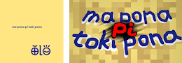

# Place Picture Contest 2023-02-01

For two sun cycles the image of Ma Pona did not change on Discord. jan Kekan San felt that this ought to change. Therefore, he organized a contest. Notably, the rule was this: do not put your name on your image. 

The group worked an sent out twelve images! Unfortunately, two of the images had the names of their creators and the rule excluded these two images. All the other images were sounds, so the group was able to look at them and discover this: which images were the best from the perspective of the group?

Notably, two images were very good to the group:

- That of kala pona Tonyu was lots of pale colors and very adorable. Lots of 'sitelen pona' were there. Racoon and animal were at the forest, and the racoon was moving on the backside of the animal's body. A sign communicated this: Ma Pona is near!
- That of kala Luno was vibrant colored like this: a colored path was on top of the land. Reddish and yellowish and blueish colours were in the sky, where kala Luno had also depicted white airy bumps. kala Luno inscribed 'Ma Pona pi Toki Pona' using sitelen pona. However, the world 'Ma' in sitelen pona was like this: if I were on a celestial body and looking at our land, then I could see the blueish of the plant areas and the blueish of water. 
  
The group came to express their feelings towards these two images. Which would become the image of Ma Pona Pi Toki Pona on Discord?

***

## **The group thought this image was good:**

### *First Place: kala pona Tonyu!!*

Downloadable images created by kala pona Tonyu include [large powerful image](kpTonyu/suli.png) and [powerful square image](kpTonyu/leko.png). 

### *Second Place: kala Luno!*

Downloadable images created by kala Luno include [large powerful image](kLuno/suli.png) and [powerful square image](kLuno/leko.png). 

And so the image of kala pona Tonyu became the new image of Ma Pona. The toki pona group knows how to make very excellent-looking and adorable-looking powerful entertaining images. In two future sun cycles, the image and competition should renew!

***

## **o lukin e sitelen ante, ona li pona kin!**

### *jan Aja*

Downloadable images created by jan Aja include [large powerful image](jAja/suli.png) and [powerful square image](jAja/leko.png). 

### *jan ante sama*

Downloadable images by jan ante sama include [large powerful image](j-ante-sama/suli.jpeg) and [powerful square image](j-ante-sama/leko.jpeg). 

### *jan Kasape*

Downloadable images created by jan Kasape include [large powerful image](jKasape/suli.png) and [powerful square image](jKasape/leko.png). 

### *ijo Koko*

Downloadable versions of ijo Koko's 'OLO' image include [large powerful image](koko/olo-suli.png) and [powerful square image](koko/olo-leko.png).

Downloadable versions of ijo Koko's 'mu' image include [large powerful image](koko/mu-suli.png) and [powerful square image](koko/mu-leko.png). 

Downloadable versions of ijo Koko's 'toki' image include [large powerful image](koko/toki-suli.png) and [powerful square image](koko/toki-leko.png). 

### *ilo Mimuki*

Downloadable images created by ilo Mimuki include [large powerful image](iMimuki/suli.png) and [powerful square image](iMimuki/leko.png). 

### *akesi kon Nalasuni*

Downloadable images created by akesi kon Nalasuni include [large powerful image](ak-Nalasuni/suli.png) and [powerful square image](ak-Nalasuni/leko.png). 

### *jan Osi*

Downloadable images created by jan Osi include [large powerful image](jOsi/suli.jpeg) and [powerful square image](jOsi/leko.png). 

### *jan Seki*

Downloadable images created by jan Seki include [large powerful image](jSeki/suli.png) and [powerful square image](jSeki/leko.png). 

