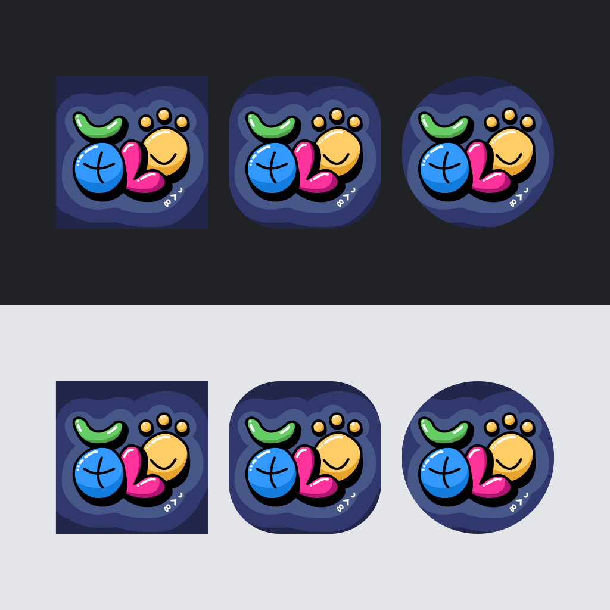

# utala pi sitelen ma #MAMW/#LT/#W

ma pona pi ilo Siko li wile e sitelen musi sin. ni la ona li kama e ni: jan mute li pali e sitelen ken mute la kulupu li toki e ni: sitelen seme li pona nanpa wan.

lon la, sitelen tu li pona suli tawa kulupu: sitelen pi *jan Melon* en sitelen pi *mute to.* taso jan mute li pana e wile tawa sitelen pi mute to la jan mute mute li pana e wile tawa jan Melon. ni la jan Melon li nanpa wan lon sitelen ma!

sitelen pi jan Melon:

o lukin e sitelen ale lon [ni](https://docs.google.com/forms/d/e/1FAIpQLSfrCDigcipOTCajDsKyLTvXzaHDOogleujgHqL55EGXooPOGQ/viewform).
