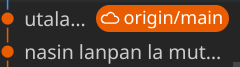

# utala musi lipu la tenpo lukin li lon!

## utala pi lipu lili la lipu MLLW li lon

[o kama lukin e lipu lili ale](/maml/lipu-musi/lipu-lili/index.md)

## utala pi lipu suli la lipu M li lon

[o kama lukin e lipu suli ale](/maml/lipu-musi/lipu-suli/index.md)

## ijo pi lipu musi li ken ike e pilin mi la mi o seme?   
insa pi lipu ale la mi pana e ijo pi ken ike lon anpa sitelen sama ni:

  
o sona e ken ike lon lipu ni

  <ul>
    <li>ike nanpa wan</li>
    <li>ike nanpa tu</li>
  </ul>

sina wile lukin e sona la o luka e sitelen. sina wile ala lukin la o luka ala e sitelen.

## mi lukin e lipu. mi o pana e pilin mi lon seme?

o awen. nasin li kama lon tenpo kama poka.

## sina pana ike e lipu mi a!
ni li lon la o toki e pakala mi tawa mi (ilo Siko la @raacz106, nasin ante la tokipona(sike lili)sasalin(sitelen a)gmail(sike lili)com).

## lawa pi utala musi li seme?

o kama lukin e [lawa ale](/maml/lipu-musi/lawa/lawa_tok.md) pi utala musi lipu.