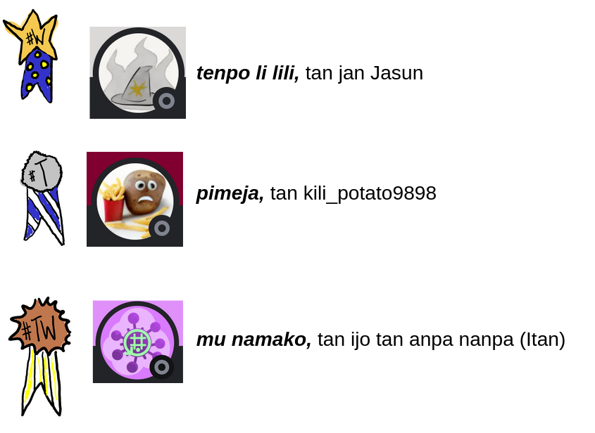
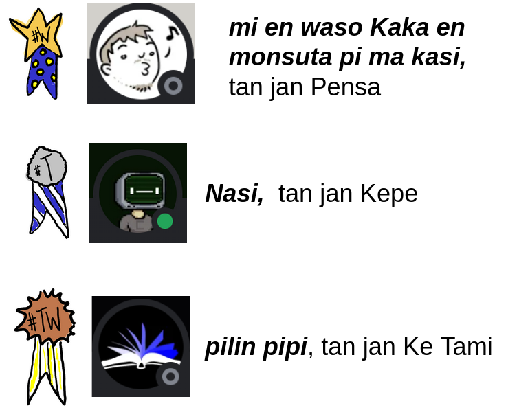

([sina wile e toki pona la o tawa ni](index.md))

# Competition of Big Documents and Small Communications 2023-08-15

jan Lakuse said this forcefully to all the beings of ma pona: Provide your documents and small communications to me! The document or communication ought to be in Toki Pona and ought to speak of a non-existant thing. It should also be artistic. The folks of ma pona delivered! Folks not of ma pona delivered! [Read all the instructions here](lawa_en.md).

The community gave 16 small communications. 

The community gave 13 larger documents. 

jan Tepo and jan Lakuse put them all on this document, 'utala.pona.la' so that the group could read. 

If you want to look at the [opinion-sharing method](pana-pilin_en.md)

## Which artworks were best to the group?

### Small communications
<ol>
  <li><a href="toki-lili.html/#tenpo-li-lili">tenpo li lili</a> by jan Jasun</li>
  <li><a href="toki-lili.html/#pimeja">pimeja</a>, by kili_potato9898</li>
  <li><a href="toki-lili.html/#mu-namako">mu namako</a>, by ijo tan anpa nanpa (Itan)</li>
</ol>

### Big documents

<ol>
  <li><a href="lipu-suli/mi-en-waso-Kaka.html">mi en waso Kaka en monsuta pi ma kasi</a>, by jan Pensa</li>
  <li><a href="lipu-suli/nasi.html">Nasi</a>, by jan Kepe</li>
  <li><a href="lipu-suli/pilin-pipi.html">pilin pipi</a>, by jan Ke Tami</li>
</ol>

## suno pi toki pona

During the *suno pi toki pona* jan Lakuse spoke of the goodness of all the art and facilitated this: People can recite their documents and communications. But gadget malfunctions happened. Many people could not recite well. 

[You can view their talk on YouTube](https://youtu.be/i56PDASYRtI?t=3251). Also you can view this below: jan Lakuse used what visuals. If you want to, [view jan Lakuse's slideshow in a non-strange way](https://docs.google.com/presentation/d/1dCipAOWfboehRvqzvP2VS-KwX_ptdK2N1yd70LMWUao/edit?usp=sharing). 

<iframe src="https://docs.google.com/presentation/d/e/2PACX-1vQzSVrsI_0SZzjLdcFdrP7uQtuiFHkPyRP8qXHnw17yVB0bAYGhOoSNoKsQ9PomZXBJZ52xtd-uKwsb/embed?start=false&loop=false&delayms=3000" frameborder="0" width="100%" height="" allowfullscreen="true" mozallowfullscreen="true" webkitallowfullscreen="true"></iframe>

Participants agreed that all works would be licensed under [CC-BY-SA 4.0](https://creativecommons.org/licenses/by-sa/4.0/).

<h2><a href="/toki-lili.html">View all the communications here</a></h2>

## View all the documents here:

























